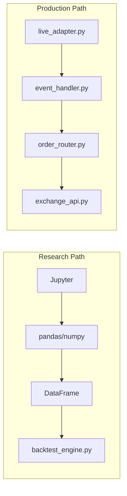
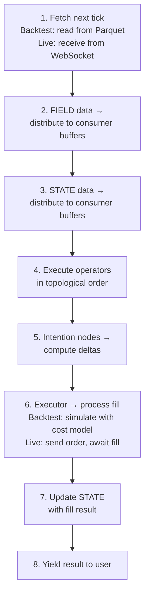
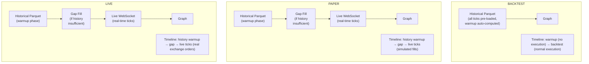

## The Most Expensive Bug in Quant Trading

You've spent weeks researching a strategy. The backtest shows a 2.1 Sharpe ratio. You deploy to live trading. Three months later, the live Sharpe is 0.3.

What went wrong? **The code changed.**

Not intentionally. But somewhere between the research notebook and the production system, subtle differences crept in:

- The research code used `pandas.shift()` for lookback; live uses a streaming buffer
- The backtest computed position sizes on close prices; live computes on fill prices
- The research notebook had access to the full DataFrame; live only has the current tick
- The backtest used a simplified fee model; live has exchange-specific tiered fees

Each difference is small. Together, they destroy your edge.

## The Industry's Dirty Secret

**Most quant platforms have two codebases.** One for research and one for production:



These codebases drift. They always drift. And when they drift, strategies that worked in backtest fail in production.

**Hedge funds solve this** by hiring infrastructure teams (5-15 engineers) whose sole job is maintaining research-production parity. They build custom execution frameworks, data pipelines, and testing harnesses — costing millions per year.

**Everyone else** just accepts the gap and hopes their backtest is close enough.

### What the Research Says

This problem is well-documented in academic literature:

- **Bailey, Borwein, López de Prado & Zhu, "The Probability of Backtest Overfitting" (2017)** — *Journal of Computational Finance*. Demonstrates mathematically that when multiple strategy configurations are tested, the probability that the selected "best" strategy is actually overfit approaches 1. The paper introduces the Probability of Backtest Overfitting (PBO) framework, showing that most published backtests are statistically indistinguishable from random selection. This is exacerbated when research and production environments differ, because the researcher cannot validate whether their backtest results are artifacts of the research environment.

- **Harvey, Liu & Zhu, "… and the Cross-Section of Expected Returns" (2016)** — *Review of Financial Studies*. Documents the multiple testing problem in finance: over 300 factors have been "discovered" through backtesting, most of which fail out-of-sample. The core insight is that backtest results are only meaningful if the testing methodology is rigorous — and a research-production gap makes rigorous testing impossible.

- **López de Prado, *Advances in Financial Machine Learning* (2018)** — Cambridge University Press. Dedicates multiple chapters to the dangers of conventional backtesting, including lookahead bias, data snooping, and the "strategy selection bias" that occurs when researchers test many strategies and report only the best one. Argues that the only reliable backtest is one that can be **reproduced exactly** in production — which requires code parity.

- **Sculley et al., "Hidden Technical Debt in Machine Learning Systems" (2015)** — Google, *NeurIPS*. While focused on ML systems generally, this paper's framework applies directly to quant trading: the gap between research and production creates "technical debt" that compounds over time. Each difference between the research environment and the production environment is a potential source of silent failure.

The common thread: **if your research code and production code are different, you cannot trust your backtest results.** The divergence between the two is not just an engineering inconvenience — it's a statistical invalidation of your research.

## How ClyptQ Guarantees Parity

ClyptQ has **one codebase, one execution path, one data flow** — for all modes.

### The TradingSpec Architecture

Everything in ClyptQ is defined in a single `TradingSpec`:

```python
from clyptq.apps.trading.spec import (
    TradingSpec, TradingDataSpec, TradingStrategySpec,
    TradingExecutionSpec, AccountSpec, CostModelSpec
)

spec = TradingSpec(
    data=TradingDataSpec(
        observations=[OHLCVSpec(exchange="binance", market_type="futures")],
        symbols=["BTC/USDT", "ETH/USDT", "SOL/USDT"],
        timeframe="1m",
    ),
    strategy=TradingStrategySpec(
        graph=graph,                  # Same graph object (defined below)
        initial_cash=10_000.0,
    ),
    execution=TradingExecutionSpec(
        mode="backtest",              # ← Only this changes
        accounts=[AccountSpec(
            exchange="binance",
            market_type="futures",
            cost_model=CostModelSpec(exchange="binance"),
        )],
    ),
)
```

To go from backtest to live, you change **one field**:

```python
# Backtest → Paper → Live
spec.execution.mode = "paper"   # Paper trading with real data
spec.execution.mode = "live"    # Live trading with real money
```

### What Stays Identical

| Component | Backtest | Paper | Live |
|---|---|---|---|
| **Graph topology** | Same DAG | Same DAG | Same DAG |
| **Operator code** | Same `compute()` | Same `compute()` | Same `compute()` |
| **Buffer sizes** | Same `RollingBuffer` | Same `RollingBuffer` | Same `RollingBuffer` |
| **Data format** | `TaggedArray` | `TaggedArray` | `TaggedArray` |
| **FIELD routing** | Same `_field_consumers` | Same `_field_consumers` | Same `_field_consumers` |
| **STATE routing** | Same `_field_consumers` | Same `_field_consumers` | Same `_field_consumers` |
| **Topological order** | Same Kahn's sort | Same Kahn's sort | Same Kahn's sort |
| **Warmup logic** | Same auto-compute | Same auto-compute | Same auto-compute |
| **Intention → Delta** | Same formula | Same formula | Same formula |

### What Changes (By Design)

| Component | Backtest | Paper | Live |
|---|---|---|---|
| **Data source** | Historical Parquet files | Live exchange feed | Live exchange feed |
| **Order execution** | Simulated fill | Simulated fill (real prices) | Real exchange fill |
| **Fill latency** | Instant (or modeled) | Real network latency | Real network latency |
| **Ephemeral operators** | Skipped (non-deterministic) | Executed | Executed |

The things that change are **environmental** — where data comes from and where orders go. The strategy logic, the computation, the state management — all identical.

## Why Other Platforms Can't Do This

### The Research-Production Translation

Even in frameworks that support both backtesting and live trading, the **research** code and **production** code use different patterns:

```python
# Freqtrade: Backtest research (vectorized DataFrame)
class MyStrategy(IStrategy):
    def populate_indicators(self, dataframe, metadata):
        dataframe["sma"] = ta.SMA(dataframe["close"], timeperiod=20)
        return dataframe

    def populate_entry_trend(self, dataframe, metadata):
        dataframe.loc[dataframe["close"] > dataframe["sma"], "enter_long"] = 1
        return dataframe
```

This looks clean, but `populate_indicators` receives the **entire DataFrame** — past and future rows. The framework tries to prevent lookahead, but the data structure itself is a full array. And more importantly, when you move from research exploration to the strategy class, the logic must be restructured into Freqtrade's specific `populate_*` pattern.

```python
# QuantConnect: Research notebook
qb = QuantBook()
history = qb.History(qb.AddEquity("SPY").Symbol, 30, Resolution.Daily)
sma = history["close"].rolling(20).mean()  # pandas research

# QuantConnect: Live algorithm — different API, different structure
class MyAlgo(QCAlgorithm):
    def Initialize(self):
        self.AddEquity("SPY")
        self.sma = self.SMA("SPY", 20)   # QC indicator, not pandas

    def OnData(self, data):
        if data["SPY"].Close > self.sma.Current.Value:
            self.SetHoldings("SPY", 0.5)  # QC order API
```

Research uses `pandas.rolling()`. Production uses `self.SMA()`. Research accesses `history["close"]`. Production accesses `data["SPY"].Close`. These are **different APIs** that can produce subtly different results.

### The State Management Problem

In vectorized backtesting, portfolio state is computed after the fact:

```python
# Backtest: compute PnL from position array (after all signals are generated)
positions = compute_positions_from_signals(signals, prices)
pnl = (positions.shift(1) * prices.pct_change()).cumsum()
equity = initial_cash + pnl
```

In event-driven live trading, state is updated incrementally:

```python
# Live: update state after each fill
def on_fill(self, fill):
    self.cash -= fill.notional + fill.fee
    self.positions[fill.symbol] += fill.quantity
    self.equity = self.cash + sum(pos * price for pos, price in ...)
```

These two approaches can produce different results due to:
- Rounding differences in cumulative vs incremental computation
- Fee calculation timing (deducted at signal time vs fill time)
- Partial fill handling (vectorized assumes 100% fill)
- Margin requirement computation (not modeled in vectorized)

### ClyptQ's Solution: The Driver Iterator

The reason ClyptQ's code is identical across modes is not just that the spec is the same — it's that the **user-facing execution interface is the same**. You iterate over a `TradingDriver`, and it yields results tick by tick:

```python
driver = TradingDriver(spec)

for result in driver:
    # result is yielded every tick — backtest, paper, or live
    # Same object structure, same fields, same semantics
    print(result.timestamp, result.equity, result.positions)
```

This single `for result in driver` loop is the **entire runtime interface**. It works identically whether:

- **Backtest**: `driver` iterates over historical Parquet data, simulating fills
- **Paper**: `driver` iterates over real-time exchange ticks, simulating fills
- **Live**: `driver` iterates over real-time exchange ticks, sending real orders

The driver abstracts **only** what differs (data source, fill execution). Everything else — graph computation, operator execution, state management, result delivery — is the same code path.

### Why This Matters: Full Control at Every Tick

Because the driver is an iterator, you have **full Python control between ticks**:

```python
driver = TradingDriver(spec)

equity_curve = []
trade_log = []

for result in driver:
    # Accumulate for post-analysis
    equity_curve.append(result.equity)

    # Real-time custom logging
    if result.trades:
        for trade in result.trades:
            trade_log.append(trade)
            logger.info(f"[{result.timestamp}] {trade.symbol}: {trade.side} {trade.quantity}")

    # Real-time visualization (same code in Jupyter backtest or live dashboard)
    if len(equity_curve) % 60 == 0:
        plot_equity(equity_curve)

    # Custom risk monitoring
    drawdown = compute_drawdown(equity_curve)
    if drawdown > 0.15:
        logger.warning(f"Drawdown {drawdown:.1%} — consider stopping")

# After loop: full backtest analysis
sharpe = compute_sharpe(equity_curve)
print(f"Sharpe: {sharpe:.2f}")
```

This code runs **unchanged** in backtest (iterating over 1 year of data in seconds), paper trading (iterating over live ticks with simulated fills), and live trading (iterating over live ticks with real fills). The analysis, logging, and visualization code you write for backtesting **is** your production monitoring code.

### The Internal Tick Loop

Inside the driver, each iteration of the `for` loop executes one tick:



Steps 2-5 and 7-8 are **identical code** in all modes. Only steps 1 and 6 differ — and those are internal to the driver, invisible to the user.

### What Actually Changes Per Mode

While the user code is identical, the driver internally swaps two components:

#### Data Injection (Step 1)



**Warmup fallback chain** (paper & live):
1. Load historical data from Parquet → fill warmup buffers
2. If insufficient historical ticks → fill remaining from live stream (gap fill)
3. Track source type per tick: `"history"` → `"gap"` → `"realtime"`
4. After warmup completes → sync to real-time clock boundary
5. No trades are executed during warmup regardless of source

The driver's `warmup_info` property reports exactly how many ticks came from each source:

```python
driver = TradingDriver.from_spec(spec)
for result in driver:
    break  # First real tick

print(driver.warmup_info)
# → {
#     "completed": True,
#     "requested_ticks": 52,
#     "executed_ticks": 52,
#     "from_history": 50,          # Pre-start historical data (ideal)
#     "from_history_post_start": 0, # Post-start history (range reduced)
#     "from_gap": 2,                # Gap-filled from live stream
#     "from_realtime": 0,           # Filled from live stream
#     "sufficient": True,           # No realtime data needed
#     "ideal": False,               # Some gap data was used
# }
```

#### Execution (Step 6)

| | Backtest | Paper | Live |
|---|---|---|---|
| **Executor** | `BacktestFactory` | `BacktestFactory` | `LiveFactory` |
| **Fill source** | Simulated (OHLCV close or orderbook) | Simulated (same as backtest) | Real exchange API |
| **Cost model** | CostModelSpec (auto-fetched or override) | Same as backtest | Exchange handles real fees |
| **TP/SL** | Checked per tick against OHLC | Same as backtest | Exchange-native TP/SL |
| **Liquidation** | Simulated (exchange MMR) | Same as backtest | Exchange handles |
| **Balance sync** | N/A | N/A | Synced from exchange before each tick |
| **Shutdown** | N/A | N/A | Emergency close-all on SIGINT/SIGTERM |

Paper mode is intentionally identical to backtest in execution — it uses live data but simulated fills. This lets you verify your strategy's real-time behavior without risking capital.

## The Three Guarantees

### 1. Data Flow Guarantee

Every operator receives data through the same mechanism:

```python
# This Input declaration works identically in all modes
Input("FIELD:binance:futures:ohlcv:close", "1m", lookback=20)
```

In backtest, the data comes from Parquet files. In live, it comes from the exchange WebSocket. The operator receives the same `TaggedArray` either way. The driver handles the source abstraction.

### 2. State Flow Guarantee

Portfolio state flows through the same STATE protocol:

```python
# Identical in all modes
Input("STATE:binance:futures:cash", "1m", lookback=1)
Input("STATE:binance:futures:pos_quantity", "1m", lookback=1)
```

In backtest, STATE is updated by the simulated executor. In live, it's updated by real fills. The operator receives the same format. The driver handles the update mechanism.

### 3. Result Flow Guarantee

Every tick yields the same `result` object:

```python
for result in driver:
    result.timestamp      # When this tick occurred
    result.equity         # Current portfolio equity
    result.positions      # Current positions per symbol
    result.trades         # Trades executed this tick (if any)
    result.signals        # Raw signal values from graph
    result.metrics        # All metric operator outputs
    result.node_outputs   # All node outputs (for debugging)
```

Your analysis code, visualization code, logging code, and monitoring code all work on this same `result` object — in backtest, paper, and live.

### Debug Mode and DataFrame Export

When you need to inspect intermediate node outputs — not just the final result — enable `debug=True` in TradingSpec. This stores every tick's output, and you can convert any node's accumulated results to a pandas DataFrame via `to_dataframe(node_id)`:

```python
spec = TradingSpec(
    data=data_config,
    strategy=TradingStrategySpec(graph=graph),
    execution=TradingExecutionSpec(mode="backtest", accounts=[account]),
    debug=True,  # ← Store all tick results for post-analysis
)

driver = TradingDriver.from_spec(spec)

for result in driver:
    pass  # Run through all ticks

# Convert specific nodes to DataFrame (node_id is required)
df_equity = driver.to_dataframe("equity")
df_signal = driver.to_dataframe("signal")
df_sma = driver.to_dataframe("sma_fast")

# Each DataFrame has timestamp index and symbol columns:
#   timestamp          | BTC     | ETH     | ...
#   2024-01-01 00:01   | 10240.5 | 1520.3  | ...
#   2024-01-01 00:02   | 10245.1 | 1521.8  | ...

# Standard pandas analysis
df_equity.plot(title="Equity Curve")
df_signal.hist(bins=50)

# Or export ALL output_nodes at once
results = driver.export_results(output_dir="./results", format="parquet")
# → results["dataframes"]["equity"], results["dataframes"]["signal"], ...
```

This bridges the gap between ClyptQ's tick-by-tick execution and the familiar pandas workflow. You run the strategy tick by tick (accurate, no lookahead), then analyze results as a DataFrame (convenient, full history). The key difference from vectorized frameworks: the DataFrame is built **after** execution, not **during** — so it's impossible to accidentally use future data in your strategy logic.

## Complete Example: Same Code, Three Modes

```python
# === 1. Define the graph (once) ===
graph = StatefulGraph()

close = Input("FIELD:binance:futures:ohlcv:close", "1m", lookback=50)

graph.add_node("sma_fast", SMA(span=10), inputs=[close])
graph.add_node("sma_slow", SMA(span=50), inputs=[close])

graph.add_node("signal", CrossoverAlpha(),
    inputs=[
        Input("sma_fast", "1m", lookback=2),
        Input("sma_slow", "1m", lookback=2),
    ])

graph.add_node("weights", EqualWeight(),
    inputs=[Input("signal", "1m", lookback=1)])

graph.add_node("equity", EquityCalculator(),
    inputs=[
        Input("STATE:binance:futures:cash", "1m", lookback=1),
        Input("STATE:binance:futures:pos_quantity", "1m", lookback=1),
        Input("FIELD:binance:futures:ohlcv:close", "1m", lookback=1),
        Input("STATE:binance:futures:pos_entry_price", "1m", lookback=1),
    ])

graph.add_node("book", BookSize(min_book_size=100.0),
    inputs=[Input("equity", "1m", lookback=1)])

graph.add_node("intention", FuturesTargetPositionIntention(
    weights=Input("weights", "1m", lookback=1),
    book_size=Input("book", "1m", lookback=1),
    positions=Input("STATE:binance:futures:pos_quantity", "1m", lookback=0),
    prices=Input("FIELD:binance:futures:ohlcv:close", "1m", lookback=0),
    axis_keys=symbol_source_map.axis_keys_for("binance:futures"),
    execution_routing=symbol_source_map.execution_routing,
    leverage=3.0,
))


# === 2. Define the spec (mode is the only variable) ===
spec = TradingSpec(
    data=data_config,
    strategy=TradingStrategySpec(graph=graph, initial_cash=10_000.0),
    execution=TradingExecutionSpec(
        mode="backtest",     # ← Change to "paper" or "live"
        accounts=[account],
    ),
)


# === 3. Run — SAME code for all modes ===
driver = TradingDriver(spec)

equity_curve = []
for result in driver:
    equity_curve.append(result.equity)

    # Custom logging (works in backtest AND live)
    if result.trades:
        for trade in result.trades:
            logger.info(f"{result.timestamp} | {trade.symbol} | {trade.side} | {trade.quantity}")

# Post-analysis (same whether it was a backtest or live session)
sharpe = compute_sharpe(equity_curve)
max_dd = compute_max_drawdown(equity_curve)
plot_equity_curve(equity_curve)
```

The graph, the spec, the `for result in driver` loop, the logging, the analysis — **all identical**. Change `mode="backtest"` to `mode="live"` and the same code trades real money.

## What This Means for You

| Scenario | Without Code Parity | With ClyptQ |
|---|---|---|
| **Strategy development** | Write twice (research + production) | Write once |
| **Bug investigation** | "Is this a research bug or production bug?" | One codebase, one source of truth |
| **Strategy verification** | Backtest results are approximate | Backtest results match live execution |
| **Marketplace trust** | Self-reported backtests (unreliable) | Verified backtests (identical code) |
| **Time to live** | Weeks of production adaptation | Change `mode` parameter |

## Relationship to Other Concepts

- **[TradingSpec](/engine/trading-spec)**: The declarative specification that makes code parity possible
- **[StatefulGraph](/engine/stateful-graph)**: The DAG that executes identically in all modes
- **[FIELD Protocol](/engine/field-data-principle)**: Data routing that's source-agnostic
- **[STATE Protocol](/engine/state-principle)**: Portfolio state that flows identically regardless of execution mode
- **[Execution Pipeline](/engine/execution-pipeline)**: The memoryless executor that differs only in fill simulation vs real fills
