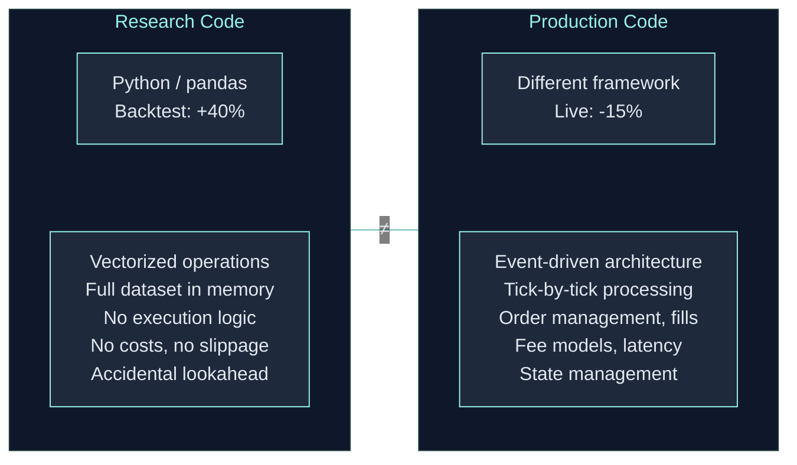

## The Problem: Research Never Equals Live

Every quant trader has experienced this: a backtest shows 40% annual returns, but the live strategy loses money. The gap between research code and production code is the single biggest source of failure in algorithmic trading.



This gap exists because:
1. **Different code paths** — Research uses pandas vectorization; live uses event-driven loops
2. **Implicit lookahead** — Future data leaks are invisible in vectorized backtests
3. **Missing costs** — Backtests ignore fees, slippage, funding rates, liquidation
4. **State management** — Research doesn't track positions, cash, margin — live must
5. **Warmup differences** — Research has full history; live has partial warmup

Top quantitative hedge funds solved this decades ago with custom infrastructure costing millions. ClyptQ brings that same architecture to every quant trader.

## Five Pillars

### 1. Research = Backtest = Live

The same `TradingSpec` and `for result in driver` loop run identically in all modes:

```python
spec = TradingSpec(
    strategy=my_strategy,
    data=my_data_config,
    execution=ExecutionSpec(accounts=[account]),
    mode="backtest",    # Paper/live managed by platform after submit
)

# This SAME loop runs in backtest, paper, and live
for result in TradingDriver.from_spec(spec):
    equity_curve.append(result.equity)
```

No translation layer. No rewrite. No "production adapter."

<Card title="Deep Dive: Code Parity" icon="equals" href="/competitive/code-parity">
  How TradingSpec guarantees identical execution across all modes
</Card>

### 2. Tick-by-Tick State Machine

Each operator sees **only past data** through its [RollingBuffer](/engine/lookback-buffers). There is no array of future prices to accidentally index into. Lookahead bias is **structurally impossible**.

```python
# Vectorized (dangerous): entire price array is visible
signals = np.where(prices > sma(prices, 20), 1, -1)

# ClyptQ (safe): operator only sees [t-lookback : t]
class MyAlpha(BaseOperator):
    def compute(self, inputs, timestamp, context):
        close = inputs[0]  # Only lookback ticks available
```

<Card title="Deep Dive: Lookahead Prevention" icon="shield" href="/backtesting/lookahead-bias-prevention">
  How RollingBuffers, warmup, and topological execution prevent future data leaks
</Card>

### 3. Full Python Freedom

Operators are **pure Python**. Use any library without restrictions:

```python
import torch, xgboost as xgb
from scipy.optimize import minimize
from transformers import pipeline

class MyOperator(BaseOperator):
    def compute(self, inputs, timestamp, context):
        # PyTorch, XGBoost, HuggingFace — anything Python can do
        ...
```

No sandbox. No language restrictions. No "approved library list."

### 4. Institutional-Grade Data Included

- **Multiple exchanges**: Binance, Gate.io, Bybit, Coinbase, Kraken, OKX, and more
- **Spot + Futures** with full historical depth
- **1-minute resolution**, pre-aligned and gap-filled
- No separate data subscriptions needed

### 5. Verified Strategy Marketplace

A marketplace where backtests are **independently verified** against cross-exchange data:

- **Builders**: Monetize without revealing source code. Platform computes all metrics.
- **Traders**: Independently verified performance with cross-exchange validation.

<Card title="How Verification Works" icon="check" href="/platform/marketplace">
  Cross-exchange validation, metric computation, and trust mechanism
</Card>

## How ClyptQ Compares

ClyptQ differentiates through:
- **Code parity** — same graph runs in backtest, paper, and live
- **Structural lookahead prevention** — RollingBuffer architecture makes it impossible to use future data
- **Python freedom** — use any library (PyTorch, XGBoost, HuggingFace) inside operators
- **Exchange-specific cost modeling** — auto-fetched fees, funding rates, and liquidation logic
- **Verified marketplace** — cross-exchange validated strategies with platform-computed metrics
- **AI/Semantic operators** — LLM scoring, web search, and sentiment analysis as first-class operators

<Info>
ClyptQ's operator architecture is compatible with external ML tools. Train a model in Qlib or FinRL, export it, and deploy as a ClyptQ operator via `BaseOperator` inheritance. See [ML/DL Integration](/engine/operator-protocol#ml-and-dl-integration).
</Info>

## The Technical Moat

ClyptQ's advantages are **structural, not incremental**. The engine was deliberately modeled on the [Von Neumann architecture](/getting-started/architecture-overview#the-architecture-behind-the-architecture) — the separation of stateless computation (operators) from stateful memory (the graph), connected by a control loop (the driver). This foundational decision makes everything else possible:

1. **Code parity** is built into the architecture — stateless operators process data identically regardless of source ([StatefulGraph](/engine/stateful-graph) + [TradingSpec](/engine/trading-spec))
2. **Lookahead prevention** is structural — [RollingBuffers](/engine/lookback-buffers) are the memory system, and operators can only access what the buffer provides
3. **Cross-exchange validation** requires source-agnostic operators — [TaggedArray](/engine/tagged-array) is the "register format," neutral by design
4. **Operator library** forms a growing instruction set that increases switching costs

These cannot be added to existing platforms — they require rebuilding from the ground up. Just as you cannot make a non-Von Neumann machine behave like one through software patches, you cannot bolt code parity onto an architecture that was not designed for it.

## Competitive Deep Dives

<CardGroup cols={2}>
  <Card title="Code Parity" icon="equals" href="/competitive/code-parity">
    How TradingSpec guarantees backtest = live
  </Card>
  <Card title="vs Vectorized" icon="bolt" href="/competitive/vs-vectorized">
    Why tick-by-tick produces more accurate results
  </Card>
  <Card title="vs QuantConnect" icon="chart-mixed" href="/competitive/vs-quantconnect">
    How ClyptQ improves on QuantConnect
  </Card>
  <Card title="vs QuantRocket" icon="docker" href="/competitive/vs-quantrocket">
    Docker pipeline vs unified SaaS
  </Card>
  <Card title="vs Nautilus" icon="rocket" href="/competitive/vs-nautilus">
    Performance vs accessibility
  </Card>
  <Card title="AI-Powered Trading" icon="brain" href="/competitive/semantic-operators">
    LLM, web search, and sentiment as first-class operators
  </Card>
</CardGroup>
