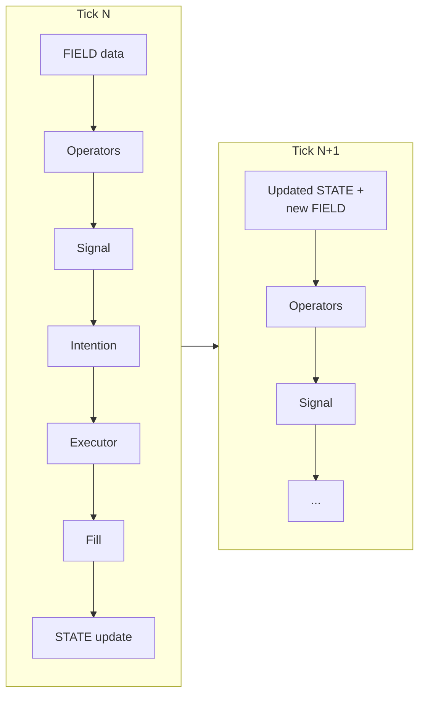
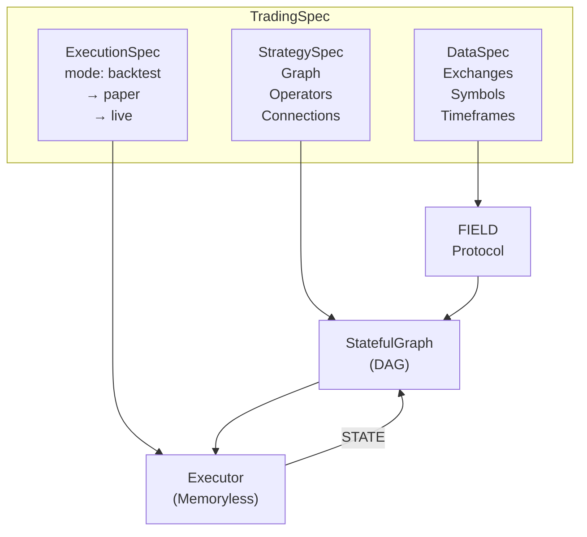

## The Problem with Quant Trading Today

Building a profitable trading strategy is hard. But the tooling makes it **unnecessarily harder**.

Every quant trader faces the same set of problems — regardless of whether they're a solo developer or a hedge fund team:

| Problem | What Happens |
|---|---|
| **Research ≠ Production** | Strategy works in a notebook but breaks in live trading. Different data APIs, different order logic, different state management |
| **Backtests lie** | Vectorized frameworks process entire arrays at once, making lookahead bias trivially easy to introduce |
| **No state management** | Portfolio state (cash, positions, margin) is managed with ad-hoc variables that drift between backtest and live |
| **Data burden** | You spend more time sourcing, cleaning, and aligning data than building strategies |
| **No monetization path** | Build a great strategy? No way to sell it. Find a great strategy? No way to verify it works |

ClyptQ solves all five problems with a single unified architecture.

## Five Pillars of ClyptQ

### 1. Research = Backtest = Live

The same `TradingSpec` and the same `for result in driver` loop run identically in all modes. Your research code, analysis code, logging code — everything is the same:

```python
spec = TradingSpec(
    strategy=my_strategy,
    data=my_data_config,
    execution=ExecutionSpec(
        mode="backtest",    # → "paper" → "live"
        accounts=[account],
    ),
)

# This SAME loop runs in backtest, paper, and live
driver = TradingDriver(spec)
for result in driver:
    equity_curve.append(result.equity)
    if result.trades:
        logger.info(f"{result.timestamp} | {result.trades}")

# debug=True → driver.to_dataframe("equity") for pandas analysis
```

**No translation layer. No rewrite. No "production adapter."** The graph, operators, buffers, execution pipeline, and your analysis code are identical across all modes. The driver iterator yields tick-by-tick results that you can accumulate, visualize, and log in real time — the same way in backtest and live.

<Card title="Deep Dive: Code Parity" icon="equals" href="/competitive/code-parity">
  How TradingSpec guarantees identical execution across research, backtest, and live
</Card>

### 2. Tick-by-Tick State Machine

ClyptQ processes data **one tick at a time**, maintaining proper state at every step:



Each operator sees **only past data** through its `RollingBuffer`. There is no array of future prices to accidentally index into. Lookahead bias is **structurally impossible**.

Compare this to vectorized frameworks:

```python
# Vectorized (dangerous): entire price array is visible
signals = np.where(prices > sma(prices, 20), 1, -1)  # lookahead possible

# ClyptQ (safe): operator only sees [t-lookback : t]
class MyAlpha(BaseOperator):
    def compute(self, inputs, timestamp, context):
        close = inputs[0]  # Only lookback ticks available
        return TaggedArray(values=signal, ...)
```

<Card title="Deep Dive: vs Vectorized" icon="bolt" href="/competitive/vs-vectorized">
  Why tick-by-tick backtesting produces fundamentally more accurate results
</Card>

### 3. Full Python Freedom

ClyptQ operators are **pure Python**. Use any library without restrictions:

```python
import torch
import xgboost as xgb
from scipy.optimize import minimize
from transformers import pipeline

class MyOperator(BaseOperator):
    role = OperatorRole.ALPHA

    def compute(self, inputs, timestamp, context):
        # PyTorch inference, XGBoost prediction, scipy optimization,
        # HuggingFace NLP — anything Python can do, operators can do
        ...
```

No sandbox. No language restrictions. No "approved library list." If it runs in Python, it runs in ClyptQ.

| Platform | Language Freedom |
|---|---|
| **ClyptQ** | Any Python library, no restrictions |
| QuantConnect | C# primary, Python via wrapper (limited library access) |
| Nautilus Trader | Rust/Cython (Python interface, but core logic in Rust) |
| Freqtrade | Python, but rigid strategy class structure |

### 4. Institutional-Grade Data Included

ClyptQ provides **exchange-quality OHLCV data** out of the box. No separate data subscriptions needed:

- **5 exchanges**: Binance, Gate.io, Bybit, OKX, Coinbase
- **Spot + Futures**: Both market types with full historical depth
- **1-minute resolution**: Tick-level granularity for accurate backtesting
- **Automatic alignment**: Multi-symbol, multi-exchange data is pre-aligned and gap-filled

With other platforms, you spend weeks sourcing and cleaning data before writing a single line of strategy code. With ClyptQ, you start with `FIELD:binance:futures:ohlcv:close` and immediately have clean, aligned data.

### 5. Verified Strategy Marketplace

ClyptQ's marketplace creates a new category: **Trading Commerce**.

**For Builders:**
- Monetize strategies without revealing source code
- Cross-exchange verification proves strategy works across venues
- Performance metrics are independently computed

**For Buyers:**
- Verified backtest results (not self-reported)
- Cross-exchange validation ensures strategies aren't overfit to one venue
- One-click deployment to live trading

**For Investors:**
- Transparent risk metrics
- Portfolio-level diversification across strategy providers
- Institutional-grade reporting

No other platform offers a marketplace where backtests are **independently verified** against cross-exchange data that the strategy builder never had access to.

## Architecture at a Glance



Every component is designed for **one principle**: the same code, the same data flow, the same execution logic — regardless of whether you're researching in a Jupyter notebook or trading live on Binance.

## How ClyptQ Compares

| Capability | ClyptQ | QuantConnect | Nautilus | QuantRocket | Freqtrade |
|---|---|---|---|---|---|
| **Research = Live** | Yes | No | Partial | Partial (Moonshot) | No |
| **Lookahead prevention** | Structural | Manual | Structural | Manual (Moonshot) | Manual |
| **Language** | Python (any library) | C#/Python (limited) | Rust/Cython | Python (pandas) | Python (rigid) |
| **Data included** | Yes (5 exchanges) | Partial (delayed) | No | IB data (requires account) | No |
| **Futures support** | Full (margin, leverage, funding) | Yes | Yes | Basic (IB) | Limited |
| **Multi-exchange** | Native | Yes | Yes | IB only | Limited |
| **Marketplace** | Verified | Alpha Streams | No | No | No |
| **Deployment** | SaaS (Jupyter) | Cloud | Self-hosted | Docker (self-hosted) | Self-hosted |
| **Cost modeling** | Exchange-specific fees, funding, liquidation | Basic fees | Configurable | IB fees | Basic fees |
| **AI operators** | LLM, WebSearch, Sentiment | No | No | No | No |
| **Custom operators** | BaseOperator inheritance | Algorithm class | Strategy class | pandas functions | Strategy class |

## vs Research-Oriented Frameworks

Some open-source projects focus on **specific domains** within quantitative finance — reinforcement learning, factor model research, or ML pipeline management. While excellent for their intended purpose, they are **not general-purpose trading platforms**.

### AI4Finance / FinRL

[FinRL](https://github.com/AI4Finance-Foundation/FinRL) is an open-source framework for **reinforcement learning in finance**, built on Stable Baselines3 and OpenAI Gym.

| | FinRL | ClyptQ |
|---|---|---|
| **Focus** | RL agent training for trading | General-purpose quant trading |
| **Strength** | Easy RL experimentation (PPO, A2C, DDPG) | Full trading pipeline (signal → execution) |
| **Backtesting** | Simplified gym environment | Tick-by-tick state machine with cost modeling |
| **Live trading** | Experimental (Alpaca API) | Production-grade (5 exchanges) |
| **Cost modeling** | Flat transaction cost | Exchange-specific fees, funding, liquidation |
| **State management** | Gym observation space | FIELD/STATE protocol |
| **Non-RL strategies** | Not designed for | 213+ operators (technical, factor, AI) |

**FinRL is great for**: Publishing RL research papers, experimenting with RL-based portfolio management.

**FinRL is not designed for**: Production trading, non-RL strategies, accurate cost modeling, multi-exchange execution.

### Microsoft Qlib

[Qlib](https://github.com/microsoft/qlib) is Microsoft's AI-oriented quantitative investment platform, focused on **factor research and ML model pipelines**.

| | Qlib | ClyptQ |
|---|---|---|
| **Focus** | ML/factor research pipeline | General-purpose quant trading |
| **Strength** | Alpha mining, model training, data processing | Full trading pipeline with execution |
| **Backtesting** | Simplified (daily-level, single-market) | Tick-by-tick, multi-exchange |
| **Live trading** | Not supported | Production-grade |
| **Market focus** | Chinese A-shares (primarily) | Crypto (multi-exchange), stocks planned |
| **Execution** | No execution engine | Memoryless executor with STATE feedback |
| **Operator model** | ML model pipeline (train → predict) | DAG of composable operators |

**Qlib is great for**: Factor research, alpha mining with ML, backtesting factor strategies on Chinese equities.

**Qlib is not designed for**: Live trading, crypto, intraday strategies, multi-exchange execution, cost-sensitive simulation.

### The Common Pattern

Most research-oriented open-source frameworks share the same limitations:

| Limitation | FinRL | Qlib | PyAlgoTrade | bt (backtest) |
|---|---|---|---|---|
| **Backtesting only** | Mostly | Yes | Yes | Yes |
| **Domain-specific** | RL only | ML/factor only | Basic event-driven | Vectorized |
| **Simplified cost model** | Yes | Yes | Yes | Yes |
| **No multi-exchange** | Yes | Yes | Yes | Yes |
| **No production execution** | Mostly | Yes | Limited | Yes |
| **No marketplace** | Yes | Yes | Yes | Yes |

These tools solve **one specific problem well** (RL training, factor research, quick prototyping) but cannot serve as the foundation for a production trading system. ClyptQ is designed to be that foundation — from research through live execution, with all the infrastructure that entails.

<Info>
ClyptQ's operator architecture is compatible with these research tools. You can train a model in Qlib or FinRL, export the trained model, and deploy it as a ClyptQ operator via `BaseOperator` inheritance. See [ML/DL Integration](/engine/operator-protocol#mldl-integration) for patterns.
</Info>

## The Technical Moat

ClyptQ's competitive advantage isn't any single feature — it's the **architectural decisions** that make everything else possible:

1. **FIELD/STATE Protocol** — Explicit data routing eliminates ambiguity and prevents lookahead bias by design
2. **TaggedArray 4-Field System** — `exists`, `valid`, `updated` masks handle missing data, warmup, and staleness without special-case code
3. **Stateless Operators, Stateful Graph** — Same operator code produces identical results in any environment
4. **Memoryless Executor** — All metrics are operators, making everything customizable and auditable
5. **213+ Pre-built Operators** — From SMA to LLM scoring, all composable in the same DAG

These aren't features that can be bolted on. They're **foundational design decisions** that determine what's possible.

## Competitive Deep Dives

<CardGroup cols={2}>
  <Card title="Research = Backtest = Live" icon="equals" href="/competitive/code-parity">
    Why code parity matters and how TradingSpec guarantees it
  </Card>
  <Card title="vs Vectorized Frameworks" icon="bolt" href="/competitive/vs-vectorized">
    Why Freqtrade, Zipline, and Backtrader produce unreliable backtests
  </Card>
  <Card title="vs QuantConnect" icon="chart-mixed" href="/competitive/vs-quantconnect">
    How ClyptQ improves on QuantConnect's pioneering cloud platform
  </Card>
  <Card title="vs QuantRocket" icon="docker" href="/competitive/vs-quantrocket">
    Docker pipeline vs unified SaaS — complexity vs simplicity
  </Card>
  <Card title="vs Nautilus Trader" icon="rocket" href="/competitive/vs-nautilus">
    Performance vs. accessibility — why you don't have to choose
  </Card>
  <Card title="AI-Powered Trading" icon="brain" href="/competitive/semantic-operators">
    LLM scoring, web search, and sentiment as first-class operators
  </Card>
</CardGroup>
