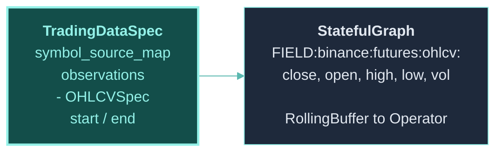
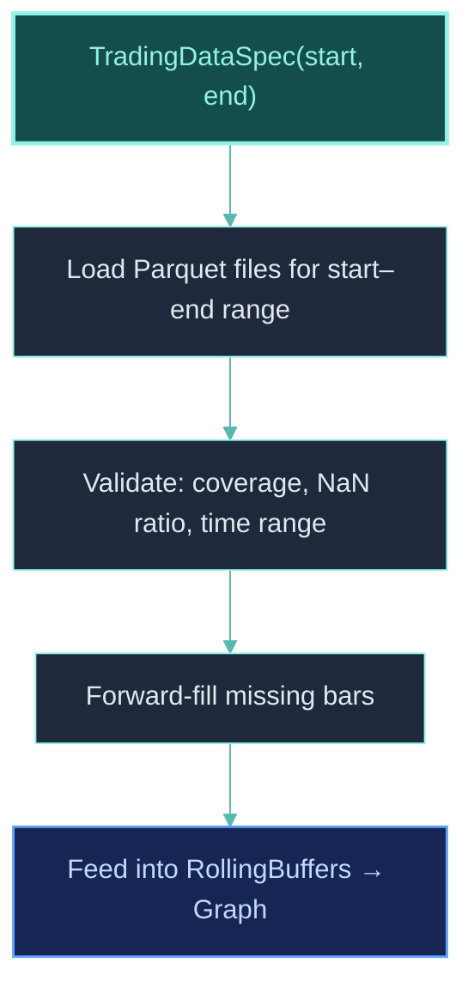
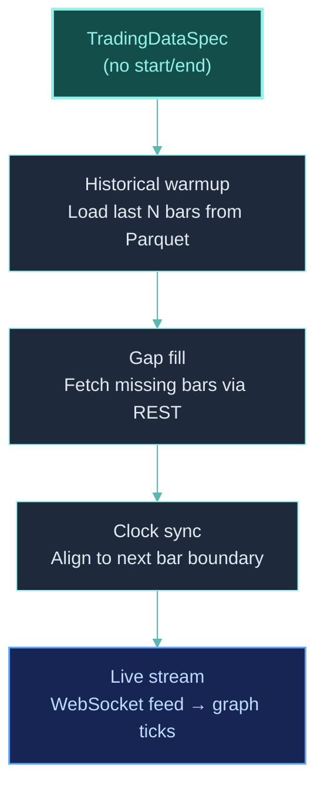

## Overview

ClyptQ's data system handles everything from historical Parquet files to live WebSocket streams, with automatic environment-based routing and warmup computation. Data is declared in `TradingDataSpec` and consumed as FIELD inputs in the graph.

## Data Flow



## ObservationSpec

Data sources are defined with `ObservationSpec` objects:

```python
from clyptq.apps.trading.spec.observation.crypto import OHLCVSpec

# OHLCV candle data from Binance futures
ohlcv = OHLCVSpec(
    exchange="binance",
    market_type="futures",
    timeframe="1m",
)
```

### Available fields

An `OHLCVSpec` provides these FIELD inputs to the graph:

| FIELD | Description | Example Usage |
|-------|------------|--------------|
| `FIELD:binance:futures:ohlcv:close` | Close price | Most indicator inputs |
| `FIELD:binance:futures:ohlcv:open` | Open price | Gap analysis |
| `FIELD:binance:futures:ohlcv:high` | High price | ATR, Bollinger, TP/SL check |
| `FIELD:binance:futures:ohlcv:low` | Low price | ATR, Bollinger, TP/SL check |
| `FIELD:binance:futures:ohlcv:volume` | Volume | Liquidity filters, volume indicators |

### Multi-exchange observations

```python
# Load from multiple exchanges in a single spec
observations = [
    OHLCVSpec(exchange="binance", market_type="futures", timeframe="1m"),
    OHLCVSpec(exchange="bybit", market_type="futures", timeframe="1m"),
]
```

Or use the list shorthand:

```python
OHLCVSpec(exchange=["binance", "bybit"], market_type="futures", timeframe="1m")
```

### Supported timeframes

All exchanges support: `1m`, `5m`, `15m`, `30m`, `1h`, `4h`, `1d`

## TradingDataSpec

The data spec defines what data to load and for what period:

```python
from clyptq.apps.trading.spec.data import TradingDataSpec
from clyptq.apps.trading.spec.symbol_source_map import SymbolSourceMap

data = TradingDataSpec(
    symbol_source_map=SymbolSourceMap({
        "binance:futures": ["BTC/USDT:USDT", "ETH/USDT:USDT"],
    }),
    observations=[
        OHLCVSpec(exchange="binance", market_type="futures", timeframe="1m"),
    ],
    start=datetime(2024, 1, 1, tzinfo=timezone.utc),   # Backtest only
    end=datetime(2024, 12, 31, tzinfo=timezone.utc),    # Backtest only
)
```

| Field | Required | Description |
|-------|---------|------------|
| `symbol_source_map` | Yes | Which symbols trade on which exchange |
| `observations` | Yes | Data sources (OHLCVSpec, etc.) |
| `start` | Backtest only | Start of backtest period |
| `end` | Backtest only | End of backtest period |

**Paper/live modes**: Omit `start`/`end`. The driver automatically handles warmup from historical data and then switches to live WebSocket feeds.

## SymbolSourceMap

Maps symbols to exchange-market pairs for data routing and execution:

```python
symbol_source_map = SymbolSourceMap({
    "binance:futures": ["BTC/USDT:USDT", "ETH/USDT:USDT"],
    "gateio:futures": ["SOL/USDT:USDT"],
})

# Helper methods
symbol_source_map.axis_keys_for("binance:futures")
# → ['binance:futures:BTC/USDT:USDT', 'binance:futures:ETH/USDT:USDT']

symbol_source_map.execution_routing
# → {'binance:futures:BTC/USDT:USDT': 'binance:futures', ...}
```

**`axis_keys`** are the canonical identifiers for each symbol on each venue. They're used by:
- `EquityCalculator` — to align prices with positions
- `FuturesTargetPositionIntention` — to route orders to the correct exchange
- `TaggedArray` columns — each column maps to an axis_key

## Storage Architecture

### Environment-based routing

| Environment | Storage | Path |
|-------------|---------|------|
| **dev** | Local Parquet | `./data` or `CLYPTQ_DATA_ROOT` |
| **prod** | EFS Parquet | `/efs/data` or `CLYPTQ_STORAGE_ROOT` |
| **kernel** | Backend API | `CLYPTQ_BACKEND_URL` |

The storage backend is selected automatically based on `CLYPTQ_ENV`. The same code works across all environments — only the data path changes.

### Parquet format

Data is stored as Parquet files, organized by:
```
data/
  binance/
    futures/
      ohlcv/
        1m/
          BTC_USDT_USDT.parquet
          ETH_USDT_USDT.parquet
```

Benefits: Columnar compression, fast reads, efficient date range filtering.

### Data discovery

Use `Helper.data_catalog()` to check what's available locally:

```python
from clyptq import Helper

# List all locally cached data
Helper.data_catalog()
# Shows: exchange, market_type, symbol, timeframe, date_range, file_size

# Check specific data availability
Helper.data_info("binance", "futures", "BTC/USDT:USDT", "1m")
# → start: 2023-01-01, end: 2024-12-31, rows: 1,051,200
```

## Data Pipeline Per Mode

### Backtest mode



All data is loaded upfront. The driver iterates through bars sequentially.

### Paper/Live mode



The `warmup_info` property tracks how data was sourced:

```python
driver.warmup_info
# → {
#     "from_history": 450,     # Bars from Parquet
#     "from_gap": 12,          # Bars from gap-fill
#     "from_realtime": 0,      # Bars from WebSocket
#     "total_warmup": 462,
#     "required_warmup": 50,   # What the graph needs
# }
```

## Data Quality

### Forward-fill (FFill)

Missing bars are automatically forward-filled. This is tracked in `TaggedArray`:

```
Bar exists:     value=42000, exists=True, valid=True, updated=True
Bar FFilled:    value=42000, exists=True, valid=True, updated=False
No data yet:    value=NaN,   exists=False, valid=False, updated=False
```

The `updated=False` flag tells operators "this is a stale value" — useful for strategies that need fresh data only.

### Validation

Data loading includes automatic validation:

| Check | What It Verifies |
|-------|-----------------|
| **Coverage** | All requested symbols have data |
| **NaN ratio** | Less than threshold of missing values |
| **Time range** | Data covers the requested period |
| **Consistency** | Timestamps are regular and monotonic |

## Live Data

### WebSocket feeds

| Exchange | WebSocket | Typical Latency | Reconnection |
|----------|-----------|----------------|-------------|
| Binance | Yes | ~50-100ms | Automatic |
| Bybit | Yes | ~50-100ms | Automatic |
| Gateio | Yes | ~100-200ms | Automatic |
| Coinbase | Yes | ~100-200ms | Automatic |
| Kraken | Yes | ~100-200ms | Automatic |

Disconnections are handled automatically with exponential backoff and gap-fill on reconnection.

### Warmup computation

The driver automatically computes the minimum warmup ticks needed:

1. Trace the graph backward from leaf nodes
2. At each node, accumulate the `lookback` requirement
3. Convert between timeframes if needed (e.g., 1h lookback=20 on a 1m graph = 1200 1m bars)
4. Add 5% safety buffer

The graph's `Input` declarations drive this computation — no manual `warmup_ticks` parameter needed.

## Related Pages

<CardGroup cols={2}>
  <Card title="FIELD Data Principle" icon="database" href="/engine/field-state">
    How FIELD inputs work in the graph
  </Card>
  <Card title="Lookback Buffers" icon="clock-rotate-left" href="/engine/lookback-buffers">
    RollingBuffer and warmup computation
  </Card>
  <Card title="Supported Exchanges" icon="building-columns" href="/platform/supported-exchanges">
    Exchange matrix with data availability
  </Card>
  <Card title="TaggedArray" icon="table" href="/engine/tagged-array">
    The 4-field data structure (value, exists, valid, updated)
  </Card>
</CardGroup>
