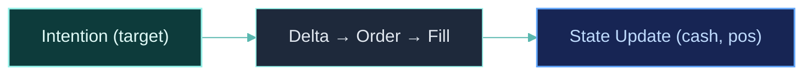

## Overview

The execution pipeline converts strategy graph outputs into actual trades. It operates identically in backtest, paper, and live modes — only the fill engine changes.



## The Three Stages

### Stage 1: Intention

An intention declares **where you want to be**, not what to buy or sell:

```python
from clyptq.apps.trading.operators.order import FuturesTargetPositionIntention

graph.add_node("intention", FuturesTargetPositionIntention(
    weights=Input("weights", "1m", lookback=1),
    book_size=Input("book", "1m", lookback=1),
    positions=Input("STATE:binance:futures:pos_quantity", "1m", lookback=0),
    prices=Input("FIELD:binance:futures:ohlcv:close", "1m", lookback=0),
    axis_keys=symbol_source_map.axis_keys_for("binance:futures"),
    execution_routing=symbol_source_map.execution_routing,
    leverage=3.0,
))
```

**Target-position trading**: You declare "I want to be 30% long BTC" — the pipeline figures out the orders to get there.

**Intention types:**

| Operator | Market Type | What It Does |
|----------|-----------|-------------|
| `FuturesTargetPositionIntention` | Futures | Target position from weights + book size, with leverage |
| `TargetPositionIntention` | Spot | Target position from weights + book size |
| `VenueAwareSizing` | Multi-venue | Allocates across venues for arbitrage |

### Stage 2: Delta Calculation

The executor computes the **delta** between current position and target position:

```
Target: 0.5 BTC long (from intention)
Current: 0.2 BTC long (from STATE)
Delta: +0.3 BTC (need to buy)
```

```
Target: 0.0 BTC (flat — signal turned neutral)
Current: 0.5 BTC long
Delta: -0.5 BTC (need to sell all)
```

The delta is computed automatically — the strategy only needs to declare target positions.

### Stage 3: Order Execution and Fill

The delta is converted to an order and executed by the fill engine:

| Mode | Fill Engine | What Happens |
|------|-----------|-------------|
| **backtest** | `BacktestFactory` | Simulated fill at OHLCV close price (INSTANT) or against orderbook (LATENT) |
| **paper** | `BacktestFactory` | Same simulated fill, but on live data |
| **live** | `LiveFactory` | Real order sent to exchange via CCXT |

## Execution Modes: INSTANT vs LATENT

### INSTANT mode

Orders fill at the current bar's close price with BPS-based slippage:

```
Fill price = close_price × (1 + slippage_bps / 10000)
Fee = fill_price × quantity × taker_fee_rate
```

Best for: Initial strategy validation, fast iteration.

### LATENT mode

Orders fill against a simulated orderbook with depth-dependent slippage:

```
Order: Buy 10 ETH at market

Orderbook:
  Ask: 2000.0 × 3.0 ETH
  Ask: 2001.0 × 5.0 ETH
  Ask: 2003.0 × 4.0 ETH

Fill:
  3.0 ETH @ 2000.0 = $6,000
  5.0 ETH @ 2001.0 = $10,005
  2.0 ETH @ 2003.0 = $4,006
  -------------------------
  Total: 10.0 ETH @ avg $2,001.1
```

Best for: Realistic execution modeling, capacity testing.

## TradingDriver: The Orchestrator

The `TradingDriver` manages the complete lifecycle:

```python
from clyptq.apps.trading.driver import TradingDriver

driver = TradingDriver.from_spec(spec)

# Each iteration = one tick through the full pipeline
for result in driver:
    print(f"{result.timestamp} | equity: {result.outputs.get('equity')}")
```

### What `from_spec()` does

1. **Expands specs** — Resolves SymbolSourceMap, ObservationSpecs, AccountSpecs
2. **Computes warmup** — Traces graph backward to find minimum ticks needed
3. **Creates TradingState** — Initializes cash, positions, margin for each account
4. **Creates executor** — `BacktestFactory` for backtest/paper, `LiveFactory` for live
5. **Loads data** — Parquet for historical, WebSocket for live
6. **Auto-injects funding** — Adds `FundingRateSpec` for futures accounts

### What each tick does

```
1. Receive FIELD data         ← OHLCV bar from Parquet or WebSocket
2. Update RollingBuffers      ← Push new data into per-consumer buffers
3. Execute graph              ← Operators compute in topological order
4. Collect intentions         ← Graph outputs target positions
5. Compute deltas             ← Target - Current = Delta
6. Generate orders            ← Convert deltas to buy/sell orders
7. Execute orders             ← BacktestFactory (sim) or LiveFactory (real)
8. Apply costs                ← Fees + slippage
9. Apply funding              ← If futures + settlement tick (every 8h)
10. Check liquidation         ← Per-exchange margin ratio check
11. Update STATE              ← cash, pos_quantity, pos_entry_price, margin
```

### TickResult

Each iteration yields a `TickResult`:

```python
for result in driver:
    result.timestamp      # Current tick timestamp
    result.outputs        # Dict of output_nodes → TaggedArray
    result.outputs.get("equity")   # Equity value at this tick
    result.outputs.get("signal")   # Signal value at this tick
```

### Post-analysis

```python
# Convert output node history to DataFrame (requires debug=True)
df_equity = driver.to_dataframe("equity")
# → DataFrame with timestamp index, one column per symbol

# Export all output nodes at once
results = driver.export_results()
# → Dict with DataFrames for each output_node, plus state summary
```

## TradingState

The executor maintains portfolio state as `TradingState`, exposed to the graph as `STATE:` inputs:

| STATE Key | What It Contains | Example |
|-----------|-----------------|---------|
| `STATE:binance:futures:cash` | Cash balance (margin for futures) | `25000.0` |
| `STATE:binance:futures:pos_quantity` | Position quantity per symbol | `[0.5, -2.0]` (BTC long, ETH short) |
| `STATE:binance:futures:pos_entry_price` | Average entry price per symbol | `[45000.0, 3200.0]` |
| `STATE:binance:spot:cash` | Spot cash balance | `10000.0` |
| `STATE:binance:spot:pos_quantity` | Spot holdings per symbol | `[1.2, 5.0]` |

State updates after every fill:

```
Fill: Buy 0.3 BTC at $45,000 on binance:futures
  → pos_quantity[BTC] += 0.3
  → pos_entry_price[BTC] = weighted_avg(old_entry, 45000)
  → cash -= (0.3 × 45000 × margin_rate) + fee
```

## Cost Application

### Fee calculation

```
fee = fill_price × quantity × fee_rate
```

Fee rates are resolved through a 4-level priority chain:
1. User override in `CostModelSpec`
2. Auto-fetched from exchange via CCXT
3. Known venue defaults (Alpaca, IB)
4. Fallback defaults (0.1% maker, 0.1% taker)

### Slippage

**INSTANT mode**: BPS-based
```
effective_price = price × (1 + slippage_bps / 10000)  # for buys
effective_price = price × (1 - slippage_bps / 10000)  # for sells
```

**LATENT mode**: Orderbook-based (depth-dependent, realistic)

### Funding rates

For futures positions, funding is applied at settlement ticks (every 8 hours for most exchanges):

```
funding_payment = position_size × mark_price × funding_rate
```

Positive rate + long position → you pay. Negative rate + long position → you receive.

See [Funding Rate Simulation](/backtesting/funding-rates) for details.

### Liquidation

After every fill, the executor checks margin ratio:

```
Binance: margin_ratio = MMR / equity × 100  (trigger if > 100%)
Bybit:   margin_ratio = equity / MMR         (trigger if < 1.0)
```

If triggered, all positions are closed and a liquidation fee is applied.

See [Liquidation Logic](/backtesting/liquidation-logic) for per-exchange formulas.

## Safety Features (Live Mode)

| Feature | How It Works |
|---------|-------------|
| **Emergency shutdown** | SIGINT/SIGTERM → close all positions immediately |
| **Balance sync** | Before each tick, check for external changes (manual trades, liquidation, funding) |
| **Heartbeat** | Periodic heartbeat prevents Kernel idle timeout |
| **First tick skip** | Skip execution on first real-time tick to avoid stale warmup signals |

## TP/SL in Backtest

Take-profit and stop-loss orders are simulated with OHLC-aware logic:

```
For each bar, check: did price hit TP or SL?

If BOTH hit in the same bar (based on OHLC range):
  → SL executes first (conservative assumption)
  → TP is cancelled

If only one hit:
  → Execute that order at the trigger price
```

## Related Pages

<CardGroup cols={2}>
  <Card title="Cost Models" icon="receipt" href="/backtesting/cost-models">
    Fee resolution, slippage, and VIP overrides
  </Card>
  <Card title="Liquidation Logic" icon="triangle-exclamation" href="/backtesting/liquidation-logic">
    Per-exchange margin and liquidation formulas
  </Card>
  <Card title="TradingSpec" icon="file-code" href="/engine/trading-spec">
    Complete configuration hierarchy
  </Card>
  <Card title="Code Parity" icon="equals" href="/competitive/code-parity">
    Why the same pipeline runs in all modes
  </Card>
</CardGroup>
