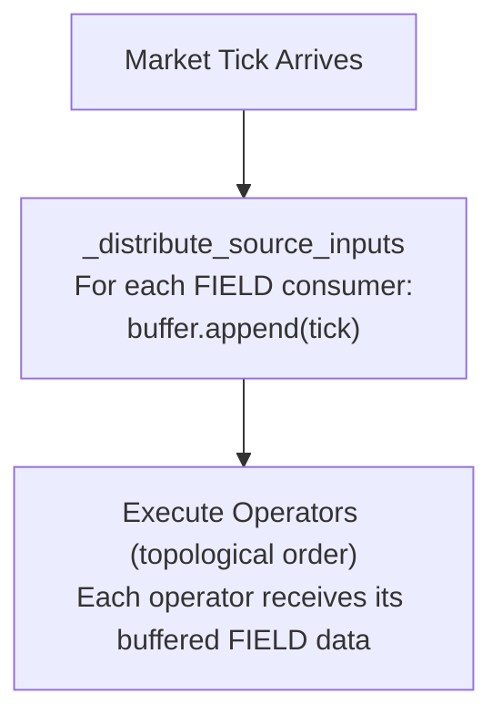

## Why FIELD Exists

Every trading strategy needs market data — prices, volumes, funding rates. In most frameworks, you access data through global variables, dataframe columns, or implicit context objects. This creates three problems:

1. **Ambiguity**: `close` could mean BTC close on Binance futures, ETH close on Gate.io spot, or any other instrument
2. **Lookahead bias**: Without explicit data routing, it's easy to accidentally use future data
3. **Multi-venue confusion**: When trading across exchanges, data origins become unclear

ClyptQ solves this with the **FIELD protocol** — a structured naming convention that makes every data dependency explicit, traceable, and safe.

## The FIELD Format

```
FIELD:{exchange}:{market_type}:ohlcv:{field_name}
```

| Component | Description | Examples |
|-----------|-------------|---------|
| `FIELD` | Protocol prefix (literal) | Always `FIELD` |
| `exchange` | Exchange identifier | `binance`, `gateio`, `bybit`, `okx` |
| `market_type` | Market category | `spot`, `futures`, `perpetual`, `linear` |
| `ohlcv` | Data domain (currently OHLCV only) | `ohlcv` |
| `field_name` | Data field | `close`, `open`, `high`, `low`, `volume` |

**Examples**:
```python
"FIELD:binance:futures:ohlcv:close"     # Binance futures close price
"FIELD:gateio:spot:ohlcv:volume"        # Gate.io spot volume
"FIELD:bybit:futures:ohlcv:high"        # Bybit futures high price
```

## How FIELD Works in Practice

When you build a strategy graph, every operator that needs market data declares its inputs using FIELD strings:

```python
from clyptq.system.graph import StatefulGraph, Input

graph = StatefulGraph()

# This operator needs Binance futures close prices
# with 20 ticks of history at 1-minute resolution
sma = graph.add_node("sma_20",
    SMA(span=20),
    inputs=[
        Input("FIELD:binance:futures:ohlcv:close", "1m", lookback=20)
    ]
)
```

The `Input` declaration tells the graph three things:
- **What data** (`FIELD:binance:futures:ohlcv:close`) — Binance futures close prices
- **At what resolution** (`"1m"`) — 1-minute candles
- **How much history** (`lookback=20`) — 20 ticks of rolling history

## FIELD Distribution: How Data Reaches Operators

When new market data arrives (a "tick"), the graph distributes it through a consumer-based routing system:



Internally, the graph pre-computes a `_field_consumers` map during `add_node()`:

```python
# Pre-computed at graph construction time
_field_consumers = {
    "FIELD:binance:futures:ohlcv:close": [
        ("sma_20", buffer_for_sma_20),
        ("rsi_14", buffer_for_rsi_14),
        ("momentum", buffer_for_momentum),
    ],
    "FIELD:binance:futures:ohlcv:volume": [
        ("volume_filter", buffer_for_volume_filter),
    ],
}
```

When a tick for `FIELD:binance:futures:ohlcv:close` arrives, it's appended to the RollingBuffer of every consuming node — in one pass, with no redundant copies.

## Forward-Fill on Missing Data

If a FIELD source has no new data at a given tick (e.g., a 1-hour candle hasn't updated yet), the graph **forward-fills** by reusing the last known value:

```python
# Pseudocode from graph.py
if new_data_available:
    buffer.append(new_tick)              # updated=True
else:
    last = buffer.get_last()
    last.updated = False                 # Mark as stale
    buffer.append(last)                  # Forward-fill
```

The key distinction: the **value** is preserved, but `updated=False` signals that it's stale data. Operators can check `updated` to decide whether to recompute. See [TaggedArray](/engine/tagged-array) for the full 4-field system.

## Multi-Venue FIELD Routing

When trading across multiple exchanges, FIELD prefixes prevent data collision:

```python
graph = StatefulGraph()

# Same field name ("close"), different sources
# These are two completely separate data streams
binance_close = Input("FIELD:binance:futures:ohlcv:close", "1m", lookback=20)
gateio_close  = Input("FIELD:gateio:futures:ohlcv:close", "1m", lookback=20)

# Spread calculation between exchanges
spread = graph.add_node("spread",
    PriceDifference(),
    inputs=[binance_close, gateio_close]
)
```

Without the FIELD protocol, you'd need complex disambiguation logic. With FIELD, the source is always explicit.

## FIELD and SymbolSourceMap

The FIELD protocol connects to the data layer through `SymbolSourceMap`, which defines which symbols exist on which exchanges:

```python
from clyptq.apps.trading.spec import SymbolSourceMap

symbol_map = SymbolSourceMap({
    "binance:futures": ["BTC/USDT", "ETH/USDT"],
    "gateio:futures":  ["SOL/USDT", "DOGE/USDT"],
})

# This creates axis_keys:
# "binance:futures:BTC/USDT"
# "binance:futures:ETH/USDT"
# "gateio:futures:SOL/USDT"
# "gateio:futures:DOGE/USDT"
```

When `FIELD:binance:futures:ohlcv:close` arrives, it contains data for BTC/USDT and ETH/USDT (the symbols mapped to that source). The graph distributes this multi-symbol data to all consuming operators.

## FIELD vs Direct Data Access

<Warning>
FIELD is the **only** way operators receive market data. There is no `get_price()` function, no global dataframe, no implicit context. This is by design.
</Warning>

**Why this matters:**

| Direct Access (other frameworks) | FIELD Protocol (ClyptQ) |
|----------------------------------|------------------------|
| `df['close']` — which close? | `FIELD:binance:futures:ohlcv:close` — unambiguous |
| Can accidentally access future rows | RollingBuffer only exposes `[t-lookback : t]` |
| Hard to trace data dependencies | Dependencies declared at graph construction |
| Single-exchange assumption | Multi-venue native |

## Available FIELD Names

Fields depend on the `ObservationSpec` used in your `TradingDataSpec`:

### OHLCVSpec Fields
| Field | Description |
|-------|-------------|
| `close` | Close price |
| `open` | Open price |
| `high` | High price |
| `low` | Low price |
| `volume` | Trading volume |

<Info>
Additional data domains (orderbook, funding rates, on-chain, macro, fundamentals) are on the [roadmap](/roadmap/overview). See below for how future data types will integrate.
</Info>

## Future Data Types (Planned)

### Domain-Specific Fields

As ClyptQ expands to additional data types, each gets its own **domain** in the FIELD path:

```python
# Current (OHLCV only)
"FIELD:binance:futures:ohlcv:close"

# Planned domains
"FIELD:binance:futures:orderbook:best_bid"
"FIELD:binance:futures:funding:rate"
"FIELD:glassnode:btc:onchain:exchange_inflow"
"FIELD:fred:us:macro:fed_funds_rate"
"FIELD:simfin:us:fundamentals:pe_ratio"
```

### Global vs Symbol-Specific Data

Some data types are **symbol-specific** (one value per symbol), while others are **global** (one value shared across all symbols):

| Type | Scope | Example |
|---|---|---|
| OHLCV | Symbol-specific | BTC/USDT close, ETH/USDT volume |
| On-chain | Symbol-specific | BTC exchange inflow, ETH gas fees |
| Funding rate | Symbol-specific | BTC/USDT perpetual funding rate |
| Macro indicators | **Global** | Fed funds rate, CPI, GDP |
| Market regime | **Global** | VIX, DXY, overall market sentiment |

**Global data** applies identically to all symbols. In the TaggedArray, global values are **padded** (broadcast) across the symbol dimension:

```python
# Fed funds rate = 5.25% — same for all symbols
# TaggedArray shape: (n_symbols,)
value   = [5.25, 5.25, 5.25, 5.25]    # Padded to all symbols
exists  = [True, True, True, True]      # Exists for all
valid   = [True, True, True, True]      # Valid for all
updated = [True, True, True, True]      # Updated for all
```

A **discriminator** will be added to FIELD metadata to distinguish global from symbol-specific data, allowing operators to handle each case appropriately.

### Multi-Asset Domain Discrimination

When a strategy trades **both crypto and stocks**, domain-specific data (like on-chain metrics) only applies to certain asset classes. The TaggedArray masks handle this naturally:

```python
# Strategy trades: [BTC/USDT, ETH/USDT, AAPL, GOOG]
# On-chain data only exists for crypto assets

# FIELD:glassnode:btc:onchain:exchange_inflow
value   = [15000.0, 8000.0,  NaN,   NaN  ]   # BTC, ETH have data
exists  = [True,    True,     False, False]   # Stocks: exists=False
valid   = [True,    True,     False, False]
updated = [True,    True,     False, False]

# FIELD:simfin:us:fundamentals:pe_ratio
value   = [NaN,     NaN,     28.5,  22.1 ]   # Only stocks have PE
exists  = [False,   False,   True,  True ]   # Crypto: exists=False
valid   = [False,   False,   True,  True ]
updated = [False,   False,   True,  True ]
```

Operators naturally ignore non-applicable data through the `exists` mask — on-chain operators skip stocks, fundamental operators skip crypto. No special-case code is needed because the [TaggedArray 4-field system](/engine/tagged-array) already handles domain boundaries.

## Common Patterns

### Pattern 1: Single Exchange Strategy

```python
# Most common: one exchange, multiple symbols
graph = StatefulGraph()

close = Input("FIELD:binance:futures:ohlcv:close", "1m", lookback=50)
volume = Input("FIELD:binance:futures:ohlcv:volume", "1m", lookback=20)

sma = graph.add_node("sma", SMA(span=50), inputs=[close])
vol_filter = graph.add_node("vol_filter", VolumeFilter(min_volume=1_000_000), inputs=[volume])
```

### Pattern 2: Cross-Exchange Arbitrage

```python
# Compare prices across venues
binance_price = Input("FIELD:binance:futures:ohlcv:close", "1m", lookback=1)
gateio_price  = Input("FIELD:gateio:futures:ohlcv:close", "1m", lookback=1)

spread = graph.add_node("spread", SpreadCalculator(), inputs=[binance_price, gateio_price])
```

### Pattern 3: Multi-Timeframe

```python
# Same source, different lookbacks
close_fast = Input("FIELD:binance:futures:ohlcv:close", "1m", lookback=10)
close_slow = Input("FIELD:binance:futures:ohlcv:close", "1m", lookback=50)

crossover = graph.add_node("crossover",
    CrossoverAlpha(),
    inputs=[close_fast, close_slow]
)
```

## Relationship to Other Concepts

- **[STATE Principle](/engine/state-principle)**: While FIELD provides market data, STATE provides portfolio data (cash, positions, margin)
- **[TaggedArray](/engine/tagged-array)**: FIELD data is delivered as TaggedArrays with 4 fields (value, exists, valid, updated)
- **[Lookback Buffers](/engine/lookback-buffers)**: FIELD data is stored in pre-allocated RollingBuffers sized by `Input.lookback`
- **[StatefulGraph](/engine/stateful-graph)**: The graph manages FIELD distribution to all consuming operators
- **[TradingSpec](/engine/trading-spec)**: `TradingDataSpec.observations` defines what FIELD data is available
