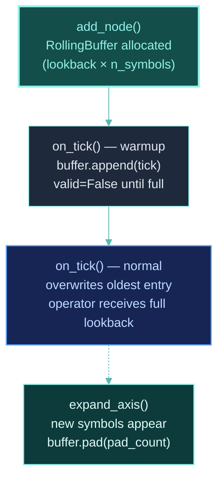

## Why Lookback Buffers?

Most technical indicators need historical data. An SMA(20) needs 20 ticks of history. An RSI(14) needs 15 ticks. In vectorized frameworks, this means slicing into a large dataframe — which introduces lookahead risk and wastes memory.

ClyptQ takes a different approach: each operator input gets a **pre-allocated circular buffer** of exactly the size it needs. No more, no less.

## RollingBuffer

`RollingBuffer` is a fixed-size circular buffer that stores [TaggedArray](/engine/tagged-array) history:

```python
# Created internally by the graph for each Input
buffer = RollingBuffer(lookback=20, n_symbols=3)
```

### Pre-allocated Arrays

On creation, 4 numpy arrays are allocated:

| Array | Dtype | Shape | Initial Value |
|-------|-------|-------|---------------|
| `value` | `float64` | `(lookback, n_symbols)` | `0.0` |
| `exists` | `bool` | `(lookback, n_symbols)` | `False` |
| `valid` | `bool` | `(lookback, n_symbols)` | `False` |
| `updated` | `bool` | `(lookback, n_symbols)` | `False` |

No dynamic allocation during execution. The memory footprint is fixed at `lookback × n_symbols × (8 + 3)` bytes (float64 + 3 bools).

## Circular Write

New data is written at `write_idx % lookback`, then `write_idx` increments:

```
Tick 1: write at index 0    [X _ _ _ _]  write_idx=1
Tick 2: write at index 1    [X X _ _ _]  write_idx=2
Tick 3: write at index 2    [X X X _ _]  write_idx=3
  ...
Tick 5: write at index 4    [X X X X X]  write_idx=5  (buffer full)
Tick 6: write at index 0    [Y X X X X]  write_idx=6  (overwrites oldest)
Tick 7: write at index 1    [Y Y X X X]  write_idx=7
```

The oldest data is automatically overwritten — no shifting, no copying, no reallocation.

### append()

Every tick, the graph calls `buffer.append(tick)`:

```python
def append(self, tick: TaggedArray):
    idx = self.write_idx % self.lookback
    self.value[idx]   = tick.value
    self.exists[idx]  = tick.exists
    self.valid[idx]   = tick.valid
    self.updated[idx] = tick.updated
    self.write_idx += 1
```

This is O(n_symbols) per append — just array assignment.

## Reading Data

### get_last(): Most Recent Tick

Returns the single most recent tick as a 1D TaggedArray:

```python
last = buffer.get_last()
# Returns TaggedArray at (write_idx - 1) % lookback
# Shape: (n_symbols,)
```

Used when `lookback=1` — the operator only needs the current value.

### to_array(): Full Buffer as 2D

Returns the entire buffer as a 2D TaggedArray, ordered oldest-to-newest:

```python
history = buffer.to_array()
# Shape: (lookback, n_symbols) if buffer is full
# Shape: (write_idx, n_symbols) if buffer is not yet full
```

Since the buffer is circular, the raw array may be out of order. `to_array()` reorders using `np.concatenate`:

```python
# If buffer is full and start != 0:
start = self.write_idx % self.lookback
ordered = np.concatenate([
    self.value[start:],    # Older data
    self.value[:start]     # Newer data
])
# Result: chronological order, oldest first
```

## Per-Consumer Buffers

Every (consumer, source) pair gets its own RollingBuffer. This is crucial:

```python
# sma_20 needs 20 ticks of close
graph.add_node("sma_20", SMA(span=20),
    inputs=[Input("FIELD:binance:futures:ohlcv:close", "1m", lookback=20)])

# rsi_14 needs 15 ticks of close
graph.add_node("rsi_14", RSI(period=14),
    inputs=[Input("FIELD:binance:futures:ohlcv:close", "1m", lookback=15)])
```

This creates **two separate buffers**:

```
Buffer ("sma_20", "FIELD:binance:futures:ohlcv:close"): lookback=20
Buffer ("rsi_14", "FIELD:binance:futures:ohlcv:close"): lookback=15
```

Both receive the same FIELD data (appended by `_distribute_source_inputs`), but each maintains its own circular buffer with its own lookback size. SMA sees 20 ticks, RSI sees 15.

## Warmup: When Buffers Are Ready

A buffer needs `lookback` ticks before it's full. The graph tracks this automatically:

```python
warmup = graph.compute_warmup_per_field()
# {"FIELD:binance:futures:ohlcv:close": 22}
# 22 ticks needed before the deepest consumer is ready
```

### Warmup Calculation Algorithm

The graph traces backwards from every node to its FIELD sources, accumulating lookback requirements:

```
signal(lookback=2) → sma_20(lookback=20) → FIELD:close
signal(lookback=2) → rsi_14(lookback=15) → FIELD:close

Path 1: 2 + 20 = 22 ticks
Path 2: 2 + 15 = 17 ticks
Max = 22 ticks for FIELD:close
```

**Timeframe ratio**: If the system clock is `"1m"` but an operator uses `"1h"` data with `lookback=5`, that's `5 × 60 = 300` clock ticks.

During warmup, operators may return `valid=False` — not enough data yet. The graph continues ticking, filling buffers, until all paths have enough data.

## Dynamic Axis Expansion

When new symbols are added at runtime, buffers expand:

```python
buffer.pad(pad_count=1)  # Add one new symbol column
```

This extends all 4 arrays by `pad_count` columns:
- `value`: padded with `NaN`
- `exists`, `valid`, `updated`: padded with `False`

The new symbol starts with no data. As ticks arrive, its data fills in naturally.

### Lazy Resize

On the first `append()` call, the buffer checks if `tick.value.shape` matches `n_symbols`. If not, it resizes:

```python
def _resize(self, new_size):
    # Reallocate all arrays to (lookback, new_size)
    # Preserve existing data, pad new columns with NaN/False
```

This handles the case where the axis size wasn't known at buffer creation time.

## Memory Efficiency

RollingBuffer is designed for minimal memory use:

```
Buffer for SMA(20) with 100 symbols:
  value:   20 × 100 × 8 bytes = 16 KB
  exists:  20 × 100 × 1 byte  =  2 KB
  valid:   20 × 100 × 1 byte  =  2 KB
  updated: 20 × 100 × 1 byte  =  2 KB
  Total: 22 KB per buffer
```

Compare to storing the full history in a dataframe:
```
Full history (525,600 minutes/year) × 100 symbols × 8 bytes = 420 MB
```

RollingBuffer uses **0.005%** of the memory. It only stores what's needed.

## Buffer Lifecycle



## Relationship to Other Concepts

- **[TaggedArray](/engine/tagged-array)**: RollingBuffer stores and delivers TaggedArrays
- **[StatefulGraph](/engine/stateful-graph)**: The graph creates and manages all RollingBuffers
- **[FIELD & STATE](/engine/field-state)**: FIELD and STATE data are distributed to consumer buffers via the same mechanism
- **[Operator Protocol](/engine/operator-protocol)**: Operators receive buffered data from their Input specifications
