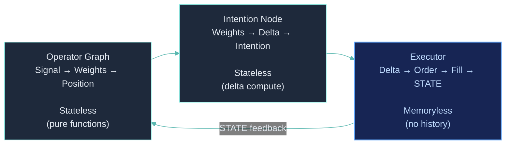

## Core Interface

Every operator in ClyptQ implements a single method:

```python
class BaseOperator(ABC):
    role: OperatorRole  # One of 13 roles

    def compute(
        self,
        data: Dict[str, TaggedArray],
        timestamp: datetime,
        context: ComputeContext
    ) -> TaggedArray:
        """
        Receive inputs → Compute → Return output.
        Called once per tick by the StatefulGraph.
        """
```

**Three guarantees:**
1. **Inputs**: Always `Dict[str, TaggedArray]` — buffered by the graph's [RollingBuffers](/engine/lookback-buffers)
2. **Output**: Always [TaggedArray](/engine/tagged-array) — 4 fields (value, exists, valid, updated)
3. **Stateless**: No mutable state between ticks. The [graph](/engine/stateful-graph) manages all state.

## 13 Operator Roles

```python
class OperatorRole(str, Enum):
    ALPHA = "alpha"           # Predictive signals (future returns)
    FACTOR = "factor"         # Cross-sectional systematic exposure
    TRANSFORM = "transform"   # Normalization (ZScore, Rank, Neutralize)
    OPTIMIZER = "optimizer"   # Portfolio weight optimization (MVO, RiskParity)
    POSITION = "position"     # Position sizing and constraints
    FILTER = "filter"         # Boolean universe selection
    SCORE = "score"           # Continuous ranking scores
    INDICATOR = "indicator"   # Technical indicators (SMA, RSI, MACD)
    METRIC = "metric"         # Performance measurement (Sharpe, drawdown)
    BALANCE = "balance"       # Portfolio state queries (cash, equity, positions)
    ORDER = "order"           # Order intention generation
    SEMANTIC = "semantic"     # LLM/WebSearch (ephemeral, paper/live only)
    CONTROL = "control"       # Conditional gates (if/and/or)
```

| Role | Input | Output | Ephemeral |
|---|---|---|---|
| ALPHA | Price/volume data | Signal [-1, 1] | No |
| FACTOR | Cross-sectional data | Rank/score per symbol | No |
| TRANSFORM | Raw signals | Normalized values | No |
| OPTIMIZER | Signals + constraints | Portfolio weights | No |
| POSITION | Weights + constraints | Position sizes | No |
| FILTER | Market data | Boolean (1.0 or 0.0) | No |
| SCORE | Market data | Continuous score | No |
| INDICATOR | Price/volume | Indicator values | No |
| METRIC | Returns/equity | Performance metrics | No |
| BALANCE | STATE data + prices | Portfolio state | No |
| ORDER | Weights + state | TradingIntention | No |
| SEMANTIC | Indicators + text | AI-generated signals | **Yes** |
| CONTROL | Any numeric | Gate (1.0 or 0.0) | No |

## Building Custom Operators

ClyptQ's operator system is designed for extension. **Inherit from `BaseOperator`** and implement `compute()` to create any custom logic:

### Basic Custom Operator

```python
from clyptq.apps.trading.operators.base import BaseOperator, OperatorRole
from clyptq.system.tagged_tensor import TaggedArray
import numpy as np

class MyMomentumAlpha(BaseOperator):
    """Custom momentum signal with configurable lookback."""
    role = OperatorRole.ALPHA

    def __init__(self, fast_period: int = 5, slow_period: int = 20):
        self.fast_period = fast_period
        self.slow_period = slow_period

    def compute(self, data, timestamp, context):
        close = data["close"]  # TaggedArray (lookback, n_symbols)

        # Fast and slow returns
        fast_ret = close.value[-1] / close.value[-self.fast_period] - 1.0
        slow_ret = close.value[-1] / close.value[-self.slow_period] - 1.0

        # Signal: fast momentum minus slow momentum
        signal = fast_ret - slow_ret

        return TaggedArray(
            value=signal,
            exists=close.exists[-1],
            valid=close.valid[-1] & close.valid[-self.slow_period],
            updated=True
        )
```

### Register and Use

```python
graph = StatefulGraph()

graph.add_node("my_alpha", MyMomentumAlpha(fast_period=5, slow_period=20),
    inputs=[Input("FIELD:binance:futures:ohlcv:close", "1m", lookback=20)])

# Use in downstream nodes
graph.add_node("normalized", ZScore(),
    inputs=[Input("my_alpha", "1m", lookback=100)])
```

### Custom Filter

```python
class VolatilityRegimeFilter(BaseOperator):
    """Only trade when volatility is within a target range."""
    role = OperatorRole.FILTER

    def __init__(self, min_vol: float = 0.01, max_vol: float = 0.05):
        self.min_vol = min_vol
        self.max_vol = max_vol

    def compute(self, data, timestamp, context):
        close = data["close"]

        # Realized volatility
        returns = np.diff(close.value, axis=0) / close.value[:-1]
        vol = np.std(returns, axis=0)

        # Filter: within regime
        in_regime = ((vol >= self.min_vol) & (vol <= self.max_vol)).astype(float)

        return TaggedArray(
            value=in_regime,
            exists=close.exists[-1],
            valid=close.valid[-1],
            updated=True
        )
```

### Custom Metric

```python
class CustomSharpe(BaseOperator):
    """Custom Sharpe with configurable risk-free rate."""
    role = OperatorRole.METRIC

    def __init__(self, risk_free_rate: float = 0.0, annualization: int = 252):
        self.rf = risk_free_rate
        self.ann = annualization

    def compute(self, data, timestamp, context):
        returns = data["returns"]

        excess = returns.value - self.rf / self.ann
        if len(excess) < 2:
            return TaggedArray.empty(n=1)

        sharpe = np.mean(excess) / np.std(excess) * np.sqrt(self.ann)

        return TaggedArray(
            value=np.array([sharpe]),
            exists=np.array([True]),
            valid=np.array([True]),
            updated=True
        )
```

**Any Python logic** can go inside `compute()` — NumPy, SciPy, PyTorch, sklearn, custom algorithms. The operator protocol only requires TaggedArray in, TaggedArray out.

## Self-Referencing Operators

Some operators need their **own previous output** as input. The classic example is EMA:

```
EMA(t) = α × close(t) + (1 - α) × EMA(t-1)
```

ClyptQ supports self-referencing by declaring the operator's own node name as an input:

```python
graph.add_node("ema_12", EMA(span=12),
    inputs=[
        Input("FIELD:binance:futures:ohlcv:close", "1m", lookback=1),  # Current price
        Input("ema_12", "1m", lookback=1),  # Self-reference: own previous output
    ]
)
```

### How It Works

1. **Topological sort excludes self-edges** — The graph's Kahn's algorithm ignores self-references when computing execution order, preventing false cycle detection
2. **Buffer seeding** — On the first tick, the self-reference buffer contains the initial/warmup value (typically `valid=False`)
3. **Each tick** — After compute, the output is written to the self-reference buffer for the next tick

```python
class EMA(BaseOperator):
    role = OperatorRole.INDICATOR

    def __init__(self, span: int):
        self.alpha = 2.0 / (span + 1)

    def compute(self, data, timestamp, context):
        close = data["close"]        # Current price
        prev_ema = data["ema_12"]    # Own previous output

        if not prev_ema.valid.any():
            # First tick: use close as initial EMA
            return TaggedArray(value=close.value, exists=close.exists,
                             valid=close.valid, updated=True)

        # EMA formula
        ema = self.alpha * close.value + (1 - self.alpha) * prev_ema.value

        return TaggedArray(value=ema, exists=close.exists,
                         valid=close.valid & prev_ema.valid, updated=True)
```

### Self-Reference Use Cases

| Operator | Formula | Self-Reference |
|---|---|---|
| EMA | α × x + (1-α) × EMA(t-1) | Previous EMA value |
| KAMA | Adaptive MA with efficiency ratio | Previous KAMA value |
| Accumulative metrics | Running sum/mean | Previous accumulator |
| Kalman filter | State estimate + prediction | Previous state estimate |
| EWMA Volatility | λσ²(t-1) + (1-λ)r²(t) | Previous variance estimate |

## Iterative Computation Within compute()

Operators are called **once per tick**, but the `compute()` method can contain **arbitrary Python logic** including loops. For algorithms that require iteration (numerical solvers, differential equations, convergence-based methods), you implement the full iteration **within a single `compute()` call**:

```python
class NewtonRaphsonOptimizer(BaseOperator):
    """Solve optimization via Newton's method within a single tick."""
    role = OperatorRole.OPTIMIZER

    def __init__(self, max_iter: int = 100, tol: float = 1e-8):
        self.max_iter = max_iter
        self.tol = tol

    def compute(self, data, timestamp, context):
        signals = data["signals"]

        # Full iterative solver within one compute() call
        x = np.zeros(signals.value.shape[-1])

        for i in range(self.max_iter):
            grad = self._gradient(x, signals.value)
            hess = self._hessian(x, signals.value)
            step = np.linalg.solve(hess, -grad)
            x = x + step

            if np.linalg.norm(step) < self.tol:
                break  # Converged

        return TaggedArray(value=x, exists=signals.exists[-1],
                         valid=signals.valid[-1], updated=True)
```

### Differential Equation Solvers

```python
class OUProcessEstimator(BaseOperator):
    """Estimate Ornstein-Uhlenbeck process parameters via Euler method."""
    role = OperatorRole.INDICATOR

    def __init__(self, dt: float = 1/1440, n_steps: int = 50):
        self.dt = dt
        self.n_steps = n_steps

    def compute(self, data, timestamp, context):
        spread = data["spread"]

        # Iterative Euler integration within compute()
        theta, mu, sigma = self._estimate_params(spread.value)
        x = spread.value[-1]

        simulated = np.zeros((self.n_steps, spread.value.shape[-1]))
        for step in range(self.n_steps):
            dx = theta * (mu - x) * self.dt + sigma * np.sqrt(self.dt) * np.random.randn(*x.shape)
            x = x + dx
            simulated[step] = x

        expected_reversion = mu - spread.value[-1]
        return TaggedArray(value=expected_reversion, exists=spread.exists[-1],
                         valid=spread.valid[-1], updated=True)
```

### Key Principle

You don't need incremental implementation for iterative algorithms. A single `compute()` call can run `for` loops, `while` loops, convergence checks — any Python control flow. The graph calls `compute()` once per tick, but **what happens inside is unrestricted**.

This means:
- **Newton-Raphson** for portfolio optimization — iterate to convergence within `compute()`
- **Runge-Kutta** for ODE solvers — full integration step per tick
- **Monte Carlo** simulation — generate thousands of paths within `compute()`
- **Gradient descent** for online learning — run N steps per tick
- **ADMM / convex optimization** — full solver per tick

## Execution Responsibility Separation

ClyptQ separates execution into three **memoryless** components:



### Memoryless Execution

The executor is stateless -- it receives an intention, computes a delta from current STATE, executes the order, updates STATE, and forgets everything. All metrics, tracking, and adaptation are done by operators in the graph, not by the executor.

<Card title="FIELD & STATE" icon="database" href="/engine/field-state">
  How FIELD (market data) and STATE (portfolio state) flow through the graph and enable the memoryless execution pattern
</Card>

### Feedback Loop Control

Because STATE flows back into the graph as input, strategies can create **closed-loop feedback**:

```python
# Signal -> Intention -> Fill -> STATE -> Equity -> Risk Adjustment -> Signal
#   ^                                                                    |
#   +----------------------- Feedback loop via STATE -------------------+

graph.add_node("signal", MomentumAlpha(), inputs=[close])
graph.add_node("equity", EquityCalculator(), inputs=[state_inputs...])
graph.add_node("drawdown", RollingDrawdown(),
    inputs=[Input("equity", "1m", lookback=252)])

# Risk adjustment based on drawdown (feedback from execution state)
graph.add_node("risk_scaled_signal", RiskAdjuster(),
    inputs=[
        Input("signal", "1m", lookback=1),
        Input("drawdown", "1m", lookback=1),
    ])

graph.add_node("intention", TargetPositionIntention(),
    inputs=[
        Input("risk_scaled_signal", "1m", lookback=1),
        Input("book_size", "1m", lookback=1),
        Input("STATE:binance:futures:pos_quantity", "1m", lookback=0),
        Input("FIELD:binance:futures:ohlcv:close", "1m", lookback=0),
    ])
```

**Feedback control examples:**
- **Drawdown-based de-leveraging**: Reduce position size when drawdown exceeds threshold
- **Equity curve trading**: Pause trading during losing streaks
- **Adaptive position sizing**: Scale based on realized equity volatility
- **Kelly criterion**: Dynamically size based on accumulated win rate and payoff ratio
- **Regime switching**: Change strategy behavior based on tracked portfolio metrics

## ML and DL Integration

### Online Learning (Per-Tick)

For models that update incrementally, the tick-by-tick architecture is natural:

```python
class OnlineLinearRegression(BaseOperator):
    """Online learning: update model at each tick."""
    role = OperatorRole.ALPHA

    def __init__(self, n_features: int, learning_rate: float = 0.01):
        self.lr = learning_rate
        self.weights = np.zeros(n_features)
        self.bias = 0.0

    def compute(self, data, timestamp, context):
        features = data["features"]    # (lookback, n_features, n_symbols)
        target = data["returns"]       # (lookback, n_symbols)

        if features.valid[-1].any():
            X = features.value[-1]
            y = target.value[-1]

            # Online gradient step
            pred = self.weights @ X + self.bias
            error = pred - y
            self.weights -= self.lr * (error @ X.T) / X.shape[1]
            self.bias -= self.lr * np.mean(error)

            prediction = self.weights @ X + self.bias
        else:
            prediction = np.zeros(features.value.shape[-1])

        return TaggedArray(value=prediction, exists=features.exists[-1],
                         valid=features.valid[-1], updated=True)
```

### Batch Data Collection for Offline Training

ClyptQ processes data **tick-by-tick**, so standard batch DL training doesn't work directly in the graph. However, you can use a **collector node** to accumulate all data, then train after the iteration completes:

```python
class DataCollector(BaseOperator):
    """Collect tick data for offline batch processing after run."""
    role = OperatorRole.INDICATOR

    def __init__(self):
        self.collected_features = []
        self.collected_targets = []

    def compute(self, data, timestamp, context):
        features = data["features"]
        target = data["returns"]

        if features.valid[-1].any():
            self.collected_features.append(features.value[-1].copy())
            self.collected_targets.append(target.value[-1].copy())

        # Placeholder: return zero signal during collection
        return TaggedArray.full(n=features.value.shape[-1], fill_value=0.0)
```

After `driver.run()` completes, all data is available for batch processing:

```python
# Run backtest to collect all data
driver = TradingDriver.from_spec(spec)
results = driver.run()

# Extract collected data
collector = graph.get_node("collector").operator
X = np.array(collector.collected_features)  # (n_ticks, n_features, n_symbols)
y = np.array(collector.collected_targets)   # (n_ticks, n_symbols)

# Now train with standard batch processing
import torch
dataset = torch.utils.data.TensorDataset(torch.tensor(X), torch.tensor(y))
loader = torch.utils.data.DataLoader(dataset, batch_size=64, shuffle=True)
# ... standard PyTorch training loop
```

<Warning>
The collector pattern is **not recommended** for production strategies. It breaks the stateless operator principle and stores unbounded data in memory. Use it only for research and prototyping. For production, prefer online learning or pre-trained model inference.
</Warning>

### Pre-Trained Model Inference (Recommended for DL)

Train externally, load model, run inference per tick:

```python
class TransformerAlpha(BaseOperator):
    """Load pre-trained model and run inference per tick."""
    role = OperatorRole.ALPHA

    def __init__(self, model_path: str, lookback: int = 60):
        import torch
        self.model = torch.load(model_path)
        self.model.eval()
        self.lookback = lookback

    def compute(self, data, timestamp, context):
        close = data["close"]     # (lookback, n_symbols)
        volume = data["volume"]   # (lookback, n_symbols)

        if close.value.shape[0] < self.lookback:
            return TaggedArray.empty(n=close.value.shape[-1])

        import torch
        features = np.stack([close.value, volume.value], axis=-1)
        tensor = torch.tensor(features, dtype=torch.float32).unsqueeze(0)

        with torch.no_grad():
            prediction = self.model(tensor).squeeze().numpy()

        return TaggedArray(value=prediction, exists=close.exists[-1],
                         valid=close.valid[-1], updated=True)
```

### Reinforcement Learning

RL agents fit naturally — each tick is an environment step:

```python
class RLAgent(BaseOperator):
    """RL agent: observe state, take action (position target) each tick."""
    role = OperatorRole.ALPHA

    def __init__(self, model_path: str, train: bool = False):
        self.agent = load_agent(model_path)
        self.train = train
        self.prev_equity = None

    def compute(self, data, timestamp, context):
        close = data["close"]
        position = data["position"]
        equity = data["equity"]

        # Construct state
        state = np.concatenate([close.value[-1], position.value, equity.value])

        # Agent action
        action = self.agent.act(state)

        if self.train and self.prev_equity is not None:
            reward = (equity.value[0] - self.prev_equity) / self.prev_equity
            self.agent.learn(state, action, reward)

        self.prev_equity = equity.value[0]

        return TaggedArray(value=action, exists=close.exists[-1],
                         valid=close.valid[-1], updated=True)
```

## Ephemeral Operators

Operators marked `ephemeral = True` make external API calls (LLM, web search) and **cannot reproduce the same output for the same historical input**:

- Skip backtest validation
- Only run in **paper** or **live** mode
- Skip warmup (return neutral values)
- Should be gated with [Control operators](/operators/control) for cost control

See [Semantic Operators](/operators/semantic) for detailed documentation.

## ComputeContext

The `context` parameter provides execution metadata:

```python
def compute(self, data, timestamp, context):
    context.is_warmup     # bool: True during warmup phase
    context.tick_count    # int: Current tick number
    context.mode          # str: "backtest", "paper", "live"
```

## Performance Considerations

| Role | Typical Complexity | Notes |
|---|---|---|
| INDICATOR/TRANSFORM | O(N) | N = number of symbols |
| ALPHA/FACTOR | O(N × L) | L = lookback length |
| OPTIMIZER | O(N²) to O(N³) | Depends on algorithm |
| METRIC | O(1) to O(W) | Accumulative = O(1), Rolling = O(W) |
| SEMANTIC | O(API latency) | 100ms-5s per call, gate for cost |
| BALANCE/ORDER | O(N) | Simple state queries |

**Tips:**
- Use NumPy vectorized operations (avoid Python loops over symbols)
- Minimize lookback — request only what the algorithm needs
- Cache expensive intermediate results in `self` (e.g., covariance matrices)
- For ML inference, batch symbols together in one forward pass

## Relationship to Other Concepts

- **[TaggedArray](/engine/tagged-array)**: All inputs and outputs
- **[StatefulGraph](/engine/stateful-graph)**: Manages operator execution and state
- **[Lookback Buffers](/engine/lookback-buffers)**: How operators receive historical data
- **[FIELD & STATE](/engine/field-state)**: Market data and portfolio state inputs
- **[Operator Reference](/operators/overview)**: Complete catalog of 380+ built-in operators
