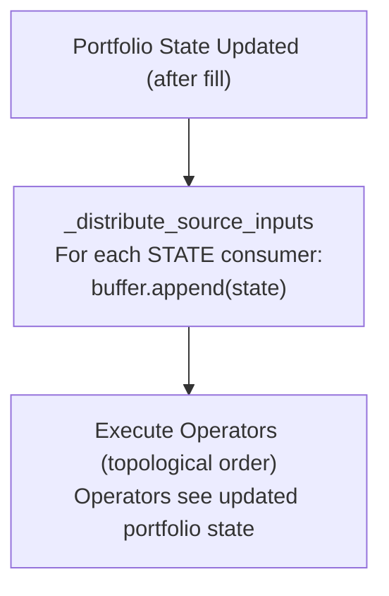
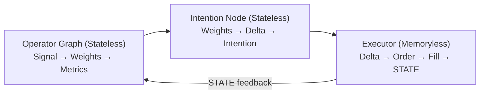

## Why STATE Exists

A trading strategy doesn't just consume market data — it needs to know the **current state of the portfolio**: how much cash is available, what positions are held, what the unrealized PnL is. In most frameworks, this information lives in separate objects that you query imperatively:

```python
# Other frameworks (imperative)
cash = portfolio.get_cash()
position = portfolio.get_position("BTC/USDT")
if cash > 1000 and position.quantity < target:
    order(...)
```

This creates tight coupling between strategy logic and portfolio management. Strategies become hard to test, hard to compose, and impossible to run identically across backtest and live.

ClyptQ takes a different approach: portfolio state is **injected into the graph** using the same mechanism as market data, through the **STATE protocol**.

## The STATE Format

```
STATE:{exchange}:{market_type}:{key}
```

| Component | Description | Examples |
|-----------|-------------|---------|
| `STATE` | Protocol prefix (literal) | Always `STATE` |
| `exchange` | Exchange identifier | `binance`, `gateio`, `bybit` |
| `market_type` | Market category | `spot`, `futures`, `perpetual` |
| `key` | State key | `cash`, `pos_quantity`, `pos_entry_price`, `available_margin` |

**Examples**:
```python
"STATE:binance:futures:cash"              # Cash balance on Binance futures
"STATE:gateio:spot:pos_quantity"          # Position quantities on Gate.io spot
"STATE:binance:futures:pos_entry_price"   # Entry prices on Binance futures
"STATE:binance:futures:available_margin"  # Available margin on Binance futures
```

## Available STATE Keys

| Key | Type | Description |
|-----|------|-------------|
| `cash` | Scalar (`float`) | Available cash balance in base currency |
| `pos_quantity` | Dict/Array (`{symbol: qty}`) | Position quantities per symbol |
| `pos_entry_price` | Dict/Array (`{symbol: price}`) | Average entry prices per symbol |
| `available_margin` | Scalar (`float`) | Free margin (futures only) |

<Info>
STATE data is updated by the **execution engine** after every fill. You don't update STATE manually — it reflects the real (or simulated) portfolio state.
</Info>

## How STATE Works in Practice

Operators that need portfolio information declare STATE inputs the same way they declare FIELD inputs:

```python
from clyptq.system.graph import StatefulGraph, Input

graph = StatefulGraph()

# EquityCalculator needs 4 inputs:
# - Cash balance (STATE)
# - Position quantities (STATE)
# - Current prices (FIELD)
# - Entry prices (STATE)
equity = graph.add_node("equity",
    EquityCalculator(),
    inputs=[
        Input("STATE:binance:futures:cash", "1m", lookback=1),
        Input("STATE:binance:futures:pos_quantity", "1m", lookback=1),
        Input("FIELD:binance:futures:ohlcv:close", "1m", lookback=1),
        Input("STATE:binance:futures:pos_entry_price", "1m", lookback=1),
    ]
)
```

Notice how FIELD and STATE inputs are **mixed in the same operator**. The graph treats both identically for routing purposes — the only difference is the data source.

## STATE Distribution

STATE follows the exact same consumer-based routing as FIELD:



The graph maintains `_field_consumers` for both FIELD and STATE sources. Both are pre-computed at graph construction time for O(1) distribution.

## STATE and Warmup

<Warning>
STATE inputs typically do **not** contribute to warmup calculation. Portfolio state starts from initial conditions (initial_cash, zero positions) — there's no "historical state" to warm up from.
</Warning>

This is different from FIELD inputs, where warmup ticks are needed to fill the RollingBuffer before the strategy can generate meaningful signals.

## Equity Calculation

The most common STATE pattern is equity calculation. Here's how `EquityCalculator` works internally:

### Spot Markets
```
equity = cash + Σ(quantity[i] × current_price[i])
```

### Futures Markets
```
equity = margin + Σ((current_price[i] - entry_price[i]) × quantity[i])
```

The operator auto-detects market type from the STATE source path:
```python
# "STATE:binance:futures:cash" → market_type = "futures"
# "STATE:gateio:spot:cash"     → market_type = "spot"
```

## Multi-Venue STATE

When trading across multiple exchanges, each account has its own STATE namespace:

```python
# Binance futures account state
binance_cash = Input("STATE:binance:futures:cash", "1m", lookback=1)
binance_pos  = Input("STATE:binance:futures:pos_quantity", "1m", lookback=1)

# Gate.io futures account state
gateio_cash = Input("STATE:gateio:futures:cash", "1m", lookback=1)
gateio_pos  = Input("STATE:gateio:futures:pos_quantity", "1m", lookback=1)

# Per-venue equity
binance_equity = graph.add_node("binance_equity",
    EquityCalculator(),
    inputs=[binance_cash, binance_pos, binance_close, binance_entry]
)
gateio_equity = graph.add_node("gateio_equity",
    EquityCalculator(),
    inputs=[gateio_cash, gateio_pos, gateio_close, gateio_entry]
)

# Total equity across all venues
total_equity = graph.add_node("total_equity",
    TotalEquityCalculator(),
    inputs=[
        Input("binance_equity", "1m", lookback=1),
        Input("gateio_equity", "1m", lookback=1),
    ]
)
```

`TotalEquityCalculator` aggregates equity from multiple `EquityCalculator` nodes, giving you a portfolio-wide view.

## Balance Operators Reference

ClyptQ provides pre-built operators for common STATE queries:

| Operator | STATE Input | Output | Purpose |
|----------|-------------|--------|---------|
| `CashBalance` | `STATE:*:cash` | Scalar | Current cash balance |
| `EquityCalculator` | `STATE:*:cash`, `STATE:*:pos_quantity`, `STATE:*:pos_entry_price` + `FIELD:*:ohlcv:close` | Scalar | Total equity (cash + positions) |
| `TotalEquityCalculator` | Multiple EquityCalculator outputs | Scalar | Aggregate across venues |
| `AvailableMargin` | `STATE:*:available_margin` | Scalar | Free margin (futures) |
| `PositionQuantity` | `STATE:*:pos_quantity` | Array | Position sizes per symbol |
| `PositionValue` | `STATE:*:pos_quantity` + prices from context | Array | Position notional values |
| `BookSize` | Any scalar balance | Scalar | Scaled book size (with min/max clamp) |

### BookSize Parameters

```python
book_size = graph.add_node("book_size",
    BookSize(
        multiplier=1.0,       # Scale factor
        min_book_size=100.0,  # Floor
        max_book_size=50000.0 # Ceiling
    ),
    inputs=[Input("total_equity", "1m", lookback=1)]
)
```

## Common Patterns

### Pattern 1: Position-Aware Signal

```python
# Scale signal based on current position
signal = graph.add_node("raw_signal", MomentumAlpha(), inputs=[close])
position = graph.add_node("position", PositionQuantity(),
    inputs=[Input("STATE:binance:futures:pos_quantity", "1m", lookback=1)]
)

# Reduce signal if already heavily positioned
adjusted = graph.add_node("adjusted_signal",
    PositionAwareScaler(),
    inputs=[
        Input("raw_signal", "1m", lookback=1),
        Input("position", "1m", lookback=1),
    ]
)
```

### Pattern 2: Risk-Based Sizing

```python
# Size positions relative to equity, not fixed amounts
equity = graph.add_node("equity", EquityCalculator(), inputs=[...])
book = graph.add_node("book", BookSize(min_book_size=100.0),
    inputs=[Input("equity", "1m", lookback=1)]
)

# Target weights × book_size = target notional
intention = graph.add_node("intention",
    TargetPositionIntention(),
    inputs=[
        Input("weights", "1m", lookback=1),
        Input("book", "1m", lookback=1),
        Input("FIELD:binance:futures:ohlcv:close", "1m", lookback=1),
    ]
)
```

### Pattern 3: Drawdown Monitor

```python
# Track equity for drawdown detection
equity = graph.add_node("equity", EquityCalculator(), inputs=[...])

# Rolling max and drawdown
peak = graph.add_node("peak", AccumMax(),
    inputs=[Input("equity", "1m", lookback=1)]
)
drawdown = graph.add_node("drawdown", DrawdownFromPeak(),
    inputs=[
        Input("equity", "1m", lookback=1),
        Input("peak", "1m", lookback=1),
    ]
)
```

## Memoryless Execution and Responsibility Separation

### Three Stateless Components

ClyptQ's execution pipeline is split into three **memoryless** components:



| Component | Role | Memory |
|---|---|---|
| **Operator Graph** | Generate signals, compute metrics, track performance | Stateless — pure functions per tick |
| **Intention Node** | Convert portfolio targets to order deltas | Stateless — reads current STATE, computes delta |
| **Executor** | Route orders, process fills, update STATE | **Memoryless** — no history of past orders/fills |

### Why Memoryless Execution Matters

The executor has **no memory** of past orders. Every tick, it:
1. Receives `TradingIntention` from intention nodes
2. Computes delta against current STATE
3. Sends order to exchange (or simulates fill)
4. Updates STATE with fill result
5. **Forgets everything** — next tick starts fresh

This means **all metrics and performance tracking are operators in the graph**, not embedded in the execution layer:

```python
# Want custom Sharpe? Write an operator.
graph.add_node("my_sharpe", CustomSharpe(risk_free=0.05),
    inputs=[Input("returns", "1m", lookback=252)])

# Want custom win rate? Write an operator.
graph.add_node("win_rate", CustomWinRate(),
    inputs=[Input("trades", "1m", lookback=100)])

# Want equity curve tracking? Write an operator.
graph.add_node("equity_curve", EquityCalculator(), inputs=[...])
graph.add_node("drawdown", RollingDrawdown(),
    inputs=[Input("equity_curve", "1m", lookback=252)])
```

### Feedback Loop Control

Because STATE flows back into the graph, strategies create **closed-loop feedback**:

```python
# Drawdown-based de-leveraging
graph.add_node("drawdown", RollingDrawdown(),
    inputs=[Input("equity", "1m", lookback=252)])

graph.add_node("leverage_scaler", DrawdownLeverageScaler(
    max_drawdown=0.10,  # Start reducing at 10% drawdown
    kill_drawdown=0.20, # Stop trading at 20% drawdown
), inputs=[Input("drawdown", "1m", lookback=1)])

graph.add_node("intention", FuturesTargetPositionIntention(
    leverage=Input("leverage_scaler", "1m", lookback=1),  # Dynamic leverage from feedback
    ...
))
```

**Feedback enables:**
- **Drawdown-based de-leveraging**: Reduce exposure during losses
- **Equity curve trading**: Pause when equity trend is negative
- **Adaptive position sizing**: Scale based on realized portfolio volatility
- **Kelly criterion**: Dynamically size based on accumulated win rate
- **Regime switching**: Change strategy behavior based on portfolio state

## FIELD vs STATE: Summary

| | FIELD | STATE |
|---|-------|-------|
| **Source** | Market data (external) | Portfolio state (internal) |
| **Updated by** | Data provider (exchange feed) | Execution engine (after fills) |
| **Warmup** | Contributes to warmup calculation | Does not contribute to warmup |
| **Forward-fill** | Last known price, `updated=False` | Last known state, `updated=False` |
| **Multi-venue** | Each exchange is a separate FIELD | Each account is a separate STATE |
| **Examples** | `close`, `volume`, `funding_rate` | `cash`, `pos_quantity`, `available_margin` |

Both protocols use the same graph infrastructure — consumer maps, RollingBuffers, TaggedArrays, and topological execution. The only difference is where the data originates.

## Relationship to Other Concepts

- **[FIELD Data Principle](/engine/field-data-principle)**: FIELD is the counterpart for market data — same protocol, external source
- **[TaggedArray](/engine/tagged-array)**: STATE data is delivered as TaggedArrays, just like FIELD data
- **[StatefulGraph](/engine/stateful-graph)**: The graph manages both FIELD and STATE distribution identically
- **[Execution Pipeline](/engine/execution-pipeline)**: The execution engine updates STATE after order fills
- **[TradingSpec](/engine/trading-spec)**: `AccountSpec` defines which STATE namespaces exist
