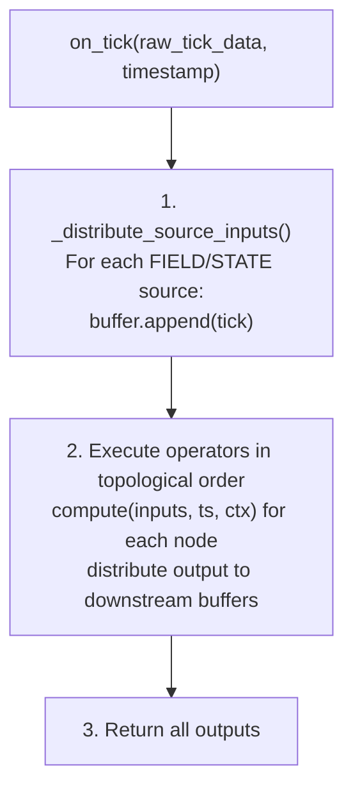

## Core Design Principle

ClyptQ separates **computation** from **state**:

- **Operators are stateless**: They receive inputs, compute, and return outputs. No internal state between ticks.
- **The Graph is stateful**: It manages buffers, routing, axis registration, and execution order.

This separation is why the same strategy code runs identically in backtest and live — operators don't care where data comes from or when. The graph handles all the plumbing.

## StatefulGraph

`StatefulGraph` is the DAG (Directed Acyclic Graph) execution engine. It manages:

1. **Nodes**: Operators registered with `add_node()`
2. **Edges**: Dependencies declared through `Input` specifications
3. **Buffers**: Pre-allocated `RollingBuffer` per (consumer, source) pair
4. **Axes**: Symbol dimensions with `AxisMeta`
5. **Execution order**: Topological sort computed at construction time

```python
from clyptq.system.graph import StatefulGraph, Input
from clyptq.operators.indicator import SMA, RSI

graph = StatefulGraph()

# Register nodes — each declares its inputs
sma = graph.add_node("sma_20",
    SMA(span=20),
    inputs=[Input("FIELD:binance:futures:ohlcv:close", "1m", lookback=20)]
)

rsi = graph.add_node("rsi_14",
    RSI(period=14),
    inputs=[Input("FIELD:binance:futures:ohlcv:close", "1m", lookback=15)]
)

# Node that depends on other nodes (not FIELD/STATE)
signal = graph.add_node("signal",
    CrossoverSignal(),
    inputs=[
        Input("sma_20", "1m", lookback=2),
        Input("rsi_14", "1m", lookback=1),
    ]
)
```

## Input: Dependency Declaration

Every operator input is an `Input` object (frozen dataclass):

```python
Input(source, timeframe, lookback)
```

| Parameter | Type | Description |
|-----------|------|-------------|
| `source` | `str` | Data source: `"FIELD:..."`, `"STATE:..."`, or a node name |
| `timeframe` | `str` | Resolution: `"1m"`, `"5m"`, `"1h"`, `"1d"` |
| `lookback` | `int` | Number of ticks to buffer (minimum 1) |

**Source types:**

```python
# External data (market prices)
Input("FIELD:binance:futures:ohlcv:close", "1m", lookback=20)

# Portfolio state (cash, positions)
Input("STATE:binance:futures:cash", "1m", lookback=1)

# Output of another node
Input("sma_20", "1m", lookback=2)
```

### Timeframe Validation

`Input` parses timeframes into seconds using regex `(\d+)([smhdw])`:

| Unit | Multiplier | Example |
|------|-----------|---------|
| `s` | 1 | `"30s"` = 30 seconds |
| `m` | 60 | `"1m"` = 60 seconds |
| `h` | 3600 | `"1h"` = 3600 seconds |
| `d` | 86400 | `"1d"` = 86400 seconds |
| `w` | 604800 | `"1w"` = 604800 seconds |

`Input.validate_against_source()` ensures you can't upsample — input timeframe must be >= source timeframe. You can request `"1h"` data from a `"1m"` source (downsample), but not `"1m"` from a `"1h"` source.

## add_node(): Registration

When you call `add_node()`, the graph does several things:

```python
graph.add_node(name, operator, inputs=[...])
```

1. **Validates** the operator implements the correct interface
2. **Extracts** input specifications from the operator
3. **Creates RollingBuffers** for each input (sized by `lookback`)
4. **Pre-computes consumer maps** for FIELD/STATE sources
5. **Re-runs topological sort** to update execution order

### Buffer Setup

For each `Input`, a dedicated `RollingBuffer` is created:

```python
# When you register:
graph.add_node("rsi_14", RSI(period=14),
    inputs=[Input("FIELD:binance:futures:ohlcv:close", "1m", lookback=15)]
)

# Internally creates:
# RollingBuffer(lookback=15, n_symbols=len(axis))
# Stored at: buffers[("rsi_14", "FIELD:binance:futures:ohlcv:close")]
```

Each (consumer, source) pair gets its own buffer. If both `sma_20` and `rsi_14` consume `FIELD:binance:futures:ohlcv:close`, they each get separate buffers with their own lookback sizes.

### Consumer Map Pre-computation

FIELD and STATE sources are registered in `_field_consumers`:

```python
# After add_node("sma_20", ..., inputs=[Input("FIELD:binance:futures:ohlcv:close", ...)])
# and   add_node("rsi_14", ..., inputs=[Input("FIELD:binance:futures:ohlcv:close", ...)])

_field_consumers["FIELD:binance:futures:ohlcv:close"] = [
    ("sma_20", sma_buffer),
    ("rsi_14", rsi_buffer),
]
```

This pre-computation makes tick distribution O(consumers) instead of O(nodes).

## on_tick(): Execution Loop

`on_tick()` is the main entry point called every tick:



### Step 1: Distribute Source Inputs

FIELD and STATE data is appended to every consuming buffer:

```python
# For each FIELD source that has new data:
for field_key, consumers in _field_consumers.items():
    tick = get_current_tick(field_key)
    for (node_id, buffer) in consumers:
        buffer.append(tick)
```

If no new data exists for a source, the graph **forward-fills**: takes the last value from the buffer and re-appends it with `updated=False`.

### Step 2: Execute in Topological Order

Nodes execute in dependency order — guaranteed by Kahn's algorithm:

```python
# If graph has: close → sma_20 → signal
#                close → rsi_14 → signal
# Execution order: [sma_20, rsi_14, signal]
# (sma_20 and rsi_14 can execute in either order since they're independent)
```

For each node:
1. **Gather inputs** from buffers (`buffer.to_array()` for lookback > 1, `buffer.get_last()` for lookback = 1)
2. **Call `operator.compute()`** with gathered inputs
3. **Distribute output** to all downstream consumers' buffers

### Step 3: Output Distribution

After an operator produces output, it's appended to buffers of all downstream nodes:

```python
# sma_20 produces output
# signal depends on sma_20
# → sma_20's output is appended to signal's buffer for sma_20
_distribute_node_output("sma_20", sma_output)
```

## Topological Sort

The graph uses **Kahn's algorithm** with modifications:

1. FIELD and STATE sources are **excluded** from the sort — they're external data, not computed nodes
2. Self-references are excluded (some operators reference their own previous output)
3. Only real node-to-node dependencies count for in-degree

```python
# Dependency graph:
# FIELD:close → sma_20 → crossover
# FIELD:close → rsi_14 → crossover

# In-degree (FIELD excluded):
# sma_20: 0 (no node dependencies)
# rsi_14: 0 (no node dependencies)
# crossover: 2 (depends on sma_20 and rsi_14)

# Topological order: [sma_20, rsi_14, crossover]
```

The sort is re-computed on every `add_node()` call. If a cycle is detected, a `ValueError` is raised.

## Axis Management

The graph tracks the **symbol dimension** through axes:

```python
# Register primary axis (done automatically by TradingDriver)
graph.register_axis(
    name="Symbol",
    axis_type="primary",
    order=["BTC/USDT", "ETH/USDT", "SOL/USDT"],
    depth=3,
    fields=["close", "open", "high", "low", "volume"],
    is_primary=True
)
```

### Dynamic Axis Expansion

If a new symbol appears at runtime (e.g., new listing), the axis can expand:

```python
graph.expand_axis(new_items=["DOGE/USDT"])
# → All buffers are padded with NaN for the new column
# → AxisMeta is updated with the new item
```

`_pad_all_buffers(pad_count)` iterates through every buffer and adds NaN-filled columns. This is safe because:
- New symbols have `exists=False` initially
- Operators check `exists` before using values

## Warmup Calculation

The graph automatically computes how many ticks are needed before the strategy can produce valid signals:

```python
warmup = graph.compute_warmup_per_field()
# Returns: {"FIELD:binance:futures:ohlcv:close": 50}
```

The algorithm **traces backwards** from leaf nodes to FIELD sources:

```
signal (lookback=2) depends on:
  sma_20 (lookback=20) depends on:
    FIELD:close
  rsi_14 (lookback=15) depends on:
    FIELD:close

# Warmup for FIELD:close:
#   Path 1: signal(2) → sma_20(20) → FIELD:close = 2 + 20 = 22
#   Path 2: signal(2) → rsi_14(15) → FIELD:close = 2 + 15 = 17
#   Max path = 22 ticks needed
```

Timeframe ratios are accounted for: if `sma_20` uses `"1h"` data but the system clock is `"1m"`, 20 hours × 60 minutes = 1200 ticks.

<Info>
STATE inputs do **not** contribute to warmup calculation. Portfolio state starts from initial conditions — there's no historical state to warm up from.
</Info>

## Stateless Operators, Stateful Graph

This is the key architectural insight:

| | Operators | Graph |
|---|---|---|
| State | **None** — pure function | **All** — buffers, routing, axes |
| Input | TaggedArray dict | Raw tick data |
| Output | TaggedArray | Distributed to consumers |
| Lifecycle | Created once, never mutated | Updated every tick |
| Testable | In isolation with mock data | Integration test with full pipeline |

### Why This Matters

**Reproducibility**: Same inputs → same outputs. No hidden state in operators that could drift between backtest and live.

**Composability**: Operators don't know about each other. They connect through the graph's buffer system.

**Parallelism**: Independent operators (same topological level) could theoretically execute in parallel — they share no state.

## Self-Referencing Operators

Some operators need their **own previous output** as input — for example, EMA uses its previous value. ClyptQ handles self-references as a special case in the graph:

```python
# EMA references itself
graph.add_node("ema_12", EMA(span=12),
    inputs=[
        Input("FIELD:binance:futures:ohlcv:close", "1m", lookback=1),
        Input("ema_12", "1m", lookback=1),  # Self-reference
    ]
)
```

**How it works:**
1. **Topological sort excludes self-edges** — Kahn's algorithm ignores the `ema_12 → ema_12` edge, so it's not treated as a cycle
2. **Buffer initialization** — The self-reference buffer starts with `valid=False` on the first tick
3. **Output feedback** — After each `compute()`, the output is appended to the self-reference buffer for the next tick

This enables recursive formulas like EMA, KAMA, Kalman filters, and any accumulative state that depends on the previous tick's output. See [Operator Protocol: Self-Referencing](/engine/operator-protocol#self-referencing-operators) for implementation details.

## Feedback Loop via STATE

The graph supports **closed-loop feedback** through STATE inputs. The execution engine updates STATE after fills, and STATE flows back into the graph on the next tick:

```
Tick N:  Signal → Intention → Executor → Fill → STATE update
Tick N+1: STATE (updated) → EquityCalculator → Risk Adjuster → Signal
```

This enables strategies that adapt based on their own performance:
- Reduce leverage during drawdowns
- Increase position size after winning streaks
- Switch strategy regimes based on equity curve

The key insight: **the executor is memoryless**. It has no history of past orders. All tracking and adaptation is done by operators in the graph reading STATE. This makes every metric and feedback mechanism **fully customizable** as operators.

See [Operator Protocol: Feedback Loop Control](/engine/operator-protocol#feedback-loop-control) for examples.

## Common Pitfalls

### Circular Dependencies

```python
# This will raise ValueError
a = graph.add_node("a", OpA(), inputs=[Input("b", "1m", lookback=1)])
b = graph.add_node("b", OpB(), inputs=[Input("a", "1m", lookback=1)])
# → "Graph contains cycles"
# Note: self-references (a → a) are allowed, but mutual references (a → b → a) are not
```

### Missing Source

```python
# Referencing a node that doesn't exist yet
signal = graph.add_node("signal", OpS(),
    inputs=[Input("nonexistent_node", "1m", lookback=1)]
)
# → Error: source "nonexistent_node" not found
```

### Timeframe Mismatch

```python
# Trying to get 1m data from 1h source
Input("hourly_sma", "1m", lookback=60)  # → Validation error
# Input timeframe must be >= source timeframe
```

## Relationship to Other Concepts

- **[FIELD Data Principle](/engine/field-data-principle)**: FIELD sources are distributed to consumer buffers by the graph
- **[STATE Principle](/engine/state-principle)**: STATE sources follow the same distribution mechanism
- **[TaggedArray](/engine/tagged-array)**: All data flowing through the graph is TaggedArrays
- **[Lookback Buffers](/engine/lookback-buffers)**: The graph creates and manages RollingBuffers for each input
- **[TradingSpec](/engine/trading-spec)**: `TradingStrategySpec.graph` holds the StatefulGraph instance
- **[Operator Protocol](/engine/operator-protocol)**: Defines the interface operators must implement
