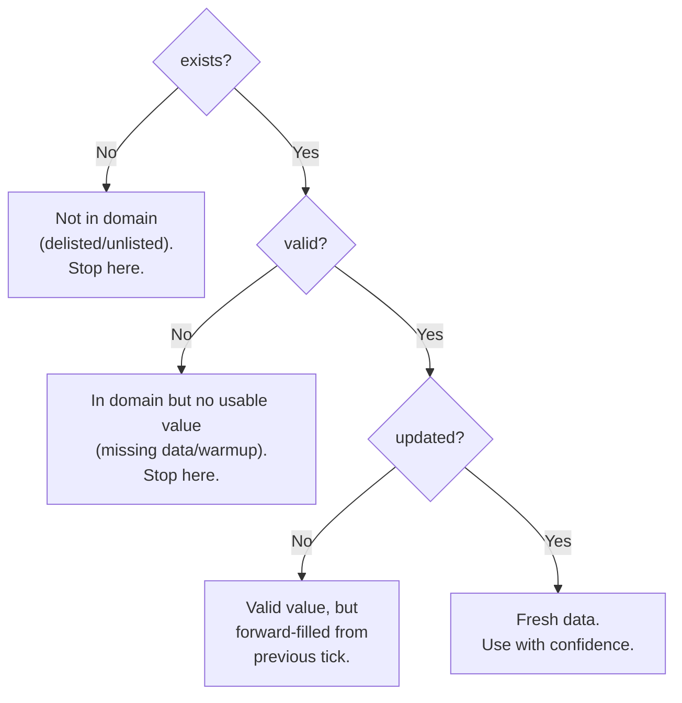

## Why 4 Fields?

In trading systems, a missing value is not the same as zero. A price of `NaN` could mean:
- The symbol doesn't exist on this exchange (`exists=False`)
- The data is corrupted or invalid (`valid=False`)
- The data hasn't been updated this tick (`updated=False`)
- The price is genuinely zero — extremely unlikely for real assets

Most frameworks collapse all these states into a single `NaN`, losing critical information. ClyptQ's **TaggedArray** separates them into 4 explicit fields, making every data point self-describing.

## The 4 Fields

Every piece of data in ClyptQ — FIELD inputs, STATE inputs, operator outputs — is a TaggedArray with exactly 4 numpy arrays:

| Field | Type | Meaning |
|-------|------|---------|
| `value` | `np.ndarray(float64)` | The numeric value |
| `exists` | `np.ndarray(bool)` | Does this data point exist in the domain? |
| `valid` | `np.ndarray(bool)` | Is the value meaningful (not NaN/error)? |
| `updated` | `np.ndarray(bool)` | Was this value freshly computed this tick? |

All 4 arrays share the same shape — either `(n_symbols,)` for a single tick or `(n_time, n_symbols)` for buffered history.

## Combined Masks

TaggedArray provides two combined properties for common checks:

```python
# Both exist AND valid
data.is_valid    # = data.exists & data.valid

# Exist AND valid AND freshly updated
data.is_fresh    # = data.exists & data.valid & data.updated
```

**Use `is_valid`** when you need any usable value (including forward-filled).
**Use `is_fresh`** when you only want newly computed values.

### Hierarchical Gate Structure

The 3 boolean fields form a **hierarchical gate** — each level only matters if the previous level is `True`:



If `exists=False`, `valid` and `updated` are irrelevant.
If `valid=False`, `updated` is irrelevant.

## When Each Field Matters

### `exists`: Domain Membership (Survivorship Bias Prevention)

```python
# Dynamic universe: TOKEN_X was delisted mid-backtest
# At tick before delisting:
exists = [True, True, True]     # BTC, ETH, TOKEN_X all listed

# At tick after delisting:
exists = [True, True, False]    # TOKEN_X delisted → exists=False
value  = [42000.0, 3200.0, NaN]
```

`exists` tracks whether a symbol is **currently listed** on the exchange. This is the foundation for **dynamic universe** support and survivorship bias prevention:
- `exists=True` → Symbol is actively traded at this timestamp
- `exists=False` → Symbol is not listed (never listed, or **delisted**)
- A symbol can transition from `True` to `False` (delisting) during a backtest

Without this field, backtests would only include currently listed symbols — inflating returns by excluding failed tokens that were delisted.

### `valid`: Value Quality

```python
# SMA needs 20 ticks but only 5 have arrived (warmup period)
valid   = [False, False, False]  # Can't compute yet
exists  = [True, True, True]     # Symbols exist, just not enough data
updated = [True, True, True]     # We tried to compute this tick
```

`valid=False` means the symbol **exists** but has **no usable value** right now. Common causes:
- Insufficient data for computation (warmup period)
- Missing/NaN data from exchange (temporary gap)
- Computation error (division by zero, overflow)
- Upstream dependency was invalid

### `updated`: Tick Freshness

```python
# BTC got a new candle, ETH didn't (different update frequencies)
updated = [True, False]
valid   = [True, True]    # Both have valid values
exists  = [True, True]    # Both exist
```

`updated=False` with `valid=True` means the value was **forward-filled** — it's the last known good value, but nothing changed this tick. This is the key to ClyptQ's forward-fill semantics: the value persists, but you know it's stale.

## Shape: 1D vs 2D

### 1D: Single Tick `(n_symbols,)`

When an operator receives its inputs with `lookback=1`, or when a single tick arrives:

```python
# Current close prices for 3 symbols
data.shape = (3,)
data.value   = [42000.0, 3200.0, 150.0]
data.exists  = [True, True, True]
data.valid   = [True, True, True]
data.updated = [True, True, False]   # SOL didn't update this tick
```

### 2D: Buffered History `(n_time, n_symbols)`

When an operator requests `lookback > 1`, the RollingBuffer delivers a 2D TaggedArray:

```python
# 20 ticks of history for 3 symbols
data.shape = (20, 3)
data.value   # shape (20, 3) — prices over time
data.exists  # shape (20, 3) — which existed at each tick
data.valid   # shape (20, 3) — which were valid at each tick
data.updated # shape (20, 3) — which were freshly updated at each tick
```

Indexing works naturally:
```python
data[-1]       # Most recent tick → 1D TaggedArray (3,)
data[0:5]      # First 5 ticks → 2D TaggedArray (5, 3)
data[-1].value # Latest values → np.array([42000.0, 3200.0, 150.0])
```

## AxisMeta: Symbol Alignment

TaggedArrays carry `AxisMeta` — frozen metadata about the symbol dimension:

```python
from clyptq.system.tagged_tensor import AxisMeta

meta = AxisMeta(
    name="Symbol",
    item_order=("BTC/USDT", "ETH/USDT", "SOL/USDT")
)

# Get index of a specific symbol
idx = meta.index_of("ETH/USDT")  # → 1
data.value[idx]                    # → 3200.0
```

`item_order` is an **immutable tuple** — the ordering never changes during execution. This guarantees that index `0` always means the same symbol across all operators and all ticks.

## Creating TaggedArrays

### In Operators

Most operators receive TaggedArrays as inputs and return them as outputs:

```python
class MyOperator(BaseOperator):
    def compute(self, data, timestamp, context):
        close = data["close"]           # Input TaggedArray
        result = close.value * 2        # Your computation

        return TaggedArray(
            value=result,
            exists=close.exists,        # Preserve domain info
            valid=close.valid,          # Preserve validity
            updated=close.updated       # Preserve freshness
        )
```

### Factory Methods

```python
# Empty (all NaN, all masks False)
empty = TaggedArray.empty(n=5)

# Filled with a constant (all masks True)
filled = TaggedArray.full(n=5, fill_value=1.0)

# From numpy arrays
custom = TaggedArray(
    value=np.array([1.0, 2.0, 3.0]),
    exists=np.array([True, True, True]),
    valid=np.array([True, True, False]),
    updated=np.array([True, False, False])
)
```

## TaggedTensor: Extended Container

`TaggedTensor` wraps `TaggedArray` with additional capabilities:

```python
from clyptq.system.tagged_tensor import TaggedTensor

# Create from dict (auto-aligns to axis)
tensor = TaggedTensor.from_dict(
    data={"BTC/USDT": 0.5, "ETH/USDT": 0.3},
    axis_order=("BTC/USDT", "ETH/USDT", "SOL/USDT"),
    axis_name="Symbol"
)
# value = [0.5, 0.3, 0.0]  — SOL filled with 0
# exists = [True, True, False]

# Create from text (for semantic operators)
text_tensor = TaggedTensor.from_text(
    texts=["BTC bullish", "ETH neutral", ""],
    axis_meta=meta
)
# value = [1.0, 1.0, 0.0]  — 1.0 if text non-empty
# metadata["text"] = ["BTC bullish", "ETH neutral", ""]
```

### Metadata

TaggedTensors support arbitrary metadata for non-numeric data:

```python
tensor = tensor.with_metadata("source", "llm_scorer")
tensor = tensor.with_metadata("urls", ["https://..."])

source = tensor.get_metadata("source")  # → "llm_scorer"
```

This is used by semantic operators (LLM, WebSearch) to carry text alongside numeric scores.

## Merge Operations

When combining two TaggedArrays (e.g., adding signals), masks propagate conservatively:

```python
from clyptq.system.tagged_tensor import merge_tagged_arrays

result = merge_tagged_arrays(a, b, operation="mul")
```

| Output Field | Rule | Reason |
|-------------|------|--------|
| `exists` | `a.exists & b.exists` | Both must exist |
| `valid` | `a.valid & b.valid` | Both must be valid |
| `updated` | `a.updated \| b.updated` | Either updated means the result changed |

This ensures invalid data never silently contaminates downstream computations.

## Practical Impact

### Why Not Just NaN?

Consider a backtest that includes a token that gets delisted mid-test:

| Scenario | NaN-only framework | TaggedArray (ClyptQ) |
|---|---|---|
| BTC price arrives | `42000.0` | `exists=True, valid=True, updated=True` |
| Token delisted | `NaN` — Missing? Error? Delisted? | `exists=False` — delisted, exclude from universe |
| Data gap (exchange issue) | `NaN` — same as delisted? | `exists=True, valid=False` — still listed, just missing data |
| SMA during warmup | `NaN` — same as above? | `exists=True, valid=False` — not enough history yet |
| BTC no new candle | `42000.0` — same as fresh? | `exists=True, valid=True, updated=False` — forward-filled |

Without TaggedArray, a delisted token, a data gap, and a warmup period all look like `NaN`. Operators can't tell them apart. With the 3-gate system, each scenario is unambiguous.

### Forward-Fill Distinction

This is critical for the [FIELD](/engine/field-data-principle) system. When a data source hasn't updated:

```
Tick 1: value=42000, updated=True   ← New data
Tick 2: value=42000, updated=False  ← Forward-filled (no new candle)
Tick 3: value=42100, updated=True   ← New data
Tick 4: value=42100, updated=False  ← Forward-filled
```

Operators that should only act on new data check `updated`. Operators that need any valid value check `valid`. This granularity prevents spurious signals from stale data.

## Relationship to Other Concepts

- **[FIELD Data Principle](/engine/field-data-principle)**: FIELD data arrives as TaggedArrays
- **[STATE Principle](/engine/state-principle)**: STATE data arrives as TaggedArrays
- **[Lookback Buffers](/engine/lookback-buffers)**: RollingBuffer stores TaggedArrays and delivers them as 2D TaggedArrays
- **[StatefulGraph](/engine/stateful-graph)**: All operator inputs and outputs are TaggedArrays
- **[Operator Protocol](/engine/operator-protocol)**: `compute()` receives and returns TaggedArrays
