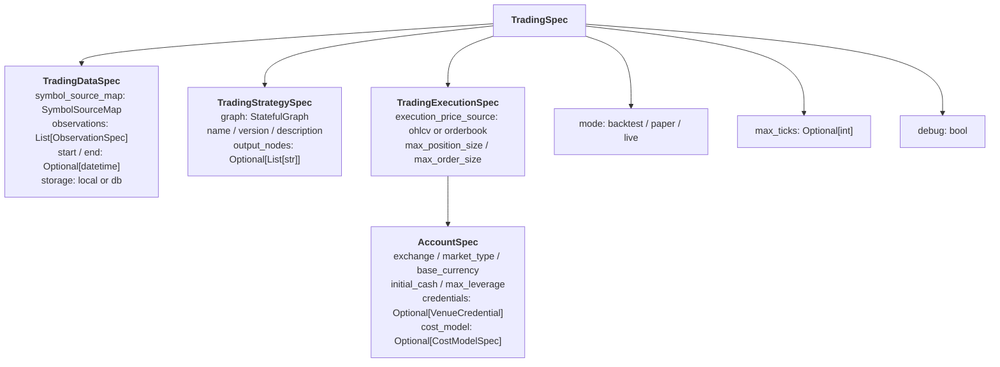

## What is TradingSpec?

`TradingSpec` is the **single configuration object** that completely defines a trading system — what data to use, what strategy to run, and how to execute orders. Change `mode` from `"backtest"` to `"live"` and the same strategy runs against real markets with real money.

```python
spec = TradingSpec(
    data=TradingDataSpec(...),          # What data to consume
    strategy=TradingStrategySpec(...),   # What strategy to run
    execution=TradingExecutionSpec(...), # How to execute trades
    mode="backtest",                    # backtest | paper | live
)
```

## Hierarchy Overview



## TradingDataSpec

Defines **what data** the system consumes.

```python
from clyptq.apps.trading.spec import TradingDataSpec, OHLCVSpec, SymbolSourceMap

data = TradingDataSpec(
    symbol_source_map=SymbolSourceMap({
        "binance:futures": ["BTC/USDT", "ETH/USDT"],
        "gateio:futures":  ["SOL/USDT"],
    }),
    observations=[
        OHLCVSpec(
            exchange="binance",
            market_type="futures",
            timeframe="1m",
        ),
        OHLCVSpec(
            exchange="gateio",
            market_type="futures",
            timeframe="1m",
        ),
    ],
    start=datetime(2024, 1, 1),
    end=datetime(2024, 12, 31),
)
```

### SymbolSourceMap

Maps exchanges to symbols, creating the axis keys used throughout the system:

```python
symbol_map = SymbolSourceMap({
    "binance:futures": ["BTC/USDT", "ETH/USDT"],
    "gateio:futures":  ["SOL/USDT"],
})

# Generates axis_keys:
# "binance:futures:BTC/USDT"
# "binance:futures:ETH/USDT"
# "gateio:futures:SOL/USDT"
```

**Key properties:**

| Property | Description |
|----------|-------------|
| `axis_keys` | All unique axis keys (source-prefixed) |
| `all_symbols` | Unique raw symbols without source prefix |
| `sources` | All source keys (e.g., `["binance:futures", "gateio:futures"]`) |

**Key methods:**

| Method | Description |
|--------|-------------|
| `symbols_for(source)` | Raw symbols for a source |
| `axis_keys_for(source)` | Axis keys for a source |
| `venue_for(axis_key)` | Get execution venue for an axis key |

**Execution routing** allows decoupling data source from execution venue (e.g., use Tiingo data but execute on Alpaca):

```python
symbol_map = SymbolSourceMap(
    source_symbols={"tiingo:stock": ["AAPL", "GOOG"]},
    execution_routing={
        "tiingo:stock:AAPL": "alpaca:stock",
        "tiingo:stock:GOOG": "alpaca:stock",
    }
)
```

### OHLCVSpec

Currently the primary data source:

```python
OHLCVSpec(
    exchange="binance",               # Exchange ID
    market_type="futures",            # spot, futures, perpetual, linear
    timeframe="1m",                   # 1m, 5m, 15m, 1h, 4h, 1d
)
```

`exchange` and `market_type` can be lists — the driver **expands** them into concrete specs:

```python
# This single spec:
OHLCVSpec(
    exchange=["binance", "gateio"],
    market_type=["futures", "spot"],
    timeframe="1m",
)

# Expands to 4 concrete specs:
# binance:futures, binance:spot, gateio:futures, gateio:spot
```

## TradingStrategySpec

Wraps the [StatefulGraph](/engine/stateful-graph) with metadata:

```python
from clyptq.apps.trading.spec import TradingStrategySpec

strategy = TradingStrategySpec(
    graph=my_graph,                     # StatefulGraph instance
    name="Momentum Crossover",         # Strategy name
    version="1.0",                     # Version string
    description="SMA crossover ...",   # Description
    output_nodes=["signal", "equity"], # Which nodes to include in results
)
```

| Field | Type | Default | Description |
|-------|------|---------|-------------|
| `graph` | `StatefulGraph` | Required | The computation graph |
| `name` | `str` | `"unnamed"` | Strategy name |
| `version` | `str` | `"1.0"` | Version identifier |
| `description` | `str` | `""` | Strategy description |
| `output_nodes` | `Optional[List[str]]` | `None` | Nodes to collect in results (None = all) |

## TradingExecutionSpec

Defines **how** trades are executed:

```python
from clyptq.apps.trading.spec import TradingExecutionSpec, AccountSpec

execution = TradingExecutionSpec(
    accounts=(
        AccountSpec(
            exchange="binance",
            market_type="futures",
            base_currency="USDT",
            initial_cash=10000.0,
        ),
    ),
    execution_price_source="ohlcv",
    max_position_size=None,
    max_order_size=None,
)
```

| Field | Type | Default | Description |
|-------|------|---------|-------------|
| `accounts` | `Tuple[AccountSpec, ...]` | `()` | Trading accounts (required) |
| `execution_price_source` | `"ohlcv"` \| `"orderbook"` | `None` | Price source for backtest fills |
| `max_position_size` | `Optional[float]` | `None` | Global position size limit |
| `max_order_size` | `Optional[float]` | `None` | Global order size limit |
| `min_order_interval_s` | `float` | `0.0` | Minimum seconds between orders |

### AccountSpec

Each exchange account is defined separately:

```python
AccountSpec(
    exchange="binance",           # Required: exchange ID
    market_type="futures",        # Required: spot, futures, perpetual, linear
    base_currency="USDT",         # Required: account currency (uppercase 3-4 letters)
    initial_cash=10000.0,         # For backtest/paper (None for live)
    max_leverage=3.0,             # None = use venue default
    cost_model=CostModelSpec(...),# None = auto-fetch from exchange
    credentials=None,             # Required for live mode
)
```

| Field | Type | Default | Notes |
|-------|------|---------|-------|
| `exchange` | `str` | Required | `"binance"`, `"gateio"`, `"bybit"`, `"okx"`, `"coinbase"` |
| `market_type` | `str` | Required | `"spot"`, `"futures"`, `"perpetual"`, `"linear"` |
| `base_currency` | `str` | Required | `"USDT"`, `"USDC"`, `"USD"` (must be uppercase) |
| `initial_cash` | `Optional[float]` | `None` | Required for backtest. Forbidden for live. Defaults to 10000 if unset. |
| `max_leverage` | `Optional[float]` | `None` | Auto: 1.0 for spot, venue max for futures |
| `cost_model` | `Optional[CostModelSpec]` | `None` | Override fees. None = auto-fetch. |
| `credentials` | `Optional[VenueCredential]` | `None` | Required for live mode |

**`key` property**: Returns `"{exchange}:{market_type}"` (e.g., `"binance:futures"`)

### CostModelSpec

Override trading fees per account:

```python
CostModelSpec(
    taker_fee=0.0004,    # 0.04% (default)
    maker_fee=0.0002,    # 0.02% (default)
    slippage_bps=2.0,    # 2 basis points (default)
)
```

If not specified, fees are auto-fetched from the exchange via CCXT.

**Zero-cost backtest:**
```python
AccountSpec(
    ...,
    cost_model=CostModelSpec(taker_fee=0.0, maker_fee=0.0, slippage_bps=0.0)
)
```

## Execution Modes

### Backtest

```python
spec = TradingSpec(
    ...,
    mode="backtest",
)
```

- Uses historical data from `start` to `end`
- Simulated execution with CostModelSpec fees
- `initial_cash` required per account
- No API credentials needed

### Paper

```python
spec = TradingSpec(
    ...,
    mode="paper",
)
```

- Uses live/current data from exchange
- Simulated execution (no real orders placed)
- `initial_cash` optional (defaults to 10000.0)
- No API credentials needed

### Live

```python
spec = TradingSpec(
    ...,
    mode="live",
)
```

- Uses live data from exchange APIs
- Real order execution
- **Requires** API credentials
- **Forbids** `initial_cash` (uses actual exchange balance)
- Credentials from environment: `CLYPTQ_{EXCHANGE}_{MARKET_TYPE}_API_KEY`

## Supported Exchanges

| Exchange | Spot | Futures | Max Leverage | Notes |
|----------|------|---------|-------------|-------|
| Binance | USDT, FDUSD, USDC, BTC, ETH | USDT, USDC | 125x | |
| Gate.io | USDT, BTC, ETH | USDT | 100x | |
| Bybit | USDT, USDC | USDT, USDC | 100x | Also supports `linear` |
| OKX | USDT, USDC | USDT, USDC | 125x | Requires passphrase |
| Coinbase | USD, USDC | USDC | 10x | Perpetual (limited) |

## Validation

`TradingSpec.validate()` enforces:

1. **Mode** must be explicitly set (`"backtest"`, `"paper"`, or `"live"`)
2. **Strategy.graph** must not be None
3. **Observations** must not be empty
4. **Live mode**: accounts must have credentials, `initial_cash` must NOT be set
5. **Backtest mode**: accounts need observation data at system clock resolution

`AccountSpec.__post_init__()` validates:
- `base_currency` is uppercase 3-4 letters
- `exchange:market_type` is a valid combination
- `base_currency` is supported by the exchange/market_type
- `max_leverage` doesn't exceed venue maximum

`SymbolSourceMap.validate_base_currencies()`:
- Symbol quote currencies must match account base currencies
- Prevents PnL calculation errors (e.g., USD vs USDT mismatch)

## Complete Example

```python
from datetime import datetime
from clyptq.system.graph import StatefulGraph, Input
from clyptq.apps.trading.spec import (
    TradingSpec, TradingDataSpec, TradingStrategySpec,
    TradingExecutionSpec, AccountSpec, CostModelSpec,
    OHLCVSpec, SymbolSourceMap,
)

# 1. Build strategy graph
graph = StatefulGraph()
graph.add_node("sma_fast", SMA(span=10),
    inputs=[Input("FIELD:binance:futures:ohlcv:close", "1m", lookback=10)])
graph.add_node("sma_slow", SMA(span=50),
    inputs=[Input("FIELD:binance:futures:ohlcv:close", "1m", lookback=50)])
graph.add_node("signal", CrossoverAlpha(),
    inputs=[
        Input("sma_fast", "1m", lookback=2),
        Input("sma_slow", "1m", lookback=2),
    ])

# 2. Compose TradingSpec
spec = TradingSpec(
    data=TradingDataSpec(
        symbol_source_map=SymbolSourceMap({
            "binance:futures": ["BTC/USDT", "ETH/USDT"],
        }),
        observations=[
            OHLCVSpec(exchange="binance", market_type="futures", timeframe="1m"),
        ],
        start=datetime(2024, 1, 1),
        end=datetime(2024, 12, 31),
    ),
    strategy=TradingStrategySpec(
        graph=graph,
        name="SMA Crossover",
        version="1.0",
        output_nodes=["signal"],
    ),
    execution=TradingExecutionSpec(
        accounts=(
            AccountSpec(
                exchange="binance",
                market_type="futures",
                base_currency="USDT",
                initial_cash=10000.0,
                max_leverage=3.0,
            ),
        ),
    ),
    mode="backtest",
)

# 3. Validate and run
spec.validate()
driver = TradingDriver.from_spec(spec)
results = driver.run()
```

### Switching to Live

Only `mode`, `initial_cash`, and `credentials` change:

```python
live_spec = TradingSpec(
    data=TradingDataSpec(
        symbol_source_map=same_symbol_map,
        observations=same_observations,
        # No start/end for live
    ),
    strategy=same_strategy,       # Identical graph
    execution=TradingExecutionSpec(
        accounts=(
            AccountSpec(
                exchange="binance",
                market_type="futures",
                base_currency="USDT",
                # No initial_cash — uses exchange balance
                max_leverage=3.0,
                credentials=VenueCredential(
                    api_key=os.getenv("CLYPTQ_BINANCE_FUTURES_API_KEY"),
                    api_secret=os.getenv("CLYPTQ_BINANCE_FUTURES_API_SECRET"),
                ),
            ),
        ),
    ),
    mode="live",                  # Only this changes
)
```

## Multi-Exchange Example

```python
spec = TradingSpec(
    data=TradingDataSpec(
        symbol_source_map=SymbolSourceMap({
            "binance:futures": ["BTC/USDT", "ETH/USDT"],
            "gateio:futures":  ["SOL/USDT", "DOGE/USDT"],
        }),
        observations=[
            OHLCVSpec(exchange="binance", market_type="futures", timeframe="1m"),
            OHLCVSpec(exchange="gateio", market_type="futures", timeframe="1m"),
        ],
    ),
    strategy=TradingStrategySpec(graph=multi_venue_graph),
    execution=TradingExecutionSpec(
        accounts=(
            AccountSpec(
                exchange="binance", market_type="futures",
                base_currency="USDT", initial_cash=10000.0,
            ),
            AccountSpec(
                exchange="gateio", market_type="futures",
                base_currency="USDT", initial_cash=10000.0,
            ),
        ),
    ),
    mode="backtest",
)
```

Each account creates its own STATE namespace (`STATE:binance:futures:*`, `STATE:gateio:futures:*`), enabling venue-specific equity tracking and order execution.

## Common Mistakes

### Mismatched base_currency

```python
# Symbol is BTC/USDT but account uses USD
AccountSpec(exchange="binance", market_type="futures", base_currency="USD")
# → validate_base_currencies() error: USDT ≠ USD
```

### Missing observation for account

```python
# Account for gateio but no GateIO observation
data = TradingDataSpec(
    symbol_source_map=SymbolSourceMap({"gateio:futures": ["BTC/USDT"]}),
    observations=[OHLCVSpec(exchange="binance", ...)],  # Missing gateio!
)
# → Validation error
```

### initial_cash in live mode

```python
AccountSpec(
    exchange="binance", market_type="futures",
    base_currency="USDT",
    initial_cash=10000.0,  # Forbidden in live mode!
)
# → Validation error: use actual exchange balance
```

## Relationship to Other Concepts

- **[StatefulGraph](/engine/stateful-graph)**: `TradingStrategySpec.graph` holds the graph
- **[FIELD Data Principle](/engine/field-data-principle)**: Observations define available FIELD sources
- **[STATE Principle](/engine/state-principle)**: AccountSpec defines STATE namespaces
- **[Execution Pipeline](/engine/execution-pipeline)**: TradingExecutionSpec configures the executor
- **[Lookback Buffers](/engine/lookback-buffers)**: Warmup is computed from graph + data specs
