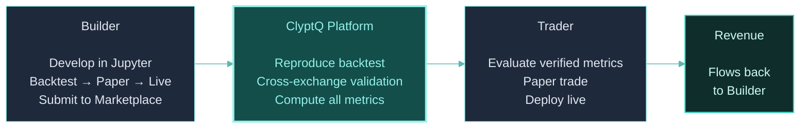
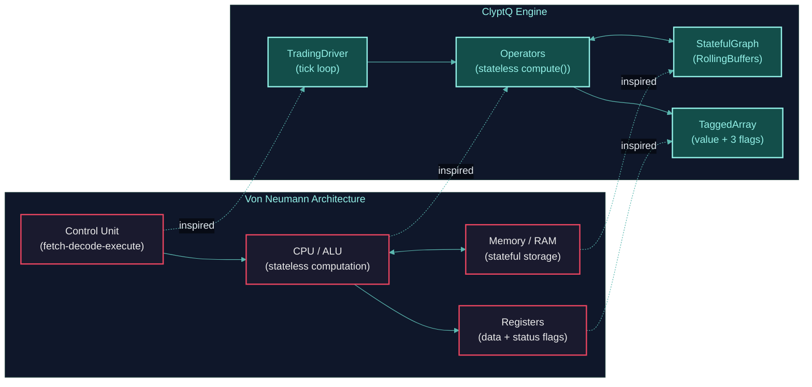
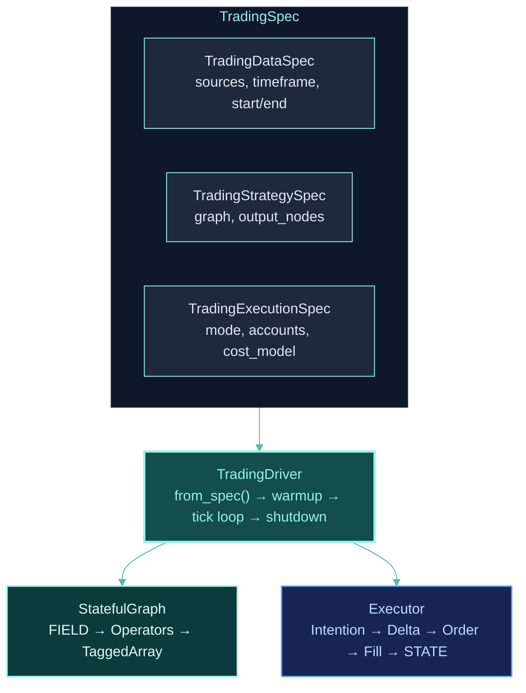
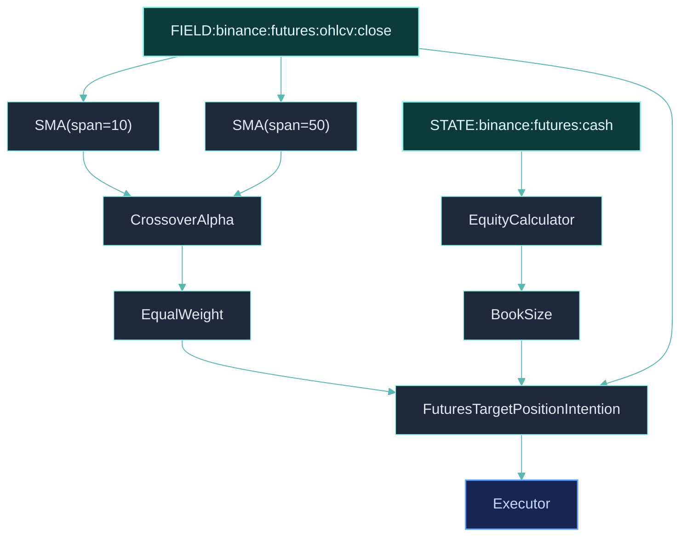

## Trading Commerce Ecosystem

ClyptQ is a **Trading Commerce platform** — a marketplace where quantitative strategies are independently verified, cross-exchange validated, and deployed with trust between Builders and Traders.



<CardGroup cols={3}>
  <Card title="For Builders" icon="wrench" href="/platform/builder-guide">
    Production infrastructure, same code from research to live, revenue via marketplace
  </Card>
  <Card title="Marketplace" icon="store" href="/platform/marketplace">
    Independent backtest verification, cross-exchange validation, platform-computed metrics
  </Card>
  <Card title="For Traders" icon="chart-line" href="/platform/trader-guide">
    Evaluate verified strategies, one-click deploy, built-in safety features
  </Card>
</CardGroup>

## The Architecture Behind the Architecture

When we set out to build ClyptQ, we asked a fundamental question: **what is the simplest possible architecture that makes Research = Backtest = Live not just possible, but inevitable?**

The answer came from computer science fundamentals. Every computer built since 1945 follows the **Von Neumann architecture** — a design that separates stateless computation (the CPU) from stateful storage (RAM), connected by a control unit that orchestrates the fetch-decode-execute cycle. This separation is why the same program can process data from any source — disk, network, keyboard — without changing a single instruction.

ClyptQ applies the same principle to quantitative trading:

| Von Neumann | ClyptQ | Why It Matters |
|---|---|---|
| **CPU / ALU** | **Operators** | Pure computation. No memory, no side effects. Process input, produce output. |
| **RAM / Memory** | **StatefulGraph** | Stores all state — buffers, history, routing — via RollingBuffers. |
| **Control Unit** | **TradingDriver** | The fetch-decode-execute cycle: receive tick, execute graph, update state. |
| **Registers** | **TaggedArray** | Fixed-format data containers with metadata (value, exists, valid, updated). |
| **Address Space** | **FIELD / STATE** | Two separate memory namespaces — market data in, portfolio state back. |
| **Instruction Pipeline** | **Topological Sort** | Dependency-driven execution order, computed once at graph construction. |



This is not a metaphor — it is the actual design principle. Operators are deliberately stateless so that the same `compute()` call produces identical results regardless of where data originates. The StatefulGraph deliberately owns all state so that buffer management, warmup, and routing are handled in one place. The TradingDriver deliberately follows a tick loop (fetch data, execute graph, update state) because that pattern guarantees deterministic execution across modes.

**This is also the key to understanding Research = Backtest = Live.** Just as the same CPU executes the same instruction set whether data comes from an SSD, RAM, or a network socket, ClyptQ operators execute identically whether data comes from Parquet files (backtest), WebSocket feeds (live), or simulated streams (paper). The computation layer does not know — and does not need to know — where its data originates.

<Tip>
This design principle is useful for understanding every page in the Engine Fundamentals section. When you read about StatefulGraph, think "memory." When you read about operators, think "CPU instructions." When you read about FIELD/STATE, think "address spaces."
</Tip>

## The 4-Layer Architecture



## Layer 1: TradingSpec (Configuration)

Everything starts with a [TradingSpec](/engine/trading-spec) — a declarative configuration that defines the complete strategy:

```python
spec = TradingSpec(
    data=TradingDataSpec(
        symbol_source_map=symbol_source_map,
        observations=[OHLCVSpec(exchange="binance", market_type="futures", timeframe="1m")],
        start=datetime(2024, 1, 1, tzinfo=timezone.utc),
        end=datetime(2024, 12, 31, tzinfo=timezone.utc),
    ),
    strategy=TradingStrategySpec(graph=graph, output_nodes=["equity", "signal"]),
    execution=TradingExecutionSpec(
        accounts=[AccountSpec(exchange="binance", market_type="futures", base_currency="USDT", initial_cash=10_000)],
    ),
    mode="backtest",
)
```

| Sub-Spec | What It Defines | Key Fields |
|----------|----------------|------------|
| **TradingDataSpec** | What data to load | `symbol_source_map`, `observations`, `start`/`end` |
| **TradingStrategySpec** | What computation to run | `graph` (StatefulGraph), `output_nodes` |
| **TradingExecutionSpec** | How to trade | `accounts` (with fees, leverage) |

## Layer 2: TradingDriver (Orchestrator)

The driver reads the spec and manages the entire lifecycle:

```python
driver = TradingDriver.from_spec(spec)
for result in driver:
    print(f"{result.timestamp} | equity: {result.outputs.get('equity')}")
```

### What `from_spec()` does

1. **Expands specs** — Resolves symbol mappings, observation specs, account configurations
2. **Computes warmup** — Traces the graph backward to find minimum ticks needed
3. **Creates state** — Initializes `TradingState` with cash, positions, margin
4. **Creates executor** — `BacktestFactory` for backtest/paper, `LiveFactory` for live
5. **Loads data** — Parquet for historical, WebSocket for live

### What each tick does

```
1. Receive market data (FIELD)     → OHLCV bar from Parquet or WebSocket
2. Update FIELD buffers            → Push new data into RollingBuffers
3. Execute graph (topological)     → Operators compute in dependency order
4. Collect intentions              → Graph outputs trading intentions
5. Compute deltas                  → Current position vs target position
6. Generate orders                 → Convert deltas to buy/sell orders
7. Execute orders                  → BacktestFactory (sim) or LiveFactory (real)
8. Apply costs                     → Fees, slippage, funding (if settlement tick)
9. Check liquidation               → Per-exchange margin ratio check (futures)
10. Update STATE                   → Cash, positions, margin, equity
```

### Execution modes

| Mode | Data Source | Fill Engine | Use Case |
|------|-----------|------------|---------|
| **backtest** | Parquet (historical) | BacktestFactory (simulated) | Strategy validation |
| **paper** | WebSocket (live) | BacktestFactory (simulated) | Real-time verification |
| **live** | WebSocket (live) | LiveFactory (real orders) | Production trading |

The graph and operators are identical across all modes. Only the data source and fill engine change. See [Code Parity](/competitive/code-parity) for why this matters.

## Layer 3: StatefulGraph (Computation Engine)

The [StatefulGraph](/engine/stateful-graph) is a DAG of [operators](/engine/operators):



Market data enters via [FIELD](/engine/field-state), portfolio state enters via [STATE](/engine/field-state). All data flows as [TaggedArrays](/engine/tagged-array) through [RollingBuffers](/engine/lookback-buffers). Operators execute in topological order.

## Layer 4: Executor (Fill Engine)

The executor converts graph outputs into fills:

```
1. Intention: "I want 0.5 BTC long"      (target position)
2. Delta:     "I need to buy 0.3 BTC"    (current: 0.2, target: 0.5)
3. Order:     "BUY 0.3 BTC at market"     (order object)
4. Fill:      "Filled 0.3 BTC at $45,000" (execution result)
```

At each fill, the executor applies exchange-specific [costs](/backtesting/cost-models) (fees, slippage, funding) and checks [liquidation](/backtesting/liquidation-logic).

## What Changes Per Mode

| Component | Backtest | Paper | Live |
|-----------|----------|-------|------|
| **TradingSpec** | Same | Same | Same |
| **StatefulGraph** | Same | Same | Same |
| **Operators** | Same | Same | Same |
| **TaggedArrays** | Same | Same | Same |
| | | | |
| **Data Source** | Parquet (historical) | WebSocket (live) | WebSocket (live) |
| **Fill Engine** | BacktestFactory | BacktestFactory | LiveFactory (real) |

Everything above the line is identical. Only the data source and fill engine change — controlled by `mode="backtest"` vs `"paper"` vs `"live"`.

## Next Steps

<CardGroup cols={2}>
  <Card title="FIELD & STATE" icon="database" href="/engine/field-state">
    How market data and portfolio state flow through the graph
  </Card>
  <Card title="StatefulGraph" icon="diagram-project" href="/engine/stateful-graph">
    DAG execution, topological ordering, warmup calculation
  </Card>
  <Card title="TradingSpec" icon="file-code" href="/engine/trading-spec">
    Complete configuration hierarchy reference
  </Card>
  <Card title="Operator System" icon="plug" href="/engine/operators">
    Operators across 14 roles
  </Card>
</CardGroup>
