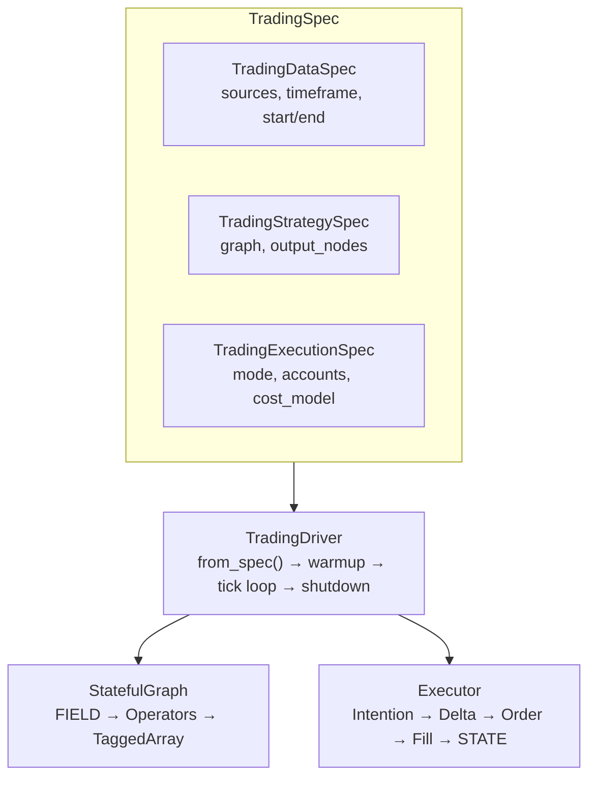
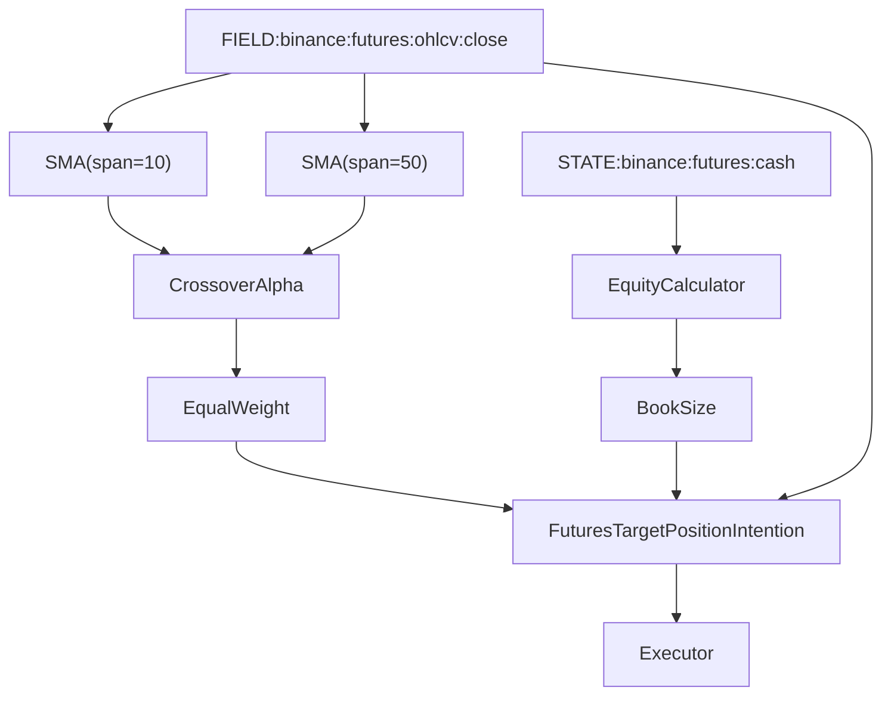

## The Big Picture

ClyptQ is built on a 4-layer architecture where strategies are declared as specs, executed by a driver, computed through a graph, and settled by an executor. The same architecture runs identically in backtest, paper, and live modes.



## Layer 1: TradingSpec (Configuration)

Everything starts with a `TradingSpec` — a declarative configuration that defines the complete strategy:

```python
spec = TradingSpec(
    data=TradingDataSpec(
        symbol_source_map=symbol_source_map,
        observations=[OHLCVSpec(exchange="binance", market_type="futures", timeframe="1m")],
        start=datetime(2024, 1, 1, tzinfo=timezone.utc),
        end=datetime(2024, 12, 31, tzinfo=timezone.utc),
    ),
    strategy=TradingStrategySpec(
        graph=graph,
        output_nodes=["equity", "signal"],
    ),
    execution=TradingExecutionSpec(
        mode="backtest",
        accounts=[AccountSpec(exchange="binance", market_type="futures", initial_cash=10_000)],
        execution_price_source="ohlcv",
    ),
    debug=True,
)
```

**Three sub-specs:**

| Sub-Spec | What It Defines | Key Fields |
|----------|----------------|------------|
| **TradingDataSpec** | What data to load | `symbol_source_map`, `observations`, `start`/`end` |
| **TradingStrategySpec** | What computation to run | `graph` (StatefulGraph), `output_nodes` |
| **TradingExecutionSpec** | How to trade | `mode`, `accounts` (with fees, leverage), `execution_price_source` |

See [TradingSpec Reference](/engine/trading-spec) for every field.

## Layer 2: TradingDriver (Orchestrator)

The driver is the runtime orchestrator. It reads the spec and manages the entire lifecycle:

```python
driver = TradingDriver.from_spec(spec)

for result in driver:
    # Each iteration = one tick
    print(f"{result.timestamp} | equity: {result.outputs.get('equity')}")
```

### What `from_spec()` does

1. **Expands specs** — Resolves symbol mappings, observation specs, account configurations
2. **Computes warmup** — Traces the graph backward to find minimum ticks needed
3. **Creates state** — Initializes `TradingState` with cash, positions, margin for each account
4. **Creates executor** — `BacktestFactory` for backtest/paper, `LiveFactory` for live
5. **Loads data** — Parquet for historical, WebSocket for live
6. **Auto-injects funding** — Adds `FundingRateSpec` for futures accounts

### What each tick does

```
For each tick:
  1. Receive market data (FIELD)     → OHLCV bar from Parquet or WebSocket
  2. Update FIELD buffers            → Push new data into RollingBuffers
  3. Execute graph (topological)     → Operators compute in dependency order
  4. Collect intentions              → Graph outputs trading intentions
  5. Compute deltas                  → Current position vs target position
  6. Generate orders                 → Convert deltas to buy/sell orders
  7. Execute orders                  → BacktestFactory (sim) or LiveFactory (real)
  8. Apply costs                     → Fees, slippage, funding (if settlement tick)
  9. Check liquidation               → Per-exchange margin ratio check (futures)
  10. Update STATE                   → Cash, positions, margin, equity
```

### Execution modes

| Mode | Data Source | Fill Engine | Use Case |
|------|-----------|------------|---------|
| **backtest** | Parquet (historical) | BacktestFactory (simulated) | Strategy validation |
| **paper** | WebSocket (live) | BacktestFactory (simulated) | Real-time verification |
| **live** | WebSocket (live) | LiveFactory (real orders via CCXT) | Production trading |

The graph and operators are identical across all modes. Only the data source and fill engine change.

## Layer 3: StatefulGraph (Computation Engine)

The graph is a DAG (Directed Acyclic Graph) of operators. It manages:

### Data flow



### Two data namespaces

| Namespace | Convention | Source | Example |
|-----------|-----------|--------|---------|
| **FIELD** | `FIELD:exchange:market:observation:field` | Market data from exchanges | `FIELD:binance:futures:ohlcv:close` |
| **STATE** | `STATE:exchange:market:key` | Portfolio state from executor | `STATE:binance:futures:cash` |

FIELD data flows forward through the graph. STATE data feeds back from the executor after each fill. See [FIELD Principle](/engine/field-data-principle) and [STATE Principle](/engine/state-principle).

### RollingBuffers

Each operator input gets its own pre-allocated circular buffer:

```
Input("sma_fast", "1m", lookback=2)
  → RollingBuffer(capacity=2)
  → Operator receives shape (2, n_symbols) on each tick
```

Buffers only expose declared history — making lookahead structurally impossible. See [Lookback Buffers](/engine/lookback-buffers).

### Execution order

Operators execute in topological order (Kahn's algorithm):
1. Compute in-degree for each node
2. Start with zero in-degree nodes (FIELD sources)
3. Process each node, decrement dependents' in-degrees
4. Repeat until all nodes are processed

This guarantees every operator's inputs are ready before it executes.

## Layer 4: Executor (Fill Engine)

The executor converts graph outputs (intentions) into actual fills:

### Intention → Delta → Order → Fill

```
1. Intention: "I want 0.5 BTC long"      (target position)
2. Delta:     "I need to buy 0.3 BTC"    (current: 0.2, target: 0.5)
3. Order:     "BUY 0.3 BTC at market"     (order object)
4. Fill:      "Filled 0.3 BTC at $45,000" (execution result)
```

### Two execution modes

**INSTANT** — Orders fill at the current bar's close price. Used for strategy logic validation.

**LATENT** — Orders fill against a simulated orderbook. Realistic execution with depth-dependent slippage.

### Cost application

At each fill, the executor applies:
- **Maker/taker fees** (exchange-specific, auto-fetched via CCXT)
- **Slippage** (BPS-based in INSTANT, orderbook-based in LATENT)
- **Funding rates** (at 8-hour settlement ticks for futures)
- **Liquidation check** (per-exchange margin ratio formulas)

See [Cost Models](/backtesting/cost-models) and [Liquidation Logic](/backtesting/liquidation-logic).

## The Key Insight: What Changes Per Mode

| Component | Backtest | Paper | Live |
|-----------|----------|-------|------|
| **TradingSpec** | Same | Same | Same |
| **StatefulGraph** | Same | Same | Same |
| **Operators** | Same | Same | Same |
| **TaggedArrays** | Same | Same | Same |
| | | | |
| **Data Source** | Parquet (historical) | WebSocket (live) | WebSocket (live) |
| **Fill Engine** | BacktestFactory (simulated) | BacktestFactory (simulated) | LiveFactory (real orders) |
| **start/end** | Required | Omitted | Omitted |
| **API credentials** | Not needed | Not needed | Required |

**Everything above the line is identical.** The strategy, graph, operators, and data structures don't change. Only the data source and fill engine are swapped — and this is controlled by a single parameter: `mode="backtest"` vs `mode="paper"` vs `mode="live"`.

## Related Pages

<CardGroup cols={2}>
  <Card title="FIELD Data Principle" icon="database" href="/engine/field-data-principle">
    How market data flows into the graph
  </Card>
  <Card title="STATE Principle" icon="server" href="/engine/state-principle">
    How portfolio state feeds back from the executor
  </Card>
  <Card title="StatefulGraph" icon="diagram-project" href="/engine/stateful-graph">
    DAG execution, topological ordering, RollingBuffers
  </Card>
  <Card title="TradingSpec" icon="file-code" href="/engine/trading-spec">
    Complete configuration hierarchy reference
  </Card>
</CardGroup>
