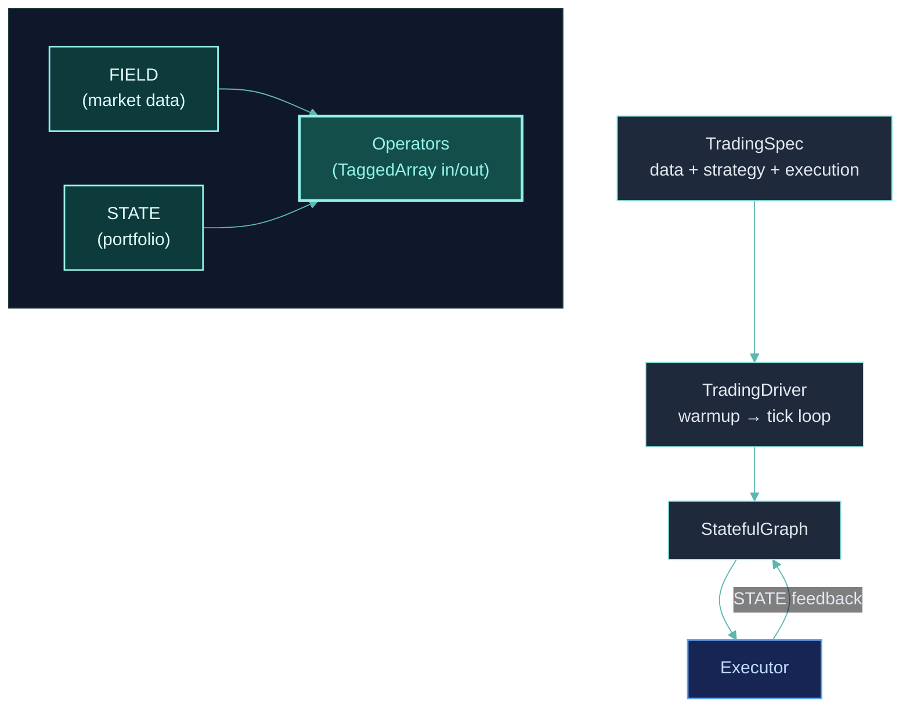

## Before You Dive In

ClyptQ has five core concepts that appear everywhere — in quickstart code, tutorials, and engine documentation. This page gives you a quick mental model so nothing feels unfamiliar.

## 1. TradingSpec

The **complete strategy definition** — what data to use, what computation to run, how to trade. A single Python object that captures everything:

```python
spec = TradingSpec(
    data=TradingDataSpec(...),           # What data
    strategy=TradingStrategySpec(graph),  # What computation
    execution=TradingExecutionSpec(       # How to trade
        mode="backtest",                 # ← Change to "paper" or "live"
    ),
)
```

Changing `mode` is all it takes to go from backtest to live. The rest stays identical.

<Card title="Full Reference" icon="file-code" href="/engine/trading-spec">
  Every field in the TradingSpec hierarchy
</Card>

## 2. StatefulGraph

Strategies are **DAGs** (Directed Acyclic Graphs) of operators. You add nodes and connect them — the graph handles execution order, buffering, and state:

```python
graph = StatefulGraph()
graph.add_node("sma_fast", SMA(span=10), inputs=[close])
graph.add_node("sma_slow", SMA(span=50), inputs=[close])
graph.add_node("signal", CrossoverAlpha(), inputs=[sma_fast, sma_slow])
```

Operators are **stateless** — they receive inputs, compute, and return output. The graph manages all state via circular buffers.

<Card title="Deep Dive" icon="diagram-project" href="/engine/stateful-graph">
  Topological execution, buffer setup, warmup calculation
</Card>

## 3. FIELD & STATE

Two data namespaces power every strategy:

| Namespace | Source | Format | Example |
|-----------|--------|--------|---------|
| **FIELD** | Market data from exchanges | `FIELD:exchange:market:ohlcv:field` | `FIELD:binance:futures:ohlcv:close` |
| **STATE** | Portfolio state from executor | `STATE:exchange:market:key` | `STATE:binance:futures:cash` |

FIELD flows forward (prices into the graph). STATE flows backward (portfolio state after fills back into the graph).

<Card title="Full Protocol" icon="database" href="/engine/field-state">
  FIELD format, STATE keys, forward-fill behavior, multi-venue routing
</Card>

## 4. TaggedArray

Every piece of data flowing through the graph is a **TaggedArray** — a 4-field structure:

| Field | Type | Purpose |
|-------|------|---------|
| `value` | `np.ndarray` | The actual data (prices, signals, weights) |
| `exists` | `np.ndarray[bool]` | Does this symbol have data at all? |
| `valid` | `np.ndarray[bool]` | Is the value usable (not NaN, not stale)? |
| `updated` | `np.ndarray[bool]` | Was it freshly updated this tick? |

This lets operators handle missing symbols, warmup periods, and multi-exchange gaps without special-case code.

<Card title="Why 4 Fields?" icon="layer-group" href="/engine/tagged-array">
  Hierarchical gate structure, merge operations, factory methods
</Card>

## 5. Operators

**Stateless computation units** that receive TaggedArrays and return TaggedArrays. Every operator has a `role` that describes what it does:

| Category | Example Roles | What They Do |
|----------|---------------|-------------|
| Signals | ALPHA, FACTOR | Generate trading signals |
| Processing | TRANSFORM, OPTIMIZER, FILTER | Normalize, optimize, filter |
| Measurement | INDICATOR, METRIC, BALANCE | Compute indicators and metrics |
| Execution | ORDER, CONTROL, SEMANTIC | Generate orders, gate logic, AI |

ClyptQ ships **prebuilt operators**. You can also create custom ones by inheriting from `BaseOperator`:

```python
class MyAlpha(BaseOperator):
    role = OperatorRole.ALPHA

    def compute(self, data, timestamp, context) -> TaggedArray:
        # Any Python logic here
        ...
```

<CardGroup cols={2}>
  <Card title="Operator Protocol" icon="plug" href="/engine/operator-protocol">
    The compute() interface, roles, and custom operator patterns
  </Card>
  <Card title="Browse Operators" icon="book" href="/operators/overview">
    Indicators, signals, transforms, metrics, and more
  </Card>
</CardGroup>

## How They Connect



**TradingSpec** defines the strategy. **TradingDriver** runs it tick-by-tick. Each tick, **FIELD** delivers market data and **STATE** delivers portfolio state to **Operators** in the **StatefulGraph**. Operators process **TaggedArrays** and produce trading intentions that the **Executor** fills.

## Next Steps

<CardGroup cols={2}>
  <Card title="Quickstart" icon="rocket" href="/quickstart">
    Build and backtest your first strategy
  </Card>
  <Card title="Architecture Overview" icon="sitemap" href="/getting-started/architecture-overview">
    The 4-layer architecture in detail
  </Card>
</CardGroup>
