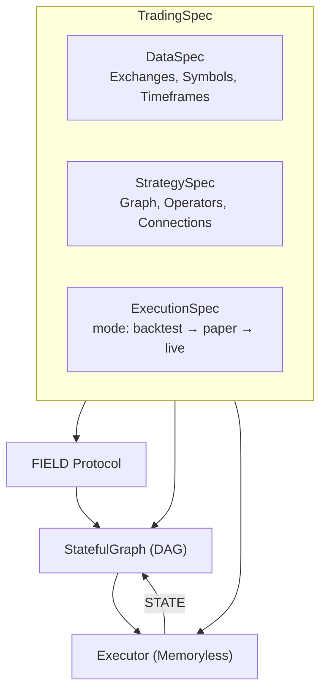

## What Is ClyptQ?

ClyptQ is a **production-grade quantitative trading engine** where the same code runs identically in research, backtesting, and live trading. No rewrites. No adapters. No "production mode."

```python
# This SAME code runs in backtest, paper, and live
spec = TradingSpec(
    data=data_config,
    strategy=TradingStrategySpec(graph=graph),
    execution=TradingExecutionSpec(
        mode="backtest",    # ← Change to "paper" or "live"
        accounts=[account],
    ),
)

driver = TradingDriver.from_spec(spec)
for result in driver:
    print(f"{result.timestamp} | equity: {result.outputs['equity']}")
```

## Who Is ClyptQ For?

<CardGroup cols={3}>
  <Card title="Builders" icon="code" href="/platform/builder-guide">
    **Strategy developers** who want to go from research to live trading without rewriting code. Use any Python library — PyTorch, XGBoost, HuggingFace — inside 213+ composable operators.
  </Card>

  <Card title="Buyers" icon="chart-line" href="/platform/buyer-guide">
    **Strategy consumers** who want verified, independently-tested strategies. Cross-exchange validation ensures strategies aren't overfit to a single venue.
  </Card>

  <Card title="Investors" icon="building-columns" href="/platform/investor-overview">
    **Capital allocators** looking for transparent risk metrics, portfolio-level diversification, and institutional-grade reporting across strategy providers.
  </Card>
</CardGroup>

## Five Pillars

| Pillar | What It Means |
|--------|---------------|
| **Research = Backtest = Live** | Same `TradingSpec`, same `for result in driver` loop, same analysis code across all modes |
| **Tick-by-Tick State Machine** | Each operator sees only past data through `RollingBuffer`. Lookahead bias is structurally impossible |
| **Full Python Freedom** | Any Python library works inside operators. No sandbox, no restrictions, no "approved list" |
| **Data Included** | 5 exchanges × spot + futures × 1-minute OHLCV. Pre-aligned, gap-filled, ready to use |
| **Verified Marketplace** | Sell strategies without revealing source code. Buy strategies with independently verified backtests |

## Architecture at a Glance



**FIELD** delivers market data (prices, volumes, funding rates) to the graph.
**STATE** feeds portfolio data (cash, positions, margin) back from the executor.
The graph processes both through operators in topological order, producing intentions that the executor fills.

## Quick Start

<Steps>
  <Step title="Explore">
    ```python
    from clyptq import Helper
    Helper.exchanges()          # Available exchanges
    Helper.symbols("binance", "futures", quote="USDT")  # Available symbols
    Helper.data_catalog()       # Local data inventory
    ```
  </Step>

  <Step title="Build a Graph">
    ```python
    from clyptq.system.graph import StatefulGraph, Input
    from clyptq.apps.trading.operators.indicator import SMA

    graph = StatefulGraph()
    close = Input("FIELD:binance:futures:ohlcv:close", "1m", lookback=50)
    graph.add_node("sma_fast", SMA(span=10), inputs=[close])
    graph.add_node("sma_slow", SMA(span=50), inputs=[close])
    ```
  </Step>

  <Step title="Run">
    ```python
    driver = TradingDriver.from_spec(spec)
    for result in driver:
        equity_curve.append(result.outputs["equity"])
    ```
  </Step>
</Steps>

<Card title="Full Quickstart Guide" icon="rocket" href="/quickstart">
  Step-by-step guide: install → build strategy → backtest → analyze results
</Card>

## Documentation Map

<CardGroup cols={2}>
  <Card title="Engine Concepts" icon="gears" href="/engine/field-data-principle">
    FIELD/STATE protocols, TaggedArray, StatefulGraph, operator system, TradingSpec
  </Card>
  <Card title="Backtesting Accuracy" icon="shield" href="/backtesting/overview">
    Cost models, funding rates, liquidation, lookahead prevention
  </Card>
  <Card title="Competitive Edge" icon="bolt" href="/competitive/why-clyptq">
    vs QuantConnect, Nautilus, QuantRocket, vectorized frameworks
  </Card>
  <Card title="Operator Reference" icon="book" href="/operators/overview">
    213+ operators: indicators, signals, transforms, metrics, AI
  </Card>
  <Card title="Tutorials" icon="graduation-cap" href="/tutorials/first-strategy">
    SMA crossover, multi-factor, AI-augmented, cross-exchange arbitrage
  </Card>
  <Card title="Roadmap" icon="road" href="/roadmap/overview">
    US stocks, data marketplace, Rust conversion, competitions
  </Card>
</CardGroup>

---

<Warning>
**Risk Disclaimer** — Trading carries substantial risk. Past performance does not guarantee future results. All strategies are provided for informational purposes. Never invest more than you can afford to lose.
</Warning>
