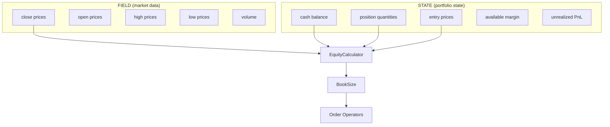

## Overview

Balance operators query the **portfolio state** managed by the execution engine. They read from [STATE](/engine/state-principle) inputs (cash, positions, margin) and combine them with [FIELD](/engine/field-data-principle) inputs (current prices) to compute real-time portfolio metrics.

**Key principle:** Balance operators don't _compute_ state — the execution engine manages state. Balance operators _query_ it and make it available to the rest of the operator graph.

## Operators

### CashBalance

Query the current cash balance from STATE.

**Role**: `BALANCE`

```python
cash = CashBalance(
    cash=Input("STATE:binance:futures:cash", "1m", lookback=0),
)

graph.add_node("cash", cash, inputs=[
    Input("STATE:binance:futures:cash", "1m", lookback=0),
])
```

**Output**: Scalar cash value as TaggedArray. Shape `(1,)` — single value, not per-symbol.

---

### EquityCalculator

Compute total portfolio equity by combining cash, positions, and current prices.

**Role**: `BALANCE`

The formula depends on the market type, **auto-detected** from the STATE input source:

**Spot**:
```
equity = cash + sum(current_price × quantity)
```

**Futures**:
```
equity = margin + sum((current_price - entry_price) × quantity)
```

```python
equity = EquityCalculator(
    cash=Input("STATE:binance:futures:cash", "1m", lookback=0),
    positions=Input("STATE:binance:futures:pos_quantity", "1m", lookback=0),
    prices=Input("FIELD:binance:futures:ohlcv:close", "1m", lookback=0),
    entry_prices=Input("STATE:binance:futures:pos_entry_price", "1m", lookback=0),
    axis_keys=symbol_source_map.axis_keys_for("binance:futures"),
)

graph.add_node("equity", equity, inputs=[
    Input("STATE:binance:futures:cash", "1m", lookback=0),
    Input("STATE:binance:futures:pos_quantity", "1m", lookback=0),
    Input("FIELD:binance:futures:ohlcv:close", "1m", lookback=0),
    Input("STATE:binance:futures:pos_entry_price", "1m", lookback=0),
])
```

**Auto-detection logic**: The STATE input source determines the market type:
- `STATE:binance:spot:cash` → uses spot equity formula
- `STATE:binance:futures:cash` → uses futures equity formula

**Output**: Scalar equity value as TaggedArray. Shape `(1,)`.

---

### TotalEquityCalculator

Aggregate equity from multiple `EquityCalculator` outputs for multi-venue portfolios.

**Role**: `BALANCE`

```python
# Individual venue equities
spot_equity = EquityCalculator(
    cash=Input("STATE:binance:spot:cash", ...),
    positions=Input("STATE:binance:spot:pos_quantity", ...),
    prices=Input("FIELD:binance:spot:ohlcv:close", ...),
    axis_keys=symbol_source_map.axis_keys_for("binance:spot"),
)

futures_equity = EquityCalculator(
    cash=Input("STATE:binance:futures:cash", ...),
    positions=Input("STATE:binance:futures:pos_quantity", ...),
    prices=Input("FIELD:binance:futures:ohlcv:close", ...),
    entry_prices=Input("STATE:binance:futures:pos_entry_price", ...),
    axis_keys=symbol_source_map.axis_keys_for("binance:futures"),
)

# Aggregate
total_equity = TotalEquityCalculator(
    equity_inputs=[
        Input("spot_equity", "1m", lookback=0),
        Input("futures_equity", "1m", lookback=0),
    ]
)
```

**Use case**: Cross-exchange arbitrage, spot-futures basis trading, or any multi-venue strategy that needs a unified equity view.

**Output**: Scalar total equity as TaggedArray. Shape `(1,)`.

---

### PositionQuantity

Query current position quantities from STATE.

**Role**: `BALANCE`

```python
positions = PositionQuantity(
    positions=Input("STATE:binance:futures:pos_quantity", "1m", lookback=0),
)
```

**Output**: Per-symbol quantities as TaggedArray. Shape `(n_symbols,)`. Positive = long, negative = short.

---

### PositionValue

Query position notional values (quantity × current price) from STATE.

**Role**: `BALANCE`

```python
pos_value = PositionValue(
    positions=Input("STATE:binance:futures:pos_quantity", "1m", lookback=0),
    prices=Input("FIELD:binance:futures:ohlcv:close", "1m", lookback=0),
)
```

**Output**: Per-symbol notional values as TaggedArray. Shape `(n_symbols,)`.

---

### AvailableMargin

Query available margin from STATE (futures only).

**Role**: `BALANCE`

```python
margin = AvailableMargin(
    margin=Input("STATE:binance:futures:available_margin", "1m", lookback=0),
)
```

**Output**: Scalar available margin as TaggedArray. Shape `(1,)`.

---

### BookSize

Compute the tradeable capital (book size) for position sizing.

**Role**: `BALANCE`

```python
book = BookSize(
    equity=Input("equity", "1m", lookback=0),
    multiplier=0.95,     # Use 95% of equity
    min_book_size=1000,  # Minimum $1000
    max_book_size=None,  # No maximum
)
```

**Output**: Scalar book size as TaggedArray. Shape `(1,)`. Used by [Order operators](/operators/order) for position sizing.

## FIELD and STATE Pattern

Balance operators are the bridge between **STATE** (execution engine) and **FIELD** (market data):



### STATE Keys

Available STATE keys per account:

| STATE Key | Type | Description |
|---|---|---|
| `STATE:{exchange}:{market_type}:cash` | Scalar | Cash balance |
| `STATE:{exchange}:{market_type}:pos_quantity` | Per-symbol | Position quantities |
| `STATE:{exchange}:{market_type}:pos_entry_price` | Per-symbol | Average entry prices |
| `STATE:{exchange}:{market_type}:available_margin` | Scalar | Available margin (futures) |

### lookback=0

Balance operators typically use `lookback=0` — they only need the current tick's state, not historical state:

```python
Input("STATE:binance:futures:cash", "1m", lookback=0)  # Current cash only
Input("STATE:binance:futures:pos_quantity", "1m", lookback=0)  # Current positions only
```

### Warmup Behavior

STATE inputs are **excluded from warmup calculation**. During warmup, STATE returns default values (0 cash, 0 positions). This is correct because there are no positions during warmup — the strategy hasn't started trading yet.

## Common Patterns

### Single-Venue Equity Tracking

```python
# Minimal equity tracking for a single futures account
graph.add_node("equity", EquityCalculator(
    cash=Input("STATE:binance:futures:cash", "1m", lookback=0),
    positions=Input("STATE:binance:futures:pos_quantity", "1m", lookback=0),
    prices=Input("FIELD:binance:futures:ohlcv:close", "1m", lookback=0),
    entry_prices=Input("STATE:binance:futures:pos_entry_price", "1m", lookback=0),
    axis_keys=symbol_source_map.axis_keys_for("binance:futures"),
))

graph.add_node("book_size", BookSize(
    equity=Input("equity", "1m", lookback=0),
    multiplier=0.95,
))
```

### Multi-Venue Arbitrage

```python
# Spot + Futures equity → Total equity
graph.add_node("spot_equity", EquityCalculator(
    cash=Input("STATE:binance:spot:cash", ...),
    positions=Input("STATE:binance:spot:pos_quantity", ...),
    prices=Input("FIELD:binance:spot:ohlcv:close", ...),
    axis_keys=symbol_source_map.axis_keys_for("binance:spot"),
))

graph.add_node("futures_equity", EquityCalculator(
    cash=Input("STATE:binance:futures:cash", ...),
    positions=Input("STATE:binance:futures:pos_quantity", ...),
    prices=Input("FIELD:binance:futures:ohlcv:close", ...),
    entry_prices=Input("STATE:binance:futures:pos_entry_price", ...),
    axis_keys=symbol_source_map.axis_keys_for("binance:futures"),
))

graph.add_node("total_equity", TotalEquityCalculator(
    equity_inputs=[
        Input("spot_equity", "1m", lookback=0),
        Input("futures_equity", "1m", lookback=0),
    ]
))
```

### Position-Aware Signal

```python
# Only signal when not already positioned
graph.add_node("positions", PositionQuantity(
    positions=Input("STATE:binance:futures:pos_quantity", "1m", lookback=0),
))

graph.add_node("has_position", ConditionalGate(
    condition_input=Input("positions", "1m", lookback=1),
    threshold=0.0,
    comparison="ne",  # Not equal to zero → has position
))
```

## Relationship to Other Concepts

- **[STATE Principle](/engine/state-principle)**: How STATE data flows through the system
- **[FIELD Data Principle](/engine/field-data-principle)**: Market data used by EquityCalculator
- **[Order Operators](/operators/order)**: Use BookSize output for position sizing
- **[TradingSpec](/engine/trading-spec)**: AccountSpec defines which STATE namespaces exist
