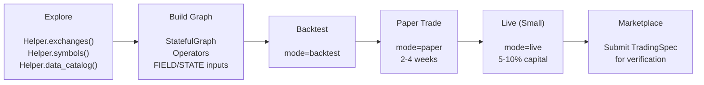

## Overview

This guide walks you through the full Builder workflow: develop a strategy in Jupyter, validate it through backtest → paper → live, and list it on the marketplace.

## Why Build on ClyptQ?

| Benefit | What You Get |
|---------|-------------|
| **Production Infrastructure** | Data (6 crypto exchanges + stocks), execution engine, monitoring — ready to use |
| **Code Parity** | Same `StatefulGraph` runs in backtest, paper, and live. No rewrite needed |
| **Python Freedom** | Use PyTorch, XGBoost, HuggingFace, scipy — any library inside operators |
| **Monetization** | List strategies on marketplace with performance fee or subscription pricing |
| **Independent Verification** | Platform verifies your backtest + runs cross-exchange validation |

## Template Format

When you submit a strategy to the marketplace, your `.py` file is executed inside ClyptQ's validation sandbox. Your code must follow a specific contract for the platform to validate, backtest, and deploy it correctly.

### The `main()` function

Every strategy must define a `main()` function that returns a `TradingDriver`. The platform calls this function to run your strategy.

**New format (recommended)** — receives `mode` and `accounts` from the platform:

```python
def main(mode, accounts):
    """
    Args:
        mode: "backtest", "paper", or "live" — injected by the platform
        accounts: Dict mapping venue -> {"initial_cash": float}
                  e.g., {"binance:futures": {"initial_cash": 10000.0}}
    Returns:
        TradingDriver instance
    """
    graph = StatefulGraph()
    # ... build graph ...

    spec = TradingSpec(
        data=TradingDataSpec(...),
        strategy=TradingStrategySpec(graph=graph, output_nodes=["equity", "signal"]),
        execution=TradingExecutionSpec(
            mode=mode,  # Use the injected mode
            accounts=[AccountSpec(
                "binance", "futures",
                initial_cash=accounts["binance:futures"]["initial_cash"],
            )],
        ),
        debug=True,
    )

    driver = TradingDriver.from_spec(spec)
    for result in driver:
        pass

    return driver  # MUST return the driver
```

**Old format** — no parameters, uses injected global variables:

```python
def main():
    initial_cash = __SANDBOX_INITIAL_CASH__  # Injected by the platform

    # ... build graph and spec ...
    driver = TradingDriver.from_spec(spec)
    for result in driver:
        pass

    return driver  # MUST return the driver
```

<Warning>
`main()` must contain a `return driver` statement. The platform validates this at submission time — strategies without a return statement will be rejected.
</Warning>

### Required metric operators

For marketplace listing, your graph **must** include three metric operators with **exact node names**. These operators are computed by ClyptQ's internal code — the platform extracts final values from these nodes to display verified metrics to buyers.

```python
from clyptq.apps.trading.operators.metric import (
    AccumSharpe,
    AccumMaxDrawdown,
    AccumTotalReturn,
)

# These three are REQUIRED — node names must match exactly
graph.add_node("sharpe", AccumSharpe(
    equity=Input("equity", "1m", lookback=1),
))

graph.add_node("max_drawdown", AccumMaxDrawdown(
    equity=Input("equity", "1m", lookback=1),
))

graph.add_node("total_return", AccumTotalReturn(
    equity=Input("equity", "1m", lookback=1),
))
```

| Node Name | Operator | What It Computes |
|-----------|----------|-----------------|
| `"sharpe"` | `AccumSharpe` | Incremental Sharpe ratio (Welford's algorithm) |
| `"max_drawdown"` | `AccumMaxDrawdown` | Running peak-to-trough max drawdown |
| `"total_return"` | `AccumTotalReturn` | Cumulative total return |

<Info>
These metric operators are computed by ClyptQ's internal code, not by user-supplied logic. This is how the platform guarantees that reported metrics are independently verified — builders cannot self-report or manipulate performance numbers.
</Info>

### Required output nodes

Your `TradingStrategySpec.output_nodes` must include `"equity"` at minimum:

```python
TradingStrategySpec(
    graph=graph,
    output_nodes=["equity", "signal"],  # "equity" is REQUIRED
)
```

| Node | Purpose |
|------|---------|
| `"equity"` | Portfolio value over time **(required)** |
| `"intention"` | Trading signals and target positions (recommended) |
| `"pnl"` | Profit/loss tracking (recommended) |
| `"drawdown"` | Drawdown curve visualization (recommended) |

### Configuration parsed from your code

The platform automatically parses the following from your strategy code:

| What | How It's Detected | Example |
|------|------------------|---------|
| **Venues** | `SymbolSourceMap`, `AccountSpec`, or `"exchange:market_type"` strings | `"binance:futures"` |
| **Symbols** | `SymbolSourceMap` dict values, or `SYMBOLS` variable | `["BTC/USDT:USDT", "ETH/USDT:USDT"]` |
| **Timeframe** | `TIMEFRAME` variable, or `timeframe=` in `OHLCVSpec`/`Input` | `"4h"` |
| **Initial cash** | `initial_cash=` in `AccountSpec`, or `INITIAL_CASH` variable | `50_000.0` |
| **Base currency** | `base_currency=` in `AccountSpec` | `"USDT"` |

<Warning>
All venues in your `SymbolSourceMap` must have a matching `AccountSpec` with `initial_cash`. Strategies with missing cash configuration will fail validation.
</Warning>

### Injected sandbox variables

During validation, the platform injects these variables into your execution environment:

| Variable | Type | Description |
|----------|------|-------------|
| `__SANDBOX_CONFIG__` | `dict` | Contains `symbols`, `start`, `end`, `timeframe`, `initial_cash` |
| `__SANDBOX_INITIAL_CASH__` | `float` | Target initial cash for current scale test |
| `__SANDBOX_ACCOUNTS__` | `dict` or `None` | Multi-venue accounts: `{"binance:futures": {"initial_cash": 10000.0}}` |

For multi-scale validation, the platform runs your strategy at multiple capital levels (e.g., $1K, $10K, $100K). The injected values are adjusted proportionally for each scale — your code should use these values instead of hardcoding initial cash.

### Ephemeral operators

Strategies using ephemeral (semantic) operators — `LLMScorer`, `WebSearchOperator`, `SentimentParser` — are handled differently:

- **Backtesting is skipped entirely** (these operators hit rate limits and produce non-reproducible results for historical data)
- **Paper trading validation only** is performed
- The strategy listing will display a badge indicating it uses AI/semantic operators

### Sandbox security

The platform enforces multiple layers of security during strategy validation to protect the infrastructure and other users. Submitted code is analyzed and executed in an isolated environment with restricted capabilities.

Strategies that attempt to access system resources, network endpoints, or execute arbitrary code outside of the ClyptQ operator framework will be automatically rejected. The platform's validation pipeline is designed to detect and block malicious or abusive patterns at multiple stages — from static analysis through runtime execution.

<Info>
Focus on writing clean strategy logic using ClyptQ's operator framework. If your code only uses ClyptQ imports, standard data science libraries (numpy, pandas, scipy, sklearn), and standard Python utilities (datetime, math, json, re, collections), it will pass validation without issues.
</Info>

### Template checklist

| Requirement | Details |
|-------------|---------|
| `main()` function exists | Defined at top level, returns `TradingDriver` |
| `main()` returns driver | Must have explicit `return driver` statement |
| `"sharpe"` node | `graph.add_node("sharpe", AccumSharpe(...))` |
| `"max_drawdown"` node | `graph.add_node("max_drawdown", AccumMaxDrawdown(...))` |
| `"total_return"` node | `graph.add_node("total_return", AccumTotalReturn(...))` |
| `"equity"` in `output_nodes` | Required for equity curve display |
| Symbols defined | `SymbolSourceMap` or `SYMBOLS` variable |
| `AccountSpec` with `initial_cash` | Required for each venue |
| Timeframe specified | `TIMEFRAME` variable or `timeframe=` parameter |

## Development Workflow



## Step 1: Explore

Use the `Helper` class to discover what's available:

```python
from clyptq import Helper

# Available exchanges
Helper.exchanges()

# Futures symbols on Binance
symbols = Helper.symbols("binance", "futures", quote="USDT", limit=20)
# → ['BTC/USDT:USDT', 'ETH/USDT:USDT', 'SOL/USDT:USDT', ...]

# What data is cached locally?
Helper.data_catalog()

# Margin parameters (MMR, liquidation fee)
Helper.margin_info("binance")
# → default_mmr: 1.3%, liquidation_fee: 0.75%
```

## Step 2: Build the Strategy Graph

### Define symbol mapping

```python
from clyptq.apps.trading.spec.symbol_source_map import SymbolSourceMap

symbol_source_map = SymbolSourceMap({
    "binance:futures": ["BTC/USDT:USDT", "ETH/USDT:USDT"],
})
```

### Build the graph

```python
from clyptq.system.graph import StatefulGraph, Input
from clyptq.apps.trading.operators.indicator import SMA
from clyptq.apps.trading.operators.signal import CrossoverAlpha
from clyptq.apps.trading.operators.transform import EqualWeight
from clyptq.apps.trading.operators.balance import EquityCalculator, BookSize
from clyptq.apps.trading.operators.order import FuturesTargetPositionIntention

graph = StatefulGraph()

# FIELD input — raw close prices from Binance futures
close = Input("FIELD:binance:futures:ohlcv:close", "1m", lookback=50)

# Indicators
graph.add_node("sma_fast", SMA(span=10), inputs=[close])
graph.add_node("sma_slow", SMA(span=50), inputs=[close])

# Signal — crossover detection
graph.add_node("signal", CrossoverAlpha(),
    inputs=[
        Input("sma_fast", "1m", lookback=2),
        Input("sma_slow", "1m", lookback=2),
    ])

# Transform — equal weight allocation
graph.add_node("weights", EqualWeight(),
    inputs=[Input("signal", "1m", lookback=1)])

# Portfolio accounting — uses STATE inputs
graph.add_node("equity", EquityCalculator(
    cash=Input("STATE:binance:futures:cash", "1m", lookback=0),
    positions=Input("STATE:binance:futures:pos_quantity", "1m", lookback=0),
    prices=Input("FIELD:binance:futures:ohlcv:close", "1m", lookback=0),
    entry_prices=Input("STATE:binance:futures:pos_entry_price", "1m", lookback=0),
    axis_keys=symbol_source_map.axis_keys_for("binance:futures"),
))

graph.add_node("book", BookSize(min_book_size=100.0),
    inputs=[Input("equity", "1m", lookback=1)])

# Order generation — target position intention
graph.add_node("intention", FuturesTargetPositionIntention(
    weights=Input("weights", "1m", lookback=1),
    book_size=Input("book", "1m", lookback=1),
    positions=Input("STATE:binance:futures:pos_quantity", "1m", lookback=0),
    prices=Input("FIELD:binance:futures:ohlcv:close", "1m", lookback=0),
    axis_keys=symbol_source_map.axis_keys_for("binance:futures"),
    execution_routing=symbol_source_map.execution_routing,
    leverage=3.0,
))
```

**Key concepts:**
- `FIELD:` inputs pull market data from exchanges
- `STATE:` inputs pull portfolio state from the executor (cash, positions, entry prices)
- Each `Input` declares its `lookback` — the number of historical ticks it needs
- The graph handles warmup, buffering, and execution order automatically

See [Your First Strategy](/tutorials/first-strategy) for a step-by-step walkthrough.

## Step 3: Backtest

### Configure and run

```python
from datetime import datetime, timezone
from clyptq.apps.trading.spec.unified import TradingSpec
from clyptq.apps.trading.spec.data import TradingDataSpec
from clyptq.apps.trading.spec.strategy import TradingStrategySpec
from clyptq.apps.trading.spec.execution import TradingExecutionSpec, AccountSpec
from clyptq.apps.trading.spec.observation.crypto import OHLCVSpec
from clyptq.apps.trading.driver import TradingDriver

spec = TradingSpec(
    data=TradingDataSpec(
        symbol_source_map=symbol_source_map,
        observations=[OHLCVSpec(exchange="binance", market_type="futures", timeframe="1m")],
        start=datetime(2024, 1, 1, tzinfo=timezone.utc),
        end=datetime(2024, 12, 31, tzinfo=timezone.utc),
    ),
    strategy=TradingStrategySpec(
        graph=graph,
        output_nodes=["equity", "signal"],
    ),
    execution=TradingExecutionSpec(
        mode="backtest",
        accounts=[AccountSpec(
            exchange="binance",
            market_type="futures",
            initial_cash=10_000.0,
            max_leverage=3.0,
        )],
        execution_price_source="ohlcv",
    ),
    debug=True,
)

driver = TradingDriver.from_spec(spec)
for result in driver:
    pass

# Analyze
df_equity = driver.to_dataframe("equity")
df_signal = driver.to_dataframe("signal")
df_equity.plot(title="Equity Curve", figsize=(14, 5))
```

### Validation checklist

<Info>
**Required metrics for marketplace submission** — the platform computes and displays three core metrics, all **annualized** with `periods_per_year=252`:
- **Annualized Total Return (CAGR)**: Compound annual growth rate
- **Maximum Drawdown (MDD)**: Peak-to-trough percentage decline
- **Annualized Sharpe Ratio**: Risk-adjusted return (excess return / annualized std deviation)
</Info>

| Check | Target | How to Verify |
|-------|--------|--------------|
| **Sharpe ratio (annualized)** | > 1.0 after costs | `driver.export_results()` |
| **Max drawdown (MDD)** | < 20% (or your tolerance) | `df_equity.min()` relative analysis |
| **Total return (CAGR)** | Positive, annualized | `driver.export_results()` |
| **Fee impact** | < 50% of gross return | Compare zero-fee vs real-fee backtest |
| **Trade frequency** | Reasonable for timeframe | Check signal changes in `df_signal` |
| **Rejection rate** | Low | `driver.export_results()["rejection_stats"]` |

### Compare with zero-cost backtest

```python
from clyptq.apps.trading.spec.execution import CostModelSpec

spec_zero = TradingSpec(
    ...  # same data and strategy
    execution=TradingExecutionSpec(
        mode="backtest",
        accounts=[AccountSpec(
            exchange="binance", market_type="futures", initial_cash=10_000,
            cost_model=CostModelSpec(maker_fee=0, taker_fee=0, slippage_bps=0),
        )],
    ),
)
```

If the gap between zero-cost and real-cost returns is > 50% of gross return, your strategy may have excessive trading costs.

## Step 4: Paper Trading

Change `mode` and remove `start`/`end` — everything else stays the same:

```python
spec_paper = TradingSpec(
    data=TradingDataSpec(
        symbol_source_map=symbol_source_map,
        observations=[OHLCVSpec(exchange="binance", market_type="futures", timeframe="1m")],
        # No start/end — paper mode uses live data
    ),
    strategy=TradingStrategySpec(graph=graph, output_nodes=["equity"]),
    execution=TradingExecutionSpec(
        mode="paper",         # ← Changed from "backtest"
        accounts=[AccountSpec(exchange="binance", market_type="futures", initial_cash=10_000)],
        execution_price_source="ohlcv",
    ),
)

driver = TradingDriver.from_spec(spec_paper)

for result in driver:
    print(f"{result.timestamp} | equity: {result.outputs.get('equity')}")
```

**What happens internally:**
1. Historical warmup loads past data to fill all RollingBuffers
2. Clock syncs to the next real-time bar boundary
3. Live data arrives via WebSocket
4. Orders are executed by `BacktestFactory` (same as backtest — simulated fills)

**Recommended duration:**

| Strategy Type | Paper Period | Why |
|--------------|-------------|-----|
| Intraday (minutes) | 1-2 weeks | Need enough trades for significance |
| Daily (hours-days) | 2-4 weeks | Capture different market conditions |
| Swing (days-weeks) | 4-8 weeks | Need multiple full trade cycles |

## Step 5: Live Trading (Small)

Change `mode` to `"live"` and add API credentials:

```python
spec_live = TradingSpec(
    data=TradingDataSpec(
        symbol_source_map=symbol_source_map,
        observations=[OHLCVSpec(exchange="binance", market_type="futures", timeframe="1m")],
    ),
    strategy=TradingStrategySpec(graph=graph, output_nodes=["equity"]),
    execution=TradingExecutionSpec(
        mode="live",          # ← Changed from "paper"
        accounts=[AccountSpec(
            exchange="binance",
            market_type="futures",
            api_key="your_api_key",
            api_secret="your_api_secret",
            # initial_cash is ignored in live — uses real exchange balance
        )],
    ),
)

driver = TradingDriver.from_spec(spec_live)

for result in driver:
    print(f"{result.timestamp} | equity: {result.outputs.get('equity')}")
```

**Safety features built in:**
- **Emergency shutdown**: Ctrl+C (SIGINT) or SIGTERM closes all positions
- **Balance sync**: Detects external changes (manual trades, liquidations, funding)
- **Heartbeat**: Prevents Kernel idle timeout during long runs
- **First tick skip**: Skips execution on the first real-time tick to avoid stale signals

**Scaling guidance:**

| Phase | Capital | Duration | Purpose |
|-------|---------|----------|---------|
| Small | 5-10% of target | 1-2 weeks | Verify real fills match backtest |
| Medium | 25-50% of target | 2-4 weeks | Check capacity constraints |
| Full | 100% | Ongoing | Monitor continuously |

## Step 6: Marketplace Listing

### What you submit

Builders submit a **TradingSpec** — not source code. The spec defines the complete strategy (graph, operators, connections, parameters) in a serializable format.

- **Included**: Graph structure, operator types, parameters, input connections, execution configuration
- **Not included**: Source code of custom operators (packaged as compiled modules)

### Verification process

The platform independently verifies your strategy through 4 stages. Each stage protects the buyer — and in doing so, protects your reputation as a builder:

**1. Reproducibility check**

The platform runs your spec on your declared exchange data. Results must match within tolerance. This proves your reported metrics are real.

**2. Cross-exchange validation (venue sampling)**

The platform runs the same spec on exchanges you never tested (e.g., Bybit, Gateio, OKX). This catches overfitting to a single venue's microstructure.

**Why this matters for builders**: A high consistency score across venues makes your strategy more attractive. Buyers trust strategies that generalize — and they're willing to pay more for them.

```
Your strategy on Binance:  Sharpe 1.8  ← you tested this
Platform tests on Bybit:   Sharpe 1.5  ← you never saw this
Platform tests on Gateio:  Sharpe 1.3  ← you never saw this

Consistency score: 0.83 → displayed prominently in your listing
```

**3. Cost verification**

Platform applies exchange-specific fees, funding rates, and liquidation logic. Strategies that are only profitable without real costs are flagged.

**4. Scale testing (capacity validation)**

Platform tests your strategy at 2×, 5×, and 10× your declared capital. This determines the **estimated capacity** — the maximum AUM where the strategy maintains acceptable performance.

**Why this matters for builders**: Capacity directly affects your earning potential:

| Capacity | Impact on Your Revenue |
|----------|----------------------|
| **High capacity** ($500K+) | More buyers can deploy simultaneously → higher total revenue |
| **Medium capacity** ($50-500K) | Platform may limit concurrent deployments → moderate revenue |
| **Low capacity** (< $50K) | Few deployment slots → limited revenue |

**How to improve capacity**: Use longer timeframes (less trading = less market impact), diversify across symbols, and avoid illiquid assets.

### Why validation helps you sell more

The validation pipeline is not a burden — it's your **sales engine**:

| You as Builder | | Buyer's Perspective |
|---|---|---|
| Self-reported metrics | | "Anyone can claim Sharpe 2.0" |
| + Platform-verified | | "This is independently confirmed" |
| + Cross-exchange valid | | "It works on venues I'll use" |
| + Scale tested | | "It works at my capital level" |
| + Real cost impact | | "Returns are after fees" |
| **Result** | **=** | **HIGH TRUST = More subscriptions** |

Every buyer who deploys your strategy generates revenue for you. The more trust signals your listing has, the more buyers convert.

### Listing requirements

- 1+ year backtest history
- 2+ weeks paper trading verification
- 1+ month live trading (optional but strongly recommended)
- Risk profile specification (max leverage, max drawdown target)

### Pricing

Set your strategy's price. The platform takes a commission on each transaction:

| Model | How It Works | Best For |
|-------|-------------|---------|
| **Subscription** | Fixed monthly fee per buyer | Predictable revenue, consistent strategies |
| **Performance fee** | % of buyer's profits (with high water mark) | High-conviction strategies |
| **Hybrid** | Base subscription + performance fee | Most strategies |

## Best Practices

### Strategy development

- **Keep it simple**: 3-5 parameters is usually enough. 20 parameters → likely overfit
- **Use universe filters**: Don't trade every symbol. Filter by volume and liquidity
- **Minimize lookback**: Smaller lookback = faster warmup + less memory
- **Test across periods**: Use out-of-sample testing. Don't curve-fit to a single year

### Backtesting

- **Always test LATENT mode**: INSTANT (perfect fills) overstates returns. LATENT adds realistic slippage
- **Check fee impact**: Compare zero-cost vs real-cost. If gap > 50% of return, reconsider
- **Sufficient period**: 1+ year minimum. Include different market regimes (bull, bear, sideways)
- **Verify with funding costs**: For futures, cumulative funding can erode profits significantly

### Paper and live

- **Paper for 2+ weeks minimum**: Statistical significance requires enough trades
- **Start live at 5-10%**: Verify real fills match paper before scaling
- **Monitor latency**: Check `Latency` logs. If processing exceeds clock interval, orders are delayed
- **Set up alerts**: Track drawdown, equity changes, execution errors

### Common pitfalls

| Pitfall | Why It's Dangerous | How ClyptQ Prevents It |
|---------|-------------------|----------------------|
| **Lookahead bias** | Using future data in signals | RollingBuffer only exposes declared lookback history |
| **Survivorship bias** | Testing only current listings | Use point-in-time symbol lists |
| **Overfitting** | Too many parameters | Cross-exchange validation catches venue-specific overfitting |
| **Ignoring costs** | Profitable in theory, not in practice | Auto-injected exchange fees and funding rates |
| **Ignoring funding** | Slow bleed on long-hold futures | Auto-injected funding rate simulation |

## Related Pages

<CardGroup cols={2}>
  <Card title="Your First Strategy" icon="graduation-cap" href="/tutorials/first-strategy">
    Step-by-step SMA crossover tutorial with detailed explanations
  </Card>
  <Card title="Backtest to Live" icon="arrow-right" href="/tutorials/backtest-to-live">
    Full deployment lifecycle from backtest through paper to live
  </Card>
  <Card title="Marketplace" icon="store" href="/platform/marketplace">
    How the strategy marketplace verification works
  </Card>
  <Card title="Operator Reference" icon="book" href="/operators/overview">
    Browse all 213+ available operators
  </Card>
</CardGroup>
