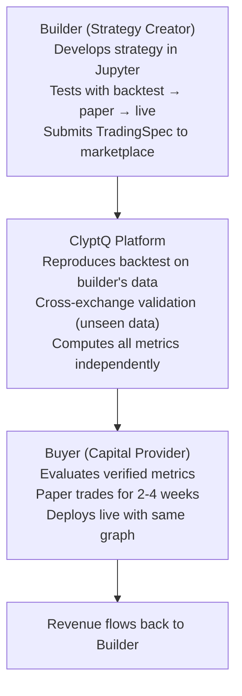
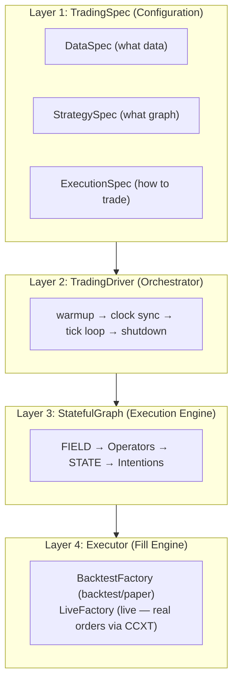

## Ecosystem Vision

ClyptQ is a **Trading Commerce platform** — a marketplace where quantitative strategies are independently verified, cross-exchange validated, and deployed with cryptographic trust between Builders and Buyers.

**Core Principles**:
- **Code Parity**: The same `StatefulGraph` runs identically in backtest, paper, and live
- **Structural Safety**: [RollingBuffers](/engine/lookback-buffers) make lookahead bias architecturally impossible
- **Independent Verification**: The platform computes all metrics — builders cannot self-report
- **Python Freedom**: Any library (PyTorch, XGBoost, HuggingFace) works inside operators

## Trading Commerce Ecosystem



<CardGroup cols={3}>
  <Card title="For Builders" icon="wrench">
    - Production infrastructure (data + execution + monitoring)
    - Same code from research to live trading
    - Revenue via marketplace (performance fee, subscription)
  </Card>

  <Card title="For Buyers" icon="chart-line">
    - Independently verified strategy metrics
    - Cross-exchange validation on unseen data
    - One-click deploy: paper → live
  </Card>

  <Card title="For Investors" icon="building-columns">
    - Quantified technical moat (code parity, structural safety)
    - Network effects (more builders → more buyers → more data)
    - Multiple revenue streams (commissions, subscriptions, data)
  </Card>
</CardGroup>

## Architecture Overview

ClyptQ consists of **4 layers**:



<AccordionGroup>
  <Accordion title="1. System Layer — Core Execution Engine">
    - **[Operator Protocol](/engine/operator-protocol)**: Standard `compute()` interface for all operations
    - **[TaggedArray](/engine/tagged-array)**: 4-field data structure (value, exists, valid, updated)
    - **[StatefulGraph](/engine/stateful-graph)**: DAG-based automatic execution with topological ordering
    - **[RollingBuffer](/engine/lookback-buffers)**: Per-consumer circular buffers preventing lookahead
    - **TradingDriver**: Warmup → tick loop → shutdown orchestration
  </Accordion>

  <Accordion title="2. Operator Layer — 213+ Strategy Components">
    - **[Indicators](/operators/overview)**: SMA, EMA, RSI, MACD, Bollinger, ATR, and 40+ more
    - **[Signals](/operators/signals/alphas)**: 21 alpha generators + 8 factor models + Alpha-101
    - **[Transforms](/operators/transforms/scalers)**: ZScore, Rank, MVO, RiskParity, EqualWeight
    - **[Universe](/operators/universe/filters)**: Volume/volatility filters and liquidity scores
    - **[Semantic](/operators/semantic)**: LLM scoring, web search — paper/live only (ephemeral)
  </Accordion>

  <Accordion title="3. Trading Layer — Execution & State Management">
    - **[TradingSpec](/engine/trading-spec)**: Unified configuration hierarchy
    - **[Execution Pipeline](/engine/execution-pipeline)**: Intention → Delta → Order → Fill
    - **[FIELD/STATE](/engine/field-data-principle)**: Market data (FIELD) and portfolio state (STATE) separation
    - **[Cost Models](/backtesting/cost-models)**: Exchange-specific fees, slippage, funding rates
  </Accordion>

  <Accordion title="4. Data Layer — Multi-Source Integration">
    - **Crypto**: 6 exchanges (Binance, Bybit, OKX, Gateio, Coinbase, Kraken)
    - **Stocks**: Alpaca, Interactive Brokers (via Tiingo/YFinance data)
    - **Storage**: Parquet files with automatic caching
    - **Live**: WebSocket feeds with automatic reconnection
  </Accordion>
</AccordionGroup>

## Key Concepts

### StatefulGraph

Strategies are DAGs (Directed Acyclic Graphs) of operators. The graph is stateless — operators receive only their declared lookback window:

```python
from clyptq.system.graph import StatefulGraph, Input
from clyptq.apps.trading.operators.indicator import SMA
from clyptq.apps.trading.operators.signal import CrossoverAlpha

graph = StatefulGraph()

close = Input("FIELD:binance:futures:ohlcv:close", "1m", lookback=50)
graph.add_node("sma_fast", SMA(span=10), inputs=[close])
graph.add_node("sma_slow", SMA(span=50), inputs=[close])

graph.add_node("signal", CrossoverAlpha(),
    inputs=[
        Input("sma_fast", "1m", lookback=2),
        Input("sma_slow", "1m", lookback=2),
    ])
```

### TaggedArray (4-Field System)

All data flows through TaggedArray — a structured container that distinguishes missing data from invalid data:

```python
TaggedArray:
    value: np.ndarray    # Actual values (shape: lookback × n_symbols)
    exists: np.ndarray   # Does data exist for this symbol?
    valid: np.ndarray    # Is the value valid (not NaN)?
    updated: np.ndarray  # Was it updated at this timestamp?
```

### FIELD and STATE

Two data namespaces power every strategy:
- **FIELD** — Market data from exchanges: `FIELD:binance:futures:ohlcv:close`
- **STATE** — Portfolio state from the executor: `STATE:binance:futures:cash`

See [FIELD Data Principle](/engine/field-data-principle) and [STATE Principle](/engine/state-principle).

### Code Parity

The same graph runs identically across all modes. Only the `TradingExecutionSpec` changes:

```python
# Backtest
TradingExecutionSpec(mode="backtest", accounts=[...])

# Paper (live data, simulated fills)
TradingExecutionSpec(mode="paper", accounts=[...])

# Live (real money)
TradingExecutionSpec(mode="live", accounts=[...with api_key...])
```

See [Code Parity](/competitive/code-parity) for the full comparison.

## Why ClyptQ?

| Capability | ClyptQ | QuantConnect | Nautilus | Vectorized (Zipline, Backtrader) |
|-----------|--------|-------------|---------|--------------------------------|
| **Code Parity** | Same graph runs in all modes | Research ≠ Live | Same engine | Backtest only |
| **Lookahead Prevention** | Structural (RollingBuffer) | Runtime checks | Runtime checks | None — manual discipline |
| **Language** | Python (any library) | C# primary | Rust only | Python |
| **Data Included** | 6 exchanges, stocks | Limited | None | None |
| **Marketplace** | Cross-exchange verified | Community (unverified) | None | None |
| **Cost Modeling** | Exchange-specific (auto CCXT) | Generic | Generic | Basic |

See [Why ClyptQ](/competitive/why-clyptq) for the detailed comparison.

## Next Steps

<CardGroup cols={2}>
  <Card title="Quickstart" icon="rocket" href="/quickstart">
    Build and backtest your first strategy in 5 minutes
  </Card>

  <Card title="Builder Guide" icon="wrench" href="/platform/builder-guide">
    Full strategy development and marketplace listing workflow
  </Card>

  <Card title="Buyer Guide" icon="chart-line" href="/platform/buyer-guide">
    How to evaluate, deploy, and manage strategies
  </Card>

  <Card title="Engine Concepts" icon="gears" href="/engine/field-data-principle">
    Deep dive into FIELD, STATE, TaggedArray, and StatefulGraph
  </Card>
</CardGroup>
