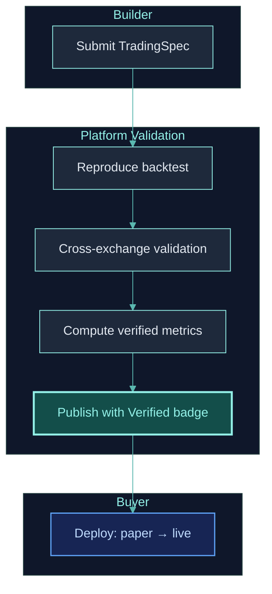
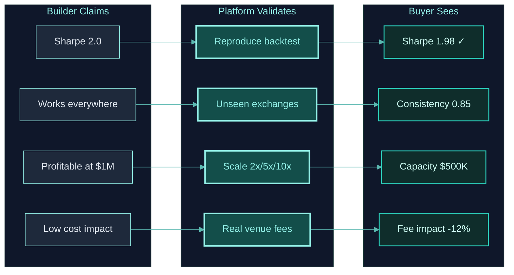

## Trading Commerce

The Clypt marketplace is not a typical app store. It's a **Trading Commerce** platform where backtests are independently verified, strategies are validated across exchanges the builder never had access to, and performance metrics are computed by the platform — not self-reported.

## How It Works



## Submission Flow

### What Builders Submit

Builders submit a **TradingSpec** — not source code. The TradingSpec defines the complete strategy (graph, operators, connections, parameters) in a serializable format:

```python
# Builder develops in Jupyter
spec = TradingSpec(
    data=data_config,
    strategy=TradingStrategySpec(graph=graph),
    execution=TradingExecutionSpec(mode="backtest", accounts=[account]),
)

# Submit to marketplace
# Platform receives the spec, not the .py files
```

**What is included**: Graph structure, operator types, parameters, input connections, execution configuration.

**What is NOT included**: Source code of custom operators (if any). Custom operators are packaged as compiled modules.

### Validation Steps

1. **Reproducibility check**: Platform runs the submitted spec on the builder's declared exchange data. Results must match the builder's reported metrics within tolerance.

2. **Cross-exchange validation**: Platform runs the same spec on data from **exchanges the builder didn't use**. This catches strategies that are overfit to a single venue's price feed.

3. **Cost model verification**: Platform applies exchange-specific fees, funding rates, and liquidation logic. Strategies that are only profitable without costs are flagged.

4. **Scale testing**: Strategy is tested at 2×, 5×, and 10× the declared capital level. If Sharpe ratio degrades significantly, the strategy may have capacity constraints (noted in listing).

## Why Validation Matters: Builder → Platform → Buyer Trust Chain

The validation pipeline exists because **the buyer's capital is at stake**. Every validation step directly addresses a specific risk that the buyer faces:



**Without this chain:** Buyers would have to trust self-reported metrics — the same broken trust model that plagues every existing copy-trading platform.

**With this chain:** Every number the buyer sees was computed by the platform, on data the builder didn't choose, at scales the builder didn't test.

## Cross-Exchange Validation (Venue Sampling)

### Why it's necessary

A strategy that only works on Binance might be exploiting:
- **Venue-specific microstructure** — Binance's matching engine quirks, fee rebates, or liquidity patterns
- **Data artifacts** — Gaps, misquotes, or feed-specific anomalies in one exchange's data
- **Overfit to price feed** — The "alpha" is just noise that happened to be profitable on one venue's price history

Cross-exchange validation catches all three by running the **exact same graph** on data the builder never saw.

### How it works

Because all operators process `TaggedArray`s (not exchange-specific data), the same strategy runs on any exchange:

```
Builder submits: Tested on Binance futures

Platform runs validation across venue samples:
  ✓ Binance futures  → Sharpe 1.8, MDD -12%  (builder's data — reproduced)
  ✓ Bybit futures    → Sharpe 1.5, MDD -15%  (builder never saw this data)
  ✓ Gateio futures   → Sharpe 1.3, MDD -18%  (builder never saw this data)
  ✗ Coinbase futures → Sharpe 0.4, MDD -35%  (poor — flagged in listing)
```

### What it catches

| Problem | How Venue Validation Detects It | Impact on Buyer |
|---------|-------------------------------|-----------------|
| **Venue-specific overfitting** | Sharpe drops 50%+ on other venues | Buyer avoids deploying on other exchanges |
| **Microstructure exploitation** | Works on Binance, fails on Bybit | Buyer knows the alpha source is fragile |
| **Data artifact trading** | Profits only from one feed's anomalies | Buyer avoids strategies that can't generalize |
| **Robust alpha** | Consistent Sharpe across 4+ venues | Buyer has high confidence in deploying |

### What the buyer sees

The marketplace listing displays:
- **Primary exchange** results (builder's declared venue)
- **Cross-exchange** results (independently validated on each sampled venue)
- **Consistency score** — how stable performance is across venues (0 = unstable, 1 = perfectly consistent)
- **Recommended venues** — which exchanges are suitable for deployment

## Scale Testing (Capacity Validation)

### Why it's necessary

A strategy that earns 50% return on $10K might earn 5% on $1M — or lose money entirely. This happens because:
- **Market impact** — Larger orders move prices, eating into profits
- **Liquidity limits** — Not enough volume to fill large orders at desired prices
- **Funding drag** — Larger positions accumulate more funding costs
- **Margin pressure** — Higher notional value increases liquidation risk

### How it works

The platform runs the same strategy at multiple capital levels:

```
Builder's declared capital: $10,000

Platform scale tests:
  1× ($10K)   → Sharpe 1.8, Return 45%
  2× ($20K)   → Sharpe 1.7, Return 42%   (minimal degradation ✓)
  5× ($50K)   → Sharpe 1.2, Return 28%   (moderate degradation ⚠️)
  10× ($100K) → Sharpe 0.6, Return 8%    (significant degradation ✗)

→ Listing shows: "Estimated capacity: $50K"
```

### What it tells the buyer

| Scale Result | What It Means | Buyer Action |
|-------------|--------------|-------------|
| **Sharpe stable at 10×** | Strategy has high capacity — works at large AUM | Safe to deploy with significant capital |
| **Sharpe drops at 5×** | Moderate capacity — works up to ~5× declared capital | Deploy up to estimated capacity limit |
| **Sharpe drops at 2×** | Low capacity — fragile at any scale increase | Only deploy at or below declared capital |

**This directly protects the buyer** from deploying $100K into a strategy that was only validated at $10K.

### Connection to builder monetization

Capacity constraints affect builder revenue:
- **High capacity strategies** attract more buyers (each can deploy more capital) → higher total revenue
- **Low capacity strategies** may limit the number of concurrent buyers → platform may cap deployment slots
- **Builders are incentivized** to create robust, scalable strategies — aligned with buyer interests

## Buyer Experience

### Strategy Evaluation

Buyers see independently verified metrics for each strategy:

| Metric | Source | Standardization | Builder Can Manipulate? |
|--------|--------|----------------|------------------------|
| **Sharpe Ratio** | Platform-computed | **Annualized** (`periods_per_year=252`) | No |
| **Max Drawdown (MDD)** | Platform-computed | **Peak-to-trough**, percentage | No |
| **Total Return** | Platform-computed | **Annualized** (CAGR) | No |
| Win Rate | Platform-computed | Percentage of positive returns | No |
| Volatility | Platform-computed | **Annualized** std deviation | No |
| Avg Trade Duration | Platform-computed | Time-weighted | No |
| Fee Impact | Platform-computed (real exchange fees) | Basis points | No |
| Funding Cost | Platform-computed (historical rates) | Annualized drag | No |
| Cross-Exchange Consistency | Platform-computed (unseen data) | 0-1 score | No |

<Info>
**All core metrics are annualized and standardized.** Sharpe Ratio, Total Return (CAGR), and Volatility use `periods_per_year=252` for consistent comparison across strategies with different timeframes. MDD is reported as the maximum peak-to-trough drawdown percentage. These three — **Annualized Return, MDD, and Annualized Sharpe** — are the required metrics for every marketplace listing.
</Info>

### Deployment

Buyers deploy strategies with one click:

1. **Paper trading** — Strategy runs on live data with simulated fills. Buyer monitors for 1-4 weeks.
2. **Live (small)** — Buyer allocates initial capital. Strategy trades real money.
3. **Scale up** — If paper and small-live match expectations, increase capital.

The buyer's `TradingSpec` uses the same graph as the builder's — ensuring verified performance matches deployed performance.

## Revenue Model

The platform generates revenue from two primary streams:

### 1. Platform Subscription

Builders and buyers pay a monthly subscription for access to infrastructure. The subscription tier determines the number of strategies you can run concurrently on the dashboard:

| Tier | What's Included | Target |
|------|----------------|--------|
| **Free** | Backtest (limited), 2 symbols, community data | Exploration |
| **Builder** | Unlimited backtest, paper/live, marketplace listing | Active builders |
| **Pro** | Priority data, lower latency, advanced analytics | Serious traders |

### 2. Marketplace Transaction Fee

Strategies are sold as **one-time purchases**. The platform takes a commission on each sale:

```
Buyer pays one-time price → Platform takes commission → Builder receives remainder
```

The builder sets the strategy price. The platform commission aligns incentives: more verified strategies attract more buyers, generating more sales for both builders and the platform.

## Builder Monetization

Builders earn revenue without revealing their strategy logic:

- **Source code is never shared** — buyers receive a deployed strategy, not source files
- **Cross-exchange validation proves** the strategy works without revealing how
- **Performance metrics are independently computed** — no self-reporting
- **Multiple buyers can deploy** the same strategy simultaneously

## Trust Guarantees

| Guarantee | How It's Enforced |
|-----------|------------------|
| **Backtest accuracy** | Platform runs backtests with exchange-specific costs, funding, and liquidation |
| **No lookahead** | ClyptQ's RollingBuffer architecture makes it structurally impossible |
| **Independent metrics** | Platform computes all metrics — builders cannot override |
| **Cross-venue robustness** | Validated on data the builder never saw |
| **Real-time verification** | Paper trading results are tracked and compared to backtest expectations |
| **Malicious code protection** | Multi-layer validation pipeline detects and blocks abusive patterns before and during execution |
| **Metric integrity** | Required metric operators (AccumSharpe, AccumMaxDrawdown, AccumTotalReturn) are computed by platform code — cannot be faked |

## Related Pages

<CardGroup cols={2}>
  <Card title="Builder Guide" icon="wrench" href="/platform/builder-guide">
    How to develop and submit strategies
  </Card>
  <Card title="Buyer Guide" icon="chart-line" href="/platform/buyer-guide">
    How to evaluate and deploy strategies
  </Card>
  <Card title="Code Parity" icon="equals" href="/competitive/code-parity">
    Why backtest = live makes marketplace trust possible
  </Card>
  <Card title="Backtesting Accuracy" icon="shield" href="/backtesting/overview">
    How backtests are verified with real-world costs
  </Card>
</CardGroup>
