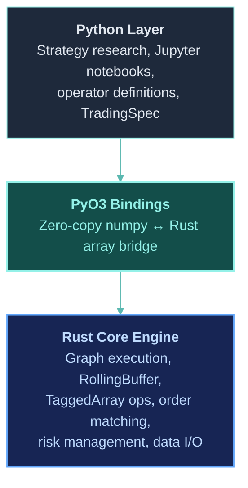

## Vision

ClyptQ's engine will be rewritten in **Rust** with **Python bindings via PyO3** — following the same architecture as PyTorch (C++/CUDA core, Python research interface). Builders write strategies in Python. The engine executes them at native speed.



**Goal:** All PyTorch-equivalent functionality in Rust. Python does research. Rust does computation.

## Why Rust?

### Current Bottlenecks (Python)

| Component | Current | Issue |
|---|---|---|
| Graph tick loop | Python `for` loop | GIL-bound, single-threaded |
| TaggedArray operations | NumPy | Good for vectorized, slow for per-tick scalar ops |
| RollingBuffer | NumPy arrays | Memory copies on `to_array()` reordering |
| Order matching | Python classes | Object allocation per order, per tick |
| Backtest (1yr, 100 symbols, 1m) | ~30 minutes | Too slow for parameter sweeps |

### Target Performance (Rust)

| Component | Target | Improvement |
|---|---|---|
| Graph tick loop | Rust `tokio` async loop | No GIL. True parallelism |
| TaggedArray operations | `ndarray` + SIMD | 10-50x for element-wise ops |
| RollingBuffer | Zero-copy circular buffer | No reallocation. No copies |
| Order matching | Stack-allocated structs | No heap allocation per order |
| Backtest (1yr, 100 symbols, 1m) | ~30 seconds | **60x speedup** |

### Rust vs Alternatives

| Option | Pros | Cons |
|---|---|---|
| **Rust + PyO3** | Zero-cost abstractions, memory safety, no GC, proven (PyTorch, Polars, Ruff) | Learning curve for contributors |
| C++ + pybind11 | Mature ecosystem, CUDA support | Memory bugs, undefined behavior, complex build |
| Cython | Easy Python integration | Still limited by GIL, modest speedup |
| Numba/JAX | JIT compilation | Can't optimize control flow, limited to numeric ops |

Rust is the clear choice: **memory safety without GC**, **zero-cost abstractions**, and a proven track record in Python ecosystem tools (Polars, Ruff, Pydantic V2, cryptography).

## Migration Strategy

### Phase 1: Hot Path (TaggedArray + RollingBuffer)

**Target: 2025 H2**

The innermost loop — TaggedArray operations and buffer management — moves to Rust first.

```rust
// Rust: TaggedArray with SIMD operations
#[pyclass]
pub struct TaggedArray {
    pub value: Array1<f64>,
    pub exists: Array1<bool>,
    pub valid: Array1<bool>,
    pub updated: Array1<bool>,
}

#[pymethods]
impl TaggedArray {
    /// Element-wise multiply with mask propagation
    fn mul(&self, other: &TaggedArray) -> TaggedArray {
        TaggedArray {
            value: &self.value * &other.value,
            exists: &self.exists & &other.exists,
            valid: &self.valid & &other.valid,
            updated: &self.updated | &other.updated,
        }
    }

    /// Combined mask: exists & valid
    #[getter]
    fn is_valid(&self) -> Array1<bool> {
        &self.exists & &self.valid
    }
}
```

```rust
// Rust: Zero-copy RollingBuffer
#[pyclass]
pub struct RollingBuffer {
    value: Array2<f64>,
    exists: Array2<bool>,
    valid: Array2<bool>,
    updated: Array2<bool>,
    write_idx: usize,
    lookback: usize,
}

#[pymethods]
impl RollingBuffer {
    /// O(n_symbols) append — no copies
    fn append(&mut self, tick: &TaggedArray) {
        let idx = self.write_idx % self.lookback;
        self.value.row_mut(idx).assign(&tick.value);
        self.exists.row_mut(idx).assign(&tick.exists);
        self.valid.row_mut(idx).assign(&tick.valid);
        self.updated.row_mut(idx).assign(&tick.updated);
        self.write_idx += 1;
    }

    /// Zero-copy view when possible, single concat when wrapped
    fn to_array(&self) -> TaggedArray {
        // If buffer hasn't wrapped, return view directly
        // If wrapped, single contiguous reorder
    }
}
```

**Python interface unchanged:**
```python
# Builder code stays exactly the same
class MyAlpha(Operator):
    def compute(self, data, timestamp, context):
        close = data["close"]          # Now a Rust TaggedArray
        returns = close.value[-1] / close.value[0] - 1.0  # NumPy interop
        return TaggedArray(value=returns, exists=close.exists[-1], ...)
```

### Phase 2: Graph Execution Engine

**Target: 2026 H1**

The `StatefulGraph.on_tick()` loop moves to Rust. Operators are still defined in Python, but the graph orchestration (buffer management, topological execution, input distribution) runs in Rust.

```rust
// Rust: Graph execution loop
pub struct RustGraph {
    nodes: Vec<NodeEntry>,
    topo_order: Vec<usize>,
    buffers: HashMap<(usize, String), RollingBuffer>,
}

impl RustGraph {
    /// Execute one tick across all nodes
    pub fn on_tick(&mut self, field_data: &FieldInputs, py: Python) -> PyResult<()> {
        // 1. Distribute FIELD inputs to consumer buffers (Rust)
        self.distribute_fields(field_data);

        // 2. Execute operators in topological order
        for &node_idx in &self.topo_order {
            let node = &self.nodes[node_idx];

            // Prepare inputs from buffers (Rust)
            let inputs = self.prepare_inputs(node_idx);

            // Call Python operator.compute() via PyO3
            let output = node.operator.call_method1(py, "compute",
                (inputs, timestamp, context))?;

            // Store output in downstream buffers (Rust)
            self.distribute_output(node_idx, output);
        }

        Ok(())
    }
}
```

### Phase 3: Built-in Operators in Rust

**Target: 2026 H1**

Common operators (SMA, EMA, RSI, MACD, all 101 Alpha operators) get Rust implementations. Python definitions become thin wrappers.

```rust
// Rust: SMA operator
pub struct SMA {
    span: usize,
}

impl Operator for SMA {
    fn compute(&self, data: &InputData) -> TaggedArray {
        let close = data.get("close");
        let n = close.value.shape()[0];
        let n_symbols = close.value.shape()[1];

        let mut result = Array1::<f64>::zeros(n_symbols);
        let mut valid = Array1::<bool>::from_elem(n_symbols, false);

        if n >= self.span {
            for s in 0..n_symbols {
                if close.is_valid.slice(s![n-self.span..n, s]).iter().all(|&v| v) {
                    result[s] = close.value.slice(s![n-self.span..n, s]).mean().unwrap();
                    valid[s] = true;
                }
            }
        }

        TaggedArray { value: result, exists: close.exists.row(n-1).to_owned(), valid, .. }
    }
}
```

```python
# Python: Thin wrapper auto-selects Rust implementation
class SMA(Operator):
    def __init__(self, span: int):
        self.span = span
        self._rust_impl = _clyptq_rs.SMA(span)  # Rust backend

    def compute(self, data, timestamp, context):
        return self._rust_impl.compute(data)  # Delegated to Rust
```

### Phase 4: Order Matching & Risk Engine

**Target: 2026 H2**

The execution pipeline (intention → delta → order → fill) moves to Rust with zero-allocation order processing.

```rust
// Rust: Stack-allocated order processing
pub struct OrderEngine {
    positions: HashMap<String, Position>,
    cash: f64,
    pending_orders: Vec<Order>,
}

impl OrderEngine {
    /// Process intention → order with zero heap allocation
    pub fn process_intention(&mut self, intention: &TradingIntention) -> Option<Order> {
        let current_pos = self.positions.get(&intention.symbol)
            .map(|p| p.quantity).unwrap_or(0.0);
        let delta = intention.target_position - current_pos;

        if delta.abs() < MIN_ORDER_SIZE {
            return None;
        }

        Some(Order {
            symbol: intention.symbol.clone(),
            side: if delta > 0.0 { Side::Buy } else { Side::Sell },
            quantity: delta.abs(),
            ..
        })
    }
}
```

### Phase 5: Data I/O & Storage

**Target: 2027**

Parquet reading/writing and live data WebSocket handling in Rust. Uses `arrow-rs` for zero-copy Parquet I/O.

```rust
// Rust: Arrow-based Parquet reader
pub fn load_ohlcv(path: &Path, start: DateTime, end: DateTime) -> OHLCVData {
    let file = File::open(path).unwrap();
    let reader = ParquetRecordBatchReaderBuilder::try_new(file)
        .unwrap()
        .with_row_filter(/* timestamp range */)
        .build()
        .unwrap();
    // Zero-copy Arrow → numpy via PyO3
}
```

## PyTorch Analogy

| PyTorch | ClyptQ (Planned) |
|---|---|
| `torch.Tensor` (C++/CUDA) | `TaggedArray` (Rust) |
| `torch.nn.Module` (Python) | `Operator` (Python) |
| `torch.autograd` engine (C++) | `StatefulGraph.on_tick()` (Rust) |
| `torch.optim` (Python + C++) | `Optimizer` operators (Python + Rust) |
| `DataLoader` (Python + C++) | `TradingDriver.load_data()` (Python + Rust) |
| Python for research/training | Python for strategy research |
| C++/CUDA for execution | Rust for backtesting + live execution |

**Key principle:** Just as PyTorch lets ML researchers write Python while CUDA handles the heavy lifting, ClyptQ lets quant researchers write Python strategies while Rust handles tick-by-tick execution.

## Performance Targets

### Backtesting Speed

| Scenario | Python (Current) | Rust (Target) | Speedup |
|---|---|---|---|
| 1 month, 10 symbols, 1m bars | ~2 min | ~2 sec | 60x |
| 1 year, 10 symbols, 1m bars | ~30 min | ~30 sec | 60x |
| 1 year, 100 symbols, 1m bars | ~5 hours | ~5 min | 60x |
| Parameter sweep (100 iterations) | ~50 hours | ~8 hours | 6x (parallelized) |

### Memory Usage

| Component | Python | Rust | Reduction |
|---|---|---|---|
| TaggedArray (100 symbols) | ~4 KB + Python overhead | ~3.3 KB (no overhead) | ~20% |
| RollingBuffer (lookback=252, 100 symbols) | ~280 KB + Python objects | ~277 KB (pure arrays) | ~1% |
| Graph overhead (50 nodes) | ~50 MB (Python objects) | ~5 MB (Rust structs) | 90% |
| Order processing (per tick) | ~10 KB allocations | ~0 KB (stack allocated) | 100% |

### Live Trading Latency

| Operation | Python | Rust | Improvement |
|---|---|---|---|
| Single tick through graph (50 nodes) | ~5 ms | ~0.1 ms | 50x |
| Order intention → exchange API | ~10 ms | ~2 ms | 5x |
| Full tick-to-order latency | ~15 ms | ~2.5 ms | 6x |

## Developer Experience

### For Strategy Builders (No Change)

```python
# This code works identically before and after Rust migration
class MomentumAlpha(Operator):
    role = OperatorRole.ALPHA

    def compute(self, data, timestamp, context):
        close = data["close"]
        returns = (close.value[-1] / close.value[0]) - 1.0
        return TaggedArray(
            value=returns,
            exists=close.exists[-1],
            valid=close.valid[-1],
            updated=True
        )
```

### For Performance-Critical Operators (Optional Rust)

```python
# Builders CAN write Rust operators for maximum performance
from clyptq_rs import register_rust_operator

@register_rust_operator("path/to/my_operator.rs")
class MyFastOperator(Operator):
    pass  # Implementation in Rust file
```

### For Data Research (Full Python)

```python
# Jupyter notebook research stays pure Python
import clyptq as cq
import pandas as pd
import matplotlib.pyplot as plt

# Load data (Rust Parquet reader under the hood)
data = cq.load_ohlcv("binance:futures", ["BTC/USDT"], "2024-01-01", "2024-12-31")

# Research with pandas/numpy/scipy (pure Python)
returns = data.close.pct_change()
rolling_sharpe = returns.rolling(252).mean() / returns.rolling(252).std()

# Backtest (Rust engine under the hood)
results = cq.backtest(spec)

# Analyze results (pure Python)
results.plot_equity_curve()
```

## Timeline

| Phase | Component | Target | Speedup |
|---|---|---|---|
| **Phase 1** | TaggedArray + RollingBuffer | 2025 H2 | 10-50x per operation |
| **Phase 2** | Graph execution engine | 2026 H1 | 20-60x backtesting |
| **Phase 3** | Built-in operators (SMA, RSI, Alpha_101) | 2026 H1 | 100x for pure-Rust operators |
| **Phase 4** | Order matching + risk engine | 2026 H2 | 50x order processing |
| **Phase 5** | Data I/O + storage | 2027 | 5-10x data loading |

## Technology Stack

| Layer | Technology | Role |
|---|---|---|
| **Core compute** | Rust + `ndarray` | Array operations, SIMD |
| **Python bindings** | PyO3 + `numpy` crate | Zero-copy numpy ↔ Rust bridge |
| **Async runtime** | `tokio` | Concurrent tick processing, WebSocket handling |
| **Serialization** | `serde` + `arrow-rs` | Parquet I/O, message passing |
| **Testing** | `criterion` (Rust benchmarks) + `pytest` | Performance regression + correctness |
| **Build** | `maturin` | Rust → Python wheel packaging |
