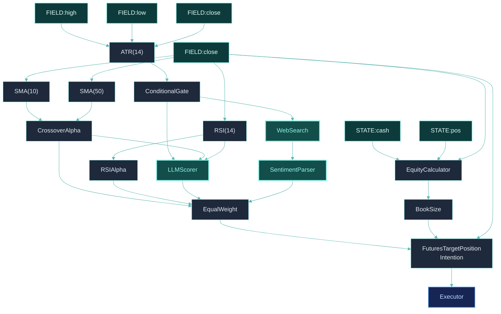

## What We're Building

A strategy that augments traditional technical indicators with AI-powered operators:

- **Traditional layer** — RSI and SMA crossover for base signal
- **AI layer** — LLM scores market conditions, web search provides sentiment
- **Gate pattern** — Only call expensive AI operators when volatility is high (cost control)
- **Signal fusion** — Combine technical and AI signals into final weights

This tutorial introduces ClyptQ's unique **semantic operators** — LLM scoring and web search that run inside the trading loop.

<Warning>
Semantic operators are **ephemeral** — they only execute in paper and live modes, not in backtest. In backtest, they return neutral values (0.0). This is by design: LLM outputs are non-deterministic and would make backtests unreproducible.
</Warning>

## Step 1: Setup

```python
from clyptq.system.graph import StatefulGraph, Input
from clyptq.apps.trading.spec.symbol_source_map import SymbolSourceMap

symbol_source_map = SymbolSourceMap({
    "binance:futures": ["BTC/USDT:USDT", "ETH/USDT:USDT"],
})

graph = StatefulGraph()

# FIELD inputs
close = Input("FIELD:binance:futures:ohlcv:close", "1m", lookback=50)
```

## Step 2: Traditional Indicators

Build the base technical signal (same pattern as [First Strategy](/tutorials/first-strategy)):

```python
from clyptq.apps.trading.operators.indicator import SMA, RSI
from clyptq.apps.trading.operators.signal import CrossoverAlpha, RSIAlpha

# SMA crossover
graph.add_node("sma_fast", SMA(span=10), inputs=[close])
graph.add_node("sma_slow", SMA(span=50), inputs=[close])

graph.add_node("crossover", CrossoverAlpha(),
    inputs=[
        Input("sma_fast", "1m", lookback=2),
        Input("sma_slow", "1m", lookback=2),
    ])

# RSI signal
graph.add_node("rsi", RSI(period=14), inputs=[close])
graph.add_node("rsi_signal", RSIAlpha(input=close))
```

## Step 3: Volatility Gate

The gate controls when expensive AI operators run. High volatility = uncertain market = AI analysis is most valuable:

```python
from clyptq.apps.trading.operators.indicator import ATR
from clyptq.apps.trading.operators.control import ConditionalGate

# ATR as volatility proxy
graph.add_node("atr", ATR(period=14),
    inputs=[
        Input("FIELD:binance:futures:ohlcv:high", "1m", lookback=14),
        Input("FIELD:binance:futures:ohlcv:low", "1m", lookback=14),
        Input("FIELD:binance:futures:ohlcv:close", "1m", lookback=14),
    ])

# Gate opens when ATR > threshold (high volatility)
graph.add_node("vol_gate", ConditionalGate(
    condition_input=Input("atr", "1m", lookback=1),
    threshold=0.02,       # 2% ATR threshold
    comparison="gt",      # Greater than
    per_symbol=True,      # Evaluate per symbol
))
```

**How the gate works:**
- ATR > 2% → gate outputs 1.0 (open) → AI operators execute
- ATR ≤ 2% → gate outputs 0.0 (closed) → AI operators skip (return cached or neutral values)

This controls API costs: AI only runs when the market is volatile enough to benefit from additional analysis.

## Step 4: LLM Scorer

The `LLMScorer` sends indicator values to an LLM and receives a [-1, 1] trading signal:

```python
from clyptq.apps.trading.operators.semantic import LLMScorer

graph.add_node("llm_score", LLMScorer(
    inputs=[
        Input("rsi", "1m", lookback=1),
        Input("crossover", "1m", lookback=1),
    ],
    input_names=["RSI", "SMA_Crossover"],
    model="deepseek-v3",
    call_interval=5,  # Call LLM every 5 ticks (cost optimization)
))
```

**Parameters explained:**
- `inputs` — The indicator values sent to the LLM as numeric context
- `input_names` — Human-readable names used in the prompt (e.g., "RSI: 72.3, SMA_Crossover: 0.8")
- `model` — LLM model to use (deepseek-v3, gemini-flash, gpt-4o, etc.)
- `call_interval` — Only call the LLM every N ticks. Between calls, the last score is reused

**Output:** [-1.0, 1.0] where -1 = strong sell, 0 = neutral, +1 = strong buy.

<Info>
The LLM receives a formatted prompt with the indicator values and returns a numeric score. The default prompt asks for a trading signal based on the technical indicators. You can customize both `system_prompt` and `user_prompt_template`.
</Info>

## Step 5: Web Search + Sentiment

Fetch market news and parse sentiment:

```python
from clyptq.apps.trading.operators.semantic import WebSearchOperator, SentimentParser

# Search for market news (gated by volatility)
graph.add_node("news", WebSearchOperator(
    query_template="cryptocurrency {symbol} market news today",
    gate_input=Input("vol_gate", "1m", lookback=1),
    num_results=5,
    cache_results=True,
    cache_ttl=3600,       # Cache for 1 hour
    per_symbol=True,
))

# Parse sentiment from search results
graph.add_node("sentiment", SentimentParser(
    text_input=Input("news", "1m", lookback=1),
    model="deepseek-v3",  # Or "rule-based" for zero API cost
))
```

**WebSearchOperator:**
- `query_template` — Uses `{symbol}` placeholder (e.g., "cryptocurrency BTC/USDT market news")
- `gate_input` — When gate is closed (0.0), search is skipped entirely (no API cost)
- `cache_results` — Caches results to avoid redundant searches
- `cache_ttl` — Cache duration in seconds

**SentimentParser:**
- Takes text from `WebSearchOperator` output
- Returns [-1.0, 1.0] sentiment score
- `model="rule-based"` uses keyword matching (no API calls — good for cost-sensitive strategies)

## Step 6: Signal Fusion

Combine technical and AI signals with explicit weights:

```python
from clyptq.apps.trading.operators.transform import EqualWeight

# Combine all signals
graph.add_node("combined", EqualWeight(),
    inputs=[
        Input("crossover", "1m", lookback=1),      # Technical: SMA crossover
        Input("rsi_signal", "1m", lookback=1),      # Technical: RSI
        Input("llm_score", "1m", lookback=1),       # AI: LLM analysis
        Input("sentiment", "1m", lookback=1),       # AI: News sentiment
    ])
```

In backtest mode, `llm_score` and `sentiment` return 0.0 (neutral), so the backtest effectively runs on technical signals only. In paper/live, the AI signals augment the technical base.

## Step 7: Portfolio Accounting + Intention

```python
from clyptq.apps.trading.operators.balance import EquityCalculator, BookSize
from clyptq.apps.trading.operators.order import FuturesTargetPositionIntention

graph.add_node("equity", EquityCalculator(
    cash=Input("STATE:binance:futures:cash", "1m", lookback=0),
    positions=Input("STATE:binance:futures:pos_quantity", "1m", lookback=0),
    prices=Input("FIELD:binance:futures:ohlcv:close", "1m", lookback=0),
    entry_prices=Input("STATE:binance:futures:pos_entry_price", "1m", lookback=0),
    axis_keys=symbol_source_map.axis_keys_for("binance:futures"),
))

graph.add_node("book", BookSize(min_book_size=100.0),
    inputs=[Input("equity", "1m", lookback=1)])

graph.add_node("intention", FuturesTargetPositionIntention(
    weights=Input("combined", "1m", lookback=1),
    book_size=Input("book", "1m", lookback=1),
    positions=Input("STATE:binance:futures:pos_quantity", "1m", lookback=0),
    prices=Input("FIELD:binance:futures:ohlcv:close", "1m", lookback=0),
    axis_keys=symbol_source_map.axis_keys_for("binance:futures"),
    execution_routing=symbol_source_map.execution_routing,
    leverage=2.0,
))
```

## Step 8: Run

### Backtest (technical signals only)

```python
from datetime import datetime, timezone
from clyptq.apps.trading.spec.unified import TradingSpec
from clyptq.apps.trading.spec.data import TradingDataSpec
from clyptq.apps.trading.spec.strategy import TradingStrategySpec
from clyptq.apps.trading.spec.execution import TradingExecutionSpec, AccountSpec
from clyptq.apps.trading.spec.observation.crypto import OHLCVSpec
from clyptq.apps.trading.driver import TradingDriver

spec = TradingSpec(
    data=TradingDataSpec(
        symbol_source_map=symbol_source_map,
        observations=[OHLCVSpec(exchange="binance", market_type="futures", timeframe="1m")],
        start=datetime(2024, 1, 1, tzinfo=timezone.utc),
        end=datetime(2024, 6, 30, tzinfo=timezone.utc),
    ),
    strategy=TradingStrategySpec(graph=graph, output_nodes=["equity", "combined"]),
    execution=TradingExecutionSpec(
        mode="backtest",
        accounts=[AccountSpec(exchange="binance", market_type="futures", initial_cash=10_000)],
        execution_price_source="ohlcv",
    ),
    debug=True,
)

driver = TradingDriver.from_spec(spec)
for result in driver:
    pass

df_equity = driver.to_dataframe("equity")
df_equity.plot(title="AI-Augmented Strategy (Backtest - Technical Only)", figsize=(14, 5))
```

### Paper & Live Trading

After backtesting, **submit your strategy and run paper/live from the dashboard**. Semantic operators (LLM scoring, web search) are only active in paper and live modes — they are skipped during backtest since they require real-time data.

<Info>
Paper and live trading are not available in notebook cells. Submit your strategy and manage execution from the dashboard.
</Info>

## The Complete Graph



## Cost Control Strategies

### Gate conditions

| Gate Strategy | When AI Runs | Cost Impact |
|--------------|-------------|------------|
| **ATR threshold** | High volatility only | ~30-50% reduction |
| **Time-based** | Every N ticks | Linear reduction (1/N) |
| **Signal strength** | Strong technical signals only | Conditional reduction |
| **Combined (AND)** | High vol AND strong signal | Maximum reduction |

### Combine gates

```python
from clyptq.apps.trading.operators.control import GateAnd

# Only run AI when BOTH conditions are met
graph.add_node("strict_gate", GateAnd(
    gate_inputs=[
        Input("vol_gate", "1m", lookback=1),        # High volatility
        Input("signal_gate", "1m", lookback=1),      # Strong technical signal
    ],
))
```

### call_interval optimization

```python
# LLM called every 60 ticks (1 hour on 1m timeframe)
LLMScorer(..., call_interval=60)
```

Between calls, the previous score is reused. For slow-moving signals, `call_interval=60` reduces costs by 98% with minimal signal degradation.

## Related Pages

<CardGroup cols={2}>
  <Card title="Semantic Operators" icon="brain" href="/operators/semantic">
    LLMScorer, WebSearch, and SentimentParser reference
  </Card>
  <Card title="Control Operators" icon="toggle-on" href="/operators/control">
    ConditionalGate, GateOr, GateAnd reference
  </Card>
  <Card title="Semantic Operators (Competitive)" icon="sparkles" href="/competitive/semantic-operators">
    Why LLM-in-the-loop is unique to ClyptQ
  </Card>
  <Card title="Backtest to Live" icon="arrow-right" href="/tutorials/backtest-to-live">
    Deploy this strategy from paper to live
  </Card>
</CardGroup>
