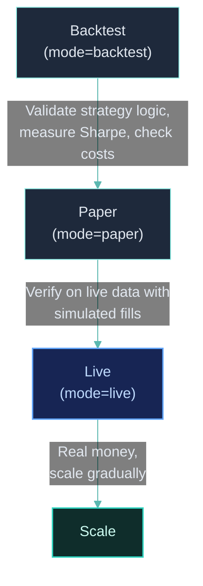

## The Deployment Lifecycle

ClyptQ's code parity means the deployment lifecycle is a parameter change, not a rewrite:



This tutorial uses the SMA crossover strategy from [Your First Strategy](/tutorials/first-strategy). The graph and operators don't change — only the `TradingExecutionSpec`.

## Phase 1: Backtest

### Run the backtest

```python
spec = TradingSpec(
    data=TradingDataSpec(
        symbol_source_map=symbol_source_map,
        observations=[OHLCVSpec(exchange="binance", market_type="futures", timeframe="1m")],
        start=datetime(2024, 1, 1, tzinfo=timezone.utc),
        end=datetime(2024, 12, 31, tzinfo=timezone.utc),
    ),
    strategy=TradingStrategySpec(graph=graph, output_nodes=["equity"]),
    execution=TradingExecutionSpec(
        accounts=[AccountSpec(exchange="binance", market_type="futures", base_currency="USDT", initial_cash=10_000)],
        execution_price_source="ohlcv",
    ),
    mode="backtest",
    debug=True,
)

driver = TradingDriver.from_spec(spec)
for result in driver:
    pass

df_equity = driver.to_dataframe("equity")
```

### What to check

Before moving to paper trading, review key metrics like Sharpe ratio, max drawdown, fee impact, and trade frequency. Compare zero-cost vs real-cost backtests to understand fee drag.

```python
# Compare with zero-cost backtest
spec_zero = TradingSpec(
    ...
    execution=TradingExecutionSpec(
        accounts=[AccountSpec(
            exchange="binance", market_type="futures", base_currency="USDT", initial_cash=10_000,
            cost_model=CostModelSpec(maker_fee=0, taker_fee=0, slippage_bps=0),
        )],
    ),
    mode="backtest",
)
```

## Phase 2: Submit & Paper Trade

After validating your backtest, **submit your strategy to the platform**. Paper and live trading are managed through the **dashboard** — not from notebook cells.

1. Submit your strategy via the marketplace submission flow
2. From the dashboard, start a **Paper Trade** run

### What happens internally

1. **Historical warmup**: Loads past data from Parquet to fill all RollingBuffers
2. **Clock sync**: Aligns to the next real-time bar boundary
3. **Live ticks**: Receives data via WebSocket from the exchange
4. **Simulated fills**: Orders are executed with the same fill model as backtest
5. **STATE updates**: Portfolio state updates with simulated positions and PnL

Paper mode is intentionally identical to backtest in execution — the only difference is the data source (live instead of historical).

### What to verify

- **Equity tracking**: Does paper equity roughly match what backtest predicted for similar market conditions?
- **Order execution**: Are intentions generating reasonable deltas?
- **Signal frequency**: Are signals generating at expected frequency?

## Phase 3: Live Trading (Small)

From the dashboard, switch to **Live** mode. Connect your exchange API credentials and start with small capital.

### What happens internally

1. **Balance sync**: Fetches real account balance from the exchange before warmup
2. **Historical warmup**: Same as paper mode
3. **Live ticks**: WebSocket data from the exchange
4. **Real orders**: Orders are sent to the exchange via CCXT
5. **Balance re-sync**: Before each tick, checks for external changes (liquidations, manual trades, funding)

### Safety features

| Feature | What It Does |
|---------|-------------|
| **Emergency shutdown** | Stop from dashboard to close all positions immediately |
| **Balance sync** | Detects external changes (manual trades, auto-liquidation) |
| **First tick skip** | Skips execution on the first real-time tick to avoid stale signals |

### Scaling up

Start small and scale gradually. Compare live performance to backtest expectations at each stage — significant divergence may indicate issues with execution, data, or market regime change.

## Code Parity

The same `StatefulGraph` you build in Jupyter runs identically on the dashboard in paper and live modes. Only the execution mode and data source change — the graph, operators, and strategy logic stay the same.

```python
# This graph runs identically in backtest (notebook), paper, and live (dashboard)
graph = StatefulGraph()
graph.add_node("sma_fast", SMA(span=10), inputs=[close])
graph.add_node("sma_slow", SMA(span=50), inputs=[close])
graph.add_node("signal", CrossoverAlpha(), inputs=[...])
graph.add_node("weights", EqualWeight(), inputs=[...])
graph.add_node("equity", EquityCalculator(...))
graph.add_node("book", BookSize(...), inputs=[...])
graph.add_node("intention", FuturesTargetPositionIntention(...))
```

## Related Pages

<CardGroup cols={2}>
  <Card title="Code Parity" icon="equals" href="/competitive/code-parity">
    Why the same code produces identical results across all modes
  </Card>
  <Card title="Backtesting Accuracy" icon="shield" href="/backtesting/overview">
    Cost models, funding rates, and liquidation in backtest
  </Card>
  <Card title="Your First Strategy" icon="graduation-cap" href="/tutorials/first-strategy">
    Build the strategy used in this tutorial
  </Card>
  <Card title="Jupyter Workflow" icon="laptop-code" href="/platform/jupyter-workflow">
    Cell-by-cell development workflow
  </Card>
</CardGroup>
