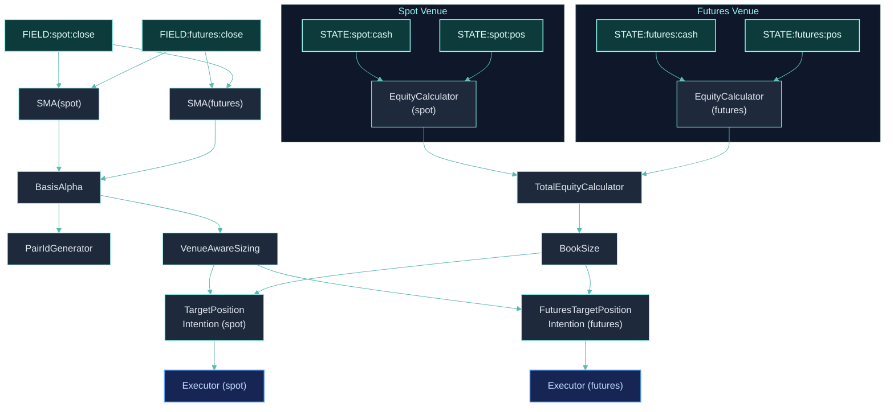

## What We're Building

A spot-futures arbitrage strategy that:

- **Buys on Binance spot** when the futures premium is high
- **Sells short on Binance futures** to hedge the position
- **Uses `VenueAwareSizing`** to allocate capital across venues
- **Uses `TotalEquityCalculator`** to track combined equity
- **Uses `PairIdGenerator`** to link spot and futures legs atomically

This is an advanced tutorial. Make sure you understand [First Strategy](/tutorials/first-strategy) and [Multi-Factor](/tutorials/multi-factor) before proceeding.

## Step 1: Multi-Venue Setup

Cross-exchange strategies need multiple entries in `SymbolSourceMap` and multiple `AccountSpec` entries:

```python
from clyptq.system.graph import StatefulGraph, Input
from clyptq.apps.trading.spec.symbol_source_map import SymbolSourceMap

# Same symbols on two venues
symbol_source_map = SymbolSourceMap({
    "binance:spot": ["BTC/USDT:USDT", "ETH/USDT:USDT"],
    "binance:futures": ["BTC/USDT:USDT", "ETH/USDT:USDT"],
})

# axis_keys for each venue
spot_keys = symbol_source_map.axis_keys_for("binance:spot")
# → ['binance:spot:BTC/USDT:USDT', 'binance:spot:ETH/USDT:USDT']

futures_keys = symbol_source_map.axis_keys_for("binance:futures")
# → ['binance:futures:BTC/USDT:USDT', 'binance:futures:ETH/USDT:USDT']

all_keys = spot_keys + futures_keys
execution_routing = symbol_source_map.execution_routing

graph = StatefulGraph()
```

## Step 2: Price Inputs

Each venue has its own FIELD inputs:

```python
# Spot prices
spot_close = Input("FIELD:binance:spot:ohlcv:close", "1m", lookback=20)

# Futures prices
futures_close = Input("FIELD:binance:futures:ohlcv:close", "1m", lookback=20)
```

## Step 3: Arbitrage Signal

Compute the futures premium (basis) as the arbitrage signal:

```python
from clyptq.apps.trading.operators.indicator import SMA

# Smooth prices for stable basis calculation
graph.add_node("spot_sma", SMA(span=10), inputs=[spot_close])
graph.add_node("futures_sma", SMA(span=10), inputs=[futures_close])
```

Create a custom operator for the basis calculation, or use a combination of built-in operators. Here's the concept using a custom operator:

```python
from clyptq.apps.trading.operators.base import BaseOperator, OperatorRole
from clyptq.system.tagged_tensor import TaggedArray
import numpy as np

class BasisAlpha(BaseOperator):
    """Computes futures premium: (futures - spot) / spot"""
    role = OperatorRole.ALPHA

    def __init__(self, threshold: float = 0.001):
        self.threshold = threshold  # Minimum basis to trade (0.1%)

    def compute(self, data, timestamp=None, context=None):
        spot = data[0].value[-1]      # Latest spot price per symbol
        futures = data[1].value[-1]   # Latest futures price per symbol

        # Basis: futures premium as percentage
        basis = (futures - spot) / np.where(spot > 0, spot, 1.0)

        # Signal: positive basis → sell futures, buy spot
        # Negative basis → buy futures, sell spot
        signal = np.where(np.abs(basis) > self.threshold, basis, 0.0)

        return TaggedArray(
            values=signal,
            exists=data[0].exists[-1],
            valid=data[0].valid[-1] & data[1].valid[-1],
            updated=data[0].updated[-1] | data[1].updated[-1],
        )

graph.add_node("arb_signal", BasisAlpha(threshold=0.001),
    inputs=[
        Input("spot_sma", "1m", lookback=1),
        Input("futures_sma", "1m", lookback=1),
    ])
```

## Step 4: Per-Venue Equity

Track equity for each venue separately, then combine:

```python
from clyptq.apps.trading.operators.balance import EquityCalculator, TotalEquityCalculator

# Spot equity
graph.add_node("spot_equity", EquityCalculator(
    cash=Input("STATE:binance:spot:cash", "1m", lookback=0),
    positions=Input("STATE:binance:spot:pos_quantity", "1m", lookback=0),
    prices=Input("FIELD:binance:spot:ohlcv:close", "1m", lookback=0),
    entry_prices=Input("STATE:binance:spot:pos_entry_price", "1m", lookback=0),
    axis_keys=spot_keys,
))

# Futures equity
graph.add_node("futures_equity", EquityCalculator(
    cash=Input("STATE:binance:futures:cash", "1m", lookback=0),
    positions=Input("STATE:binance:futures:pos_quantity", "1m", lookback=0),
    prices=Input("FIELD:binance:futures:ohlcv:close", "1m", lookback=0),
    entry_prices=Input("STATE:binance:futures:pos_entry_price", "1m", lookback=0),
    axis_keys=futures_keys,
))

# Combined equity across both venues
graph.add_node("total_equity", TotalEquityCalculator(
    equity_inputs=[
        Input("spot_equity", "1m", lookback=1),
        Input("futures_equity", "1m", lookback=1),
    ],
))
```

`TotalEquityCalculator` sums equity from all venue-level calculators, giving you a portfolio-wide equity figure for risk management and position sizing.

## Step 5: Venue-Aware Position Sizing

`VenueAwareSizing` allocates capital across venues based on the arbitrage signal:

```python
from clyptq.apps.trading.operators.order import VenueAwareSizing

graph.add_node("sizing", VenueAwareSizing(
    signal=Input("arb_signal", "1m", lookback=1),
    total_equity=Input("total_equity", "1m", lookback=1),
    venue_configs={
        "binance:spot": {
            "role": "long",            # Spot side buys
            "allocation_ratio": 0.5,   # 50% of capital
        },
        "binance:futures": {
            "role": "short",           # Futures side sells
            "allocation_ratio": 0.5,   # 50% of capital
        },
    },
    axis_keys=all_keys,
    execution_routing=execution_routing,
    allocation_mode="inverse_hedge",  # Spot long ↔ Futures short
    max_exposure_ratio=0.8,           # Max 80% of equity deployed
    min_notional=10.0,                # Min $10 per trade
))
```

**Allocation modes:**
- `"equal"` — Equal split across venues
- `"proportional"` — Split based on `allocation_ratio`
- `"inverse_hedge"` — Spot long, futures short (or vice versa based on signal direction)

**How it works:**
1. Takes the arbitrage signal (per symbol)
2. Allocates total equity to each venue based on config
3. For `inverse_hedge`: positive signal → buy spot, sell futures; negative → opposite
4. Outputs target notional per axis_key across all venues

## Step 6: Pair ID Generation

Link spot and futures legs so they execute atomically:

```python
from clyptq.apps.trading.operators.order import PairIdGenerator

graph.add_node("pair_ids", PairIdGenerator(
    signal=Input("arb_signal", "1m", lookback=1),
    axis_keys=all_keys,
    execution_routing=execution_routing,
    threshold=0.001,  # Only generate pair_id if signal > 0.1%
))
```

`PairIdGenerator` creates a unique pair ID when the same symbol has active signals on multiple venues. This tells the executor to execute both legs atomically — if one leg fails, the other is cancelled.

## Step 7: Order Intentions

Create separate intentions for each venue, referencing the shared sizing output:

```python
from clyptq.apps.trading.operators.order import (
    TargetPositionIntention,
    FuturesTargetPositionIntention,
)
from clyptq.apps.trading.operators.balance import BookSize

# Book size from total equity
graph.add_node("book", BookSize(min_book_size=100.0),
    inputs=[Input("total_equity", "1m", lookback=1)])

# Spot intention (long leg)
graph.add_node("spot_intention", TargetPositionIntention(
    weights=Input("sizing", "1m", lookback=1),
    book_size=Input("book", "1m", lookback=1),
    positions=Input("STATE:binance:spot:pos_quantity", "1m", lookback=0),
    prices=Input("FIELD:binance:spot:ohlcv:close", "1m", lookback=0),
    axis_keys=spot_keys,
    execution_routing=execution_routing,
))

# Futures intention (short leg)
graph.add_node("futures_intention", FuturesTargetPositionIntention(
    weights=Input("sizing", "1m", lookback=1),
    book_size=Input("book", "1m", lookback=1),
    positions=Input("STATE:binance:futures:pos_quantity", "1m", lookback=0),
    prices=Input("FIELD:binance:futures:ohlcv:close", "1m", lookback=0),
    axis_keys=futures_keys,
    execution_routing=execution_routing,
    leverage=1.0,  # 1× for matched arbitrage
))
```

## Step 8: Configure and Run

```python
from datetime import datetime, timezone
from clyptq.apps.trading.spec.unified import TradingSpec
from clyptq.apps.trading.spec.data import TradingDataSpec
from clyptq.apps.trading.spec.strategy import TradingStrategySpec
from clyptq.apps.trading.spec.execution import TradingExecutionSpec, AccountSpec
from clyptq.apps.trading.spec.observation.crypto import OHLCVSpec
from clyptq.apps.trading.driver import TradingDriver

spec = TradingSpec(
    data=TradingDataSpec(
        symbol_source_map=symbol_source_map,
        observations=[
            # Need data from both venues
            OHLCVSpec(exchange="binance", market_type="spot", timeframe="1m"),
            OHLCVSpec(exchange="binance", market_type="futures", timeframe="1m"),
        ],
        start=datetime(2024, 1, 1, tzinfo=timezone.utc),
        end=datetime(2024, 6, 30, tzinfo=timezone.utc),
    ),
    strategy=TradingStrategySpec(
        graph=graph,
        output_nodes=["total_equity", "arb_signal", "spot_equity", "futures_equity"],
    ),
    execution=TradingExecutionSpec(
        mode="backtest",
        accounts=[
            # Separate accounts for each venue
            AccountSpec(
                exchange="binance", market_type="spot",
                initial_cash=25_000.0,
            ),
            AccountSpec(
                exchange="binance", market_type="futures",
                initial_cash=25_000.0,
                max_leverage=1.0,  # 1× for matched arb
            ),
        ],
        execution_price_source="ohlcv",
    ),
    debug=True,
)

driver = TradingDriver.from_spec(spec)
for result in driver:
    pass

# Analyze
df_total = driver.to_dataframe("total_equity")
df_signal = driver.to_dataframe("arb_signal")

df_total.plot(title="Cross-Exchange Arbitrage — Total Equity", figsize=(14, 5))
df_signal.plot(title="Basis (Futures Premium)", figsize=(14, 3))
```

## The Complete Graph



## Multi-Exchange Variant

The same pattern works across different exchanges:

```python
symbol_source_map = SymbolSourceMap({
    "binance:futures": ["BTC/USDT:USDT", "ETH/USDT:USDT"],
    "bybit:futures": ["BTC/USDT:USDT", "ETH/USDT:USDT"],
})

spec = TradingSpec(
    data=TradingDataSpec(
        symbol_source_map=symbol_source_map,
        observations=[
            OHLCVSpec(exchange="binance", market_type="futures", timeframe="1m"),
            OHLCVSpec(exchange="bybit", market_type="futures", timeframe="1m"),
        ],
    ),
    execution=TradingExecutionSpec(
        mode="backtest",
        accounts=[
            AccountSpec(exchange="binance", market_type="futures", initial_cash=25_000),
            AccountSpec(exchange="bybit", market_type="futures", initial_cash=25_000),
        ],
    ),
)
```

Each exchange is independently simulated with its own fees, margin rules, and funding rates.

## Key Considerations

### Funding rate arbitrage

For spot-futures basis trading, the main return comes from **collecting funding rates**. When futures trade at a premium:
- Long spot (earn the asset)
- Short futures (collect positive funding every 8 hours)
- Net return ≈ funding rate × time

See [Funding Rate Simulation](/backtesting/funding-rates) for how funding is modeled in backtest.

### Execution risk

- **Leg risk**: One leg fills but the other doesn't. `PairIdGenerator` mitigates this by linking legs
- **Timing**: In live mode, both orders are submitted simultaneously
- **Slippage**: Use LATENT mode backtest to estimate realistic execution costs

### Capital efficiency

| Config | Spot Capital | Futures Capital | Total | Leverage |
|--------|-------------|----------------|-------|---------|
| **Conservative** | 50% | 50% | 100% | 1× each |
| **Moderate** | 40% | 30% (2× lev) | 70% | Mixed |
| **Aggressive** | 30% | 20% (3× lev) | 50% | Higher futures leverage |

## Related Pages

<CardGroup cols={2}>
  <Card title="Supported Exchanges" icon="building-columns" href="/platform/supported-exchanges">
    Exchange matrix with fees, leverage, and data
  </Card>
  <Card title="Funding Rates" icon="percent" href="/backtesting/funding-rates">
    How funding rate simulation works in backtest
  </Card>
  <Card title="Liquidation Logic" icon="triangle-exclamation" href="/backtesting/liquidation-logic">
    Per-exchange margin and liquidation rules
  </Card>
  <Card title="Code Parity" icon="equals" href="/competitive/code-parity">
    Same arb strategy runs from backtest to live
  </Card>
</CardGroup>
